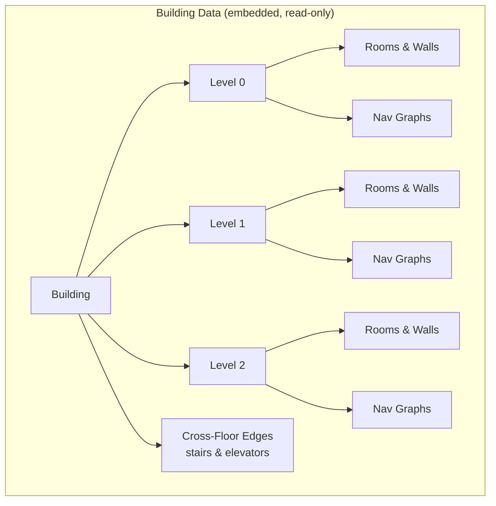

# Building Data API

Read-only endpoints for building metadata, floor plans, and cross-floor connections.



## Get Building Metadata

```
GET /api/building
```

Returns building name and available floor levels.

```bash
curl http://localhost:9090/api/building
```

```json
{
  "name": "A-Building (LTU)",
  "levels": [
    {"id": "level0", "label": "Floor 0"},
    {"id": "level1", "label": "Floor 1"},
    {"id": "level2", "label": "Floor 2"}
  ]
}
```

## Get Floor Data

```
GET /api/building/floors/{level}
```

Returns full floor plan data: page dimensions, rooms with polygons, walls, doors, labels, and navigation graphs.

| Parameter | Type | Description |
|-----------|------|-------------|
| `level` | path | Floor level ID: `level0`, `level1`, `level2` |

```bash
curl http://localhost:9090/api/building/floors/level0
```

```json
{
  "page": {"width": 595.22, "height": 842.0},
  "rooms": [
    {
      "id": 0,
      "name": "1540",
      "area": 263.5,
      "center": [129.08, 433.25],
      "polygon": [[124.64, 420.58], [132.41, 420.58], [132.41, 446.47], [124.64, 446.47]],
      "type": "corridor"
    }
  ],
  "walls": [[[x1, y1], [x2, y2]], ...],
  "red_lines": [...],
  "labels": [{"text": "1540", "x": 129.0, "y": 433.0}],
  "graph": {"nodes": [...], "edges": [...]},
  "walkable_graph": {"nodes": [...], "edges": [...]}
}
```

### Room Object

| Field | Type | Description |
|-------|------|-------------|
| `id` | int | Room ID (unique per floor) |
| `name` | string | Room label (e.g. "A2306", "1542") |
| `area` | float | Room area in PDF square units |
| `center` | [x, y] | Room centroid coordinates |
| `polygon` | [[x,y], ...] | Room boundary polygon vertices |
| `type` | string | `"corridor"` or `"room"` |

## Get Cross-Floor Edges

```
GET /api/building/cross-floor-edges
```

Returns stair and elevator connections between floors.

```bash
curl http://localhost:9090/api/building/cross-floor-edges
```

```json
[
  {
    "from_level": "abuilding/level0",
    "from_name": "A1105",
    "from_id": 0,
    "to_level": "abuilding/level1",
    "to_name": "A2005",
    "to_id": 0,
    "connector": "TRAPPA A",
    "type": "stair"
  },
  {
    "from_level": "abuilding/level0",
    "from_name": "A1017",
    "to_level": "abuilding/level1",
    "to_name": "A202",
    "connector": "HISS 12",
    "type": "elevator"
  }
]
```
