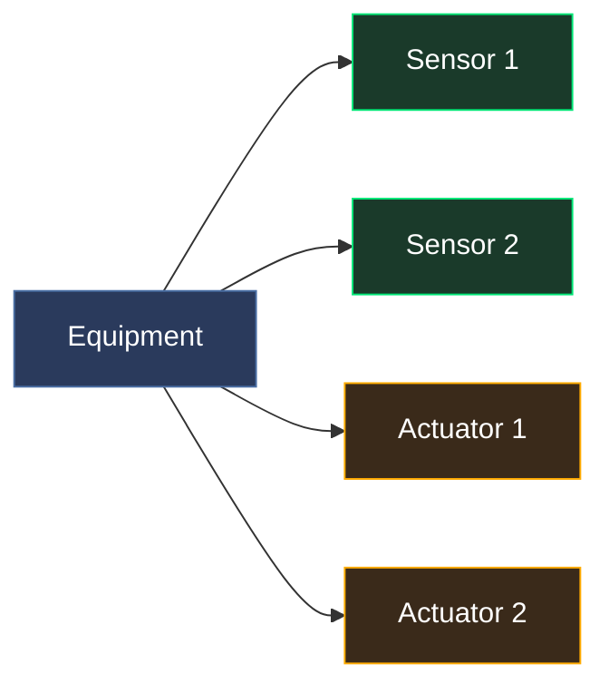
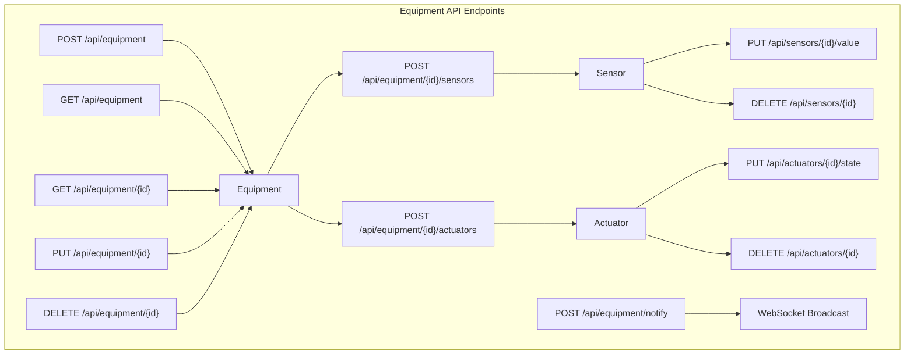

# Equipment API

CRUD operations for equipment, sensors, and actuators. All equipment state is in-memory and resets on server restart.





## Equipment

### Create Equipment

```
POST /api/equipment
```

```bash
curl -X POST http://localhost:9090/api/equipment \
  -H 'Content-Type: application/json' \
  -d '{
    "id": "temp-1",
    "name": "Room Temperature Sensor",
    "type": "temperature_sensor",
    "category": "monitoring",
    "level": "level0",
    "room": "1542",
    "status": "running"
  }'
```

```json
{
  "id": "temp-1",
  "name": "Room Temperature Sensor",
  "type": "temperature_sensor",
  "category": "monitoring",
  "level": "level0",
  "room": "1542",
  "status": "running",
  "version": 0,
  "sensors": [],
  "actuators": []
}
```

### Equipment Object

| Field | Type | Description |
|-------|------|-------------|
| `id` | string | Unique equipment ID |
| `name` | string | Display name |
| `type` | string | Equipment type (e.g. `door_lock`, `ac_unit`) |
| `category` | string | Category (e.g. `access_control`, `hvac`, `monitoring`) |
| `level` | string | Floor level: `level0`, `level1`, `level2` |
| `room` | string | Room name/label from the floor plan (e.g. `"1542"`, `"A2306"`) |
| `status` | string | `running`, `stopped`, `warning`, `alarm` |
| `sensors` | array | Attached sensors |
| `actuators` | array | Attached actuators |

### Bulk Create Equipment

Create multiple equipment items with their sensors and actuators in a single request.

```
POST /api/equipment/bulk
```

```bash
curl -X POST http://localhost:9090/api/equipment/bulk \
  -H 'Content-Type: application/json' \
  -d '[
    {
      "id": "temp-1", "name": "Temp Sensor", "type": "temperature_sensor",
      "category": "monitoring", "level": "level0", "room": "1542", "status": "running",
      "sensors": [
        {"id": "temp-1-val", "name": "Temperature", "type": "temperature", "data_type": "text", "unit": "°C", "value": "21.5"}
      ],
      "actuators": []
    },
    {
      "id": "door-1", "name": "Door Lock", "type": "door_lock",
      "category": "access_control", "level": "level0", "room": "1542", "status": "running",
      "sensors": [
        {"id": "door-1-pos", "name": "Position", "type": "door_position", "data_type": "binary"}
      ],
      "actuators": [
        {"id": "door-1-lock", "name": "Lock", "type": "lock_control", "state": "locked"}
      ]
    }
  ]'
```

```json
{"created": 2, "total": 2, "version": 1}
```

Duplicates (matching existing IDs) are silently skipped. The equipment version is bumped and all browser sessions are notified.

### List Equipment

```
GET /api/equipment
```

Optional query filters:

| Parameter | Description |
|-----------|-------------|
| `level` | Filter by floor (e.g. `level0`) |
| `room` | Filter by room name (e.g. `1542`) |
| `type` | Filter by equipment type (e.g. `smoke_detector`) |
| `category` | Filter by category (e.g. `monitoring`) |

```bash
# List all
curl http://localhost:9090/api/equipment

# Filter by floor and category
curl 'http://localhost:9090/api/equipment?level=level0&category=monitoring'
```

### Get Equipment

```
GET /api/equipment/{id}
```

```bash
curl http://localhost:9090/api/equipment/temp-1
```

### Update Equipment

```
PUT /api/equipment/{id}
```

```bash
curl -X PUT http://localhost:9090/api/equipment/temp-1 \
  -H 'Content-Type: application/json' \
  -d '{
    "name": "Room Temperature Sensor (Updated)",
    "type": "temperature_sensor",
    "category": "monitoring",
    "level": "level0",
    "room": "1542",
    "status": "warning"
  }'
```

### Delete Equipment

```
DELETE /api/equipment/{id}
```

```bash
curl -X DELETE http://localhost:9090/api/equipment/temp-1
```

### Notify Equipment Change

Bumps the global equipment version counter and notifies all connected browser sessions via WebSocket.

```
POST /api/equipment/notify
```

```bash
curl -X POST http://localhost:9090/api/equipment/notify
```

```json
{"version": 3}
```

---

## Sensors

Sensors are data points attached to equipment. Each sensor has a value that can be text or binary.

### Add Sensor

```
POST /api/equipment/{equipment_id}/sensors
```

```bash
# Text sensor (temperature)
curl -X POST http://localhost:9090/api/equipment/temp-1/sensors \
  -H 'Content-Type: application/json' \
  -d '{
    "id": "temp-1-reading",
    "name": "Temperature",
    "type": "temperature",
    "data_type": "text",
    "unit": "°C",
    "value": "21.5"
  }'

# Binary sensor (door position)
curl -X POST http://localhost:9090/api/equipment/door-1/sensors \
  -H 'Content-Type: application/json' \
  -d '{
    "id": "door-1-pos",
    "name": "Door Position",
    "type": "door_position",
    "data_type": "binary",
    "unit": ""
  }'
```

### Sensor Object

| Field | Type | Description |
|-------|------|-------------|
| `id` | string | Unique sensor ID |
| `name` | string | Display name |
| `type` | string | Sensor type (e.g. `temperature`, `door_position`, `smoke_level`) |
| `data_type` | string | `"text"` or `"binary"` |
| `value` | string | Current text value (when data_type is text) |
| `binary_value` | bool | Current binary value (when data_type is binary) |
| `unit` | string | Unit of measurement (e.g. `"°C"`, `"ppm"`, `"lux"`) |
| `timestamp` | string | ISO 8601 timestamp of last update |

### List Sensors

```
GET /api/equipment/{equipment_id}/sensors
```

```bash
curl http://localhost:9090/api/equipment/temp-1/sensors
```

### Set Sensor Value

```
PUT /api/sensors/{sensor_id}/value
```

```bash
# Set text value
curl -X PUT http://localhost:9090/api/sensors/temp-1-reading/value \
  -H 'Content-Type: application/json' \
  -d '{"data_type": "text", "value": "23.7"}'

# Set binary value
curl -X PUT http://localhost:9090/api/sensors/door-1-pos/value \
  -H 'Content-Type: application/json' \
  -d '{"data_type": "binary", "binary_value": true}'
```

### Delete Sensor

```
DELETE /api/sensors/{sensor_id}
```

```bash
curl -X DELETE http://localhost:9090/api/sensors/temp-1-reading
```

---

## Actuators

Actuators are control points attached to equipment.

### Add Actuator

```
POST /api/equipment/{equipment_id}/actuators
```

```bash
curl -X POST http://localhost:9090/api/equipment/door-1/actuators \
  -H 'Content-Type: application/json' \
  -d '{
    "id": "door-1-lock",
    "name": "Lock Control",
    "type": "lock_control",
    "state": "locked"
  }'
```

### Actuator Object

| Field | Type | Description |
|-------|------|-------------|
| `id` | string | Unique actuator ID |
| `name` | string | Display name |
| `type` | string | Actuator type (e.g. `lock_control`, `fan_speed`, `on_off`) |
| `state` | string | Current state value |
| `timestamp` | string | ISO 8601 timestamp of last update |

### List Actuators

```
GET /api/equipment/{equipment_id}/actuators
```

```bash
curl http://localhost:9090/api/equipment/door-1/actuators
```

### Set Actuator State

```
PUT /api/actuators/{actuator_id}/state
```

```bash
curl -X PUT http://localhost:9090/api/actuators/door-1-lock/state \
  -H 'Content-Type: application/json' \
  -d '{"state": "unlocked"}'
```

### Delete Actuator

```
DELETE /api/actuators/{actuator_id}
```

```bash
curl -X DELETE http://localhost:9090/api/actuators/door-1-lock
```

---

## Full Example: Door with Sensors and Actuators

```bash
BASE=localhost:9090

# Create equipment
curl -X POST http://$BASE/api/equipment -H 'Content-Type: application/json' -d '{
  "id": "door-main", "name": "Main Entrance", "type": "door_lock",
  "category": "access_control", "level": "level0", "room": "1542", "status": "running"
}'

# Add sensors
curl -X POST http://$BASE/api/equipment/door-main/sensors -H 'Content-Type: application/json' \
  -d '{"id": "door-main-pos", "name": "Position", "type": "door_position", "data_type": "binary"}'

curl -X POST http://$BASE/api/equipment/door-main/sensors -H 'Content-Type: application/json' \
  -d '{"id": "door-main-lock-st", "name": "Lock Status", "type": "lock_status", "data_type": "binary"}'

# Add actuator
curl -X POST http://$BASE/api/equipment/door-main/actuators -H 'Content-Type: application/json' \
  -d '{"id": "door-main-lock", "name": "Lock", "type": "lock_control", "state": "locked"}'

# Open door and unlock
curl -X PUT http://$BASE/api/sensors/door-main-pos/value \
  -H 'Content-Type: application/json' -d '{"data_type": "binary", "binary_value": true}'
curl -X PUT http://$BASE/api/actuators/door-main-lock/state \
  -H 'Content-Type: application/json' -d '{"state": "unlocked"}'

# Notify browsers
curl -X POST http://$BASE/api/equipment/notify
```
