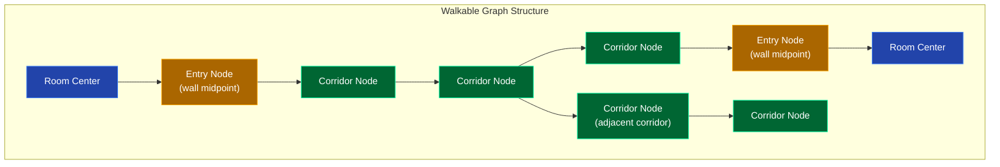
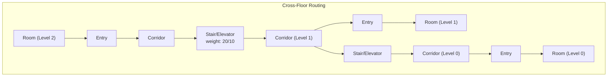

# Navigation Graph API

Query the building navigation graph and compute shortest paths using Dijkstra's algorithm.





Two graph types are available:

- **Adjacency graph** (`type=adjacency`, default) -- Room-to-corridor logical connections
- **Walkable graph** (`type=walkable`) -- Corridor centerline nodes with room entry points at wall midpoints. Paths follow corridors through doorways.

## Get Navigation Graph

```
GET /api/graph
```

| Parameter | Type | Default | Description |
|-----------|------|---------|-------------|
| `level` | query | `level0` | Floor level |
| `type` | query | `adjacency` | Graph type: `adjacency` or `walkable` |

```bash
# Adjacency graph for level0
curl 'http://localhost:9090/api/graph?level=level0'

# Walkable graph for level1
curl 'http://localhost:9090/api/graph?level=level1&type=walkable'
```

```json
{
  "nodes": [
    {"id": 0, "name": "1540", "x": 128.53, "y": 421.58, "type": "corridor"},
    {"id": 220, "name": "1542", "x": 119.32, "y": 424.1, "type": "entry"},
    {"id": 221, "name": "1542", "x": 117.5, "y": 424.6, "type": "room"}
  ],
  "edges": [
    {"from": 0, "to": 1, "weight": 10.5, "x1": 128.5, "y1": 421.6, "x2": 128.5, "y2": 432.1}
  ]
}
```

### Node Types (walkable graph)

| Type | Description |
|------|-------------|
| `corridor` | Node along corridor centerline |
| `entry` | Room entry point at wall midpoint (doorway) |
| `room` | Room center node |

### Edge Object

| Field | Type | Description |
|-------|------|-------------|
| `from` | int | Source node ID |
| `to` | int | Target node ID |
| `weight` | float | Edge distance |
| `x1, y1` | float | Source point coordinates (optional) |
| `x2, y2` | float | Target point coordinates (optional) |

---

## Compute Shortest Path

```
GET /api/graph/route
```

### By Room Name (recommended for walkable graph)

| Parameter | Type | Description |
|-----------|------|-------------|
| `from_name` | query | Source room name (e.g. `A2306`) |
| `to_name` | query | Target room name (e.g. `1542`) |
| `level` | query | Floor level (omit for cross-floor routing) |
| `type` | query | Graph type: `adjacency` or `walkable` |

```bash
# Same-floor route
curl 'http://localhost:9090/api/graph/route?from_name=1542&to_name=A1123&level=level0&type=walkable'

# Cross-floor route (omit level)
curl 'http://localhost:9090/api/graph/route?from_name=A2306&to_name=A109&type=walkable'
```

```json
{
  "path": [
    {"room_id": 552, "name": "A2306", "level": "level1", "x": 223.5, "y": 307.25},
    {"room_id": 551, "name": "A2306", "level": "level1", "x": 229.75, "y": 303.4},
    {"room_id": 12, "name": "A2318", "level": "level1", "x": 224.5, "y": 277.3},
    ...
    {"room_id": 890, "name": "A109", "level": "level0", "x": 442.8, "y": 291.5}
  ],
  "distance": 580.8
}
```

### By Node ID

| Parameter | Type | Description |
|-----------|------|-------------|
| `from` | query | Source node ID (integer) |
| `to` | query | Target node ID (integer) |
| `level` | query | Floor level |
| `type` | query | Graph type |

```bash
curl 'http://localhost:9090/api/graph/route?from=0&to=5&level=level0'
```

---

## Cross-Floor Routing

When using the walkable graph with room names and no `level` parameter, the server uses a merged multi-floor graph that includes stair and elevator connections.

```bash
# Route from level1 to level0 (via stairs)
curl 'http://localhost:9090/api/graph/route?from_name=A2306&to_name=A109&type=walkable'
```

The path will include nodes from both floors. Each node has a `level` field indicating which floor it's on. Cross-floor edges use stairs (weight 20) or elevators (weight 10).

---

## Examples

### Find all rooms reachable within a distance

```bash
# Get walkable graph
curl -s 'http://localhost:9090/api/graph?level=level0&type=walkable' | python3 -c "
import sys, json
g = json.load(sys.stdin)
print(f'{len(g[\"nodes\"])} nodes, {len(g[\"edges\"])} edges')
rooms = [n for n in g['nodes'] if n.get('type') == 'room']
print(f'{len(rooms)} rooms connected')
for r in rooms[:10]:
    print(f'  {r[\"name\"]} at ({r[\"x\"]}, {r[\"y\"]})')
"
```

### Compute route and display distance

```bash
curl -s 'http://localhost:9090/api/graph/route?from_name=1542&to_name=A1123&level=level0&type=walkable' | python3 -c "
import sys, json
r = json.load(sys.stdin)
print(f'Route: {r[\"path\"][0][\"name\"]} -> {r[\"path\"][-1][\"name\"]}')
print(f'Distance: {r[\"distance\"]:.1f} units')
print(f'Waypoints: {len(r[\"path\"])}')
for n in r['path']:
    print(f'  {n[\"name\"]:10s} ({n[\"x\"]:6.1f}, {n[\"y\"]:6.1f})')
"
```
