# Icons API

SVG equipment icons embedded in the binary. Used by the browser to render equipment on the map.

## Get Icon

```
GET /api/icons/{name}.svg
```

Returns the SVG file with `Content-Type: image/svg+xml`.

```bash
# Download an icon
curl http://localhost:9090/api/icons/compressor.svg -o compressor.svg

# View in browser
open http://localhost:9090/api/icons/alien.svg
```

## Icon Gallery

### Access Control
| | |
|:---:|:---:|
| 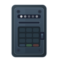 | 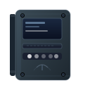 |
| `door_lock` | `card_reader` |

### HVAC & Climate
| | | | |
|:---:|:---:|:---:|:---:|
| 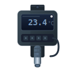 | 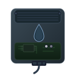 | 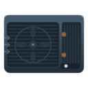 | 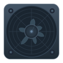 |
| `temperature_sensor` | `humidity_sensor` | `ac_unit` | `ventilation_fan` |
| 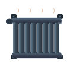 | 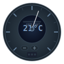 | 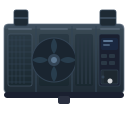 | |
| `radiator` | `thermostat` | `ahu` | |

### Safety & Fire
| | | | |
|:---:|:---:|:---:|:---:|
| 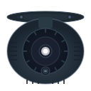 | 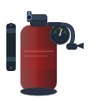 | 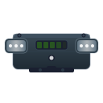 | 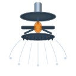 |
| `smoke_detector` | `fire_extinguisher` | `emergency_light` | `sprinkler` |
| 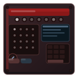 | 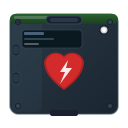 | | |
| `fire_alarm_panel` | `aed` | | |

### Electrical & Power
| | | | |
|:---:|:---:|:---:|:---:|
| 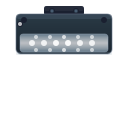 | 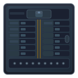 | 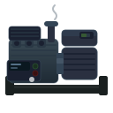 | 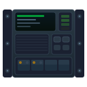 |
| `light_fixture` | `distribution_panel` | `emergency_generator` | `ups` |

### Plumbing
| | | |
|:---:|:---:|:---:|
| 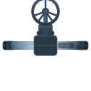 | 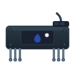 | 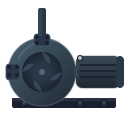 |
| `water_valve` | `water_leak_sensor` | `pump` |

### Monitoring & Sensors
| | | | |
|:---:|:---:|:---:|:---:|
|  | 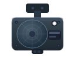 | 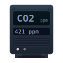 | 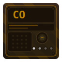 |
| `security_camera` | `motion_sensor` | `co2_sensor` | `co_sensor` |
| 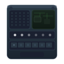 | 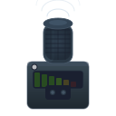 | 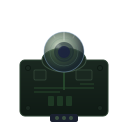 | 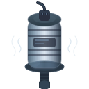 |
| `air_quality_sensor` | `noise_sensor` | `light_sensor` | `vibration_sensor` |
| 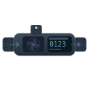 | 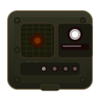 | 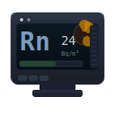 | 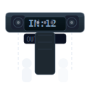 |
| `water_flow_meter` | `gas_leak_detector` | `radon_detector` | `occupancy_counter` |

### Network & IT
| | | | | |
|:---:|:---:|:---:|:---:|:---:|
| 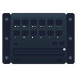 | 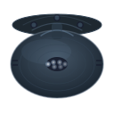 | 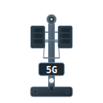 | 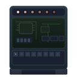 | 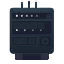 |
| `network_switch` | `wifi_access_point` | `base_station_5g` | `bms_controller` | `iot_gateway` |

### Vertical Transport
| | |
|:---:|:---:|
| 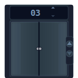 | 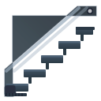 |
| `elevator` | `escalator` |

### Fixed Equipment
| | | | |
|:---:|:---:|:---:|:---:|
| 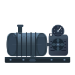 | 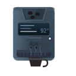 | 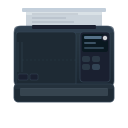 |  |
| `compressor` | `coffee_machine` | `printer` | `projector` |

### Special (Occupancy & Fallback)
| | | | |
|:---:|:---:|:---:|:---:|
|  |  |  | 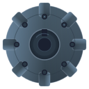 |
| `person` | `group` | `alien` | `generic` |
