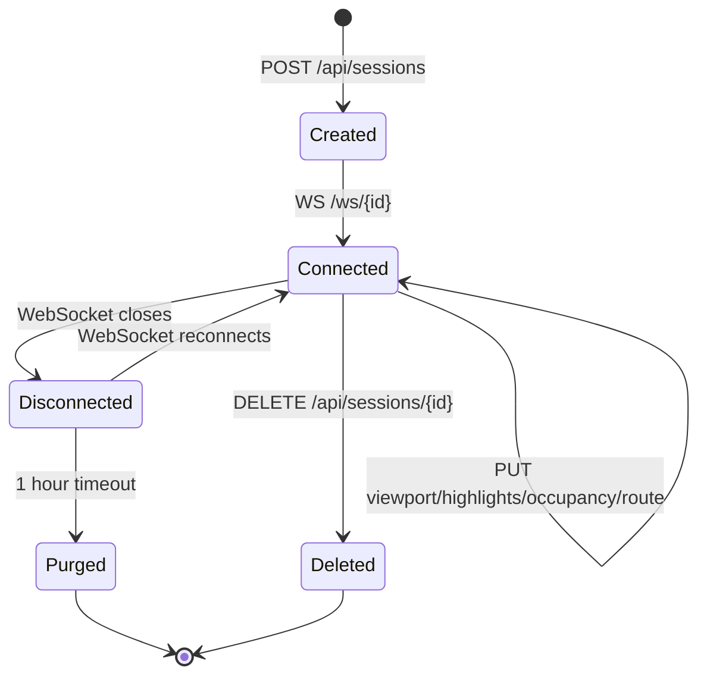
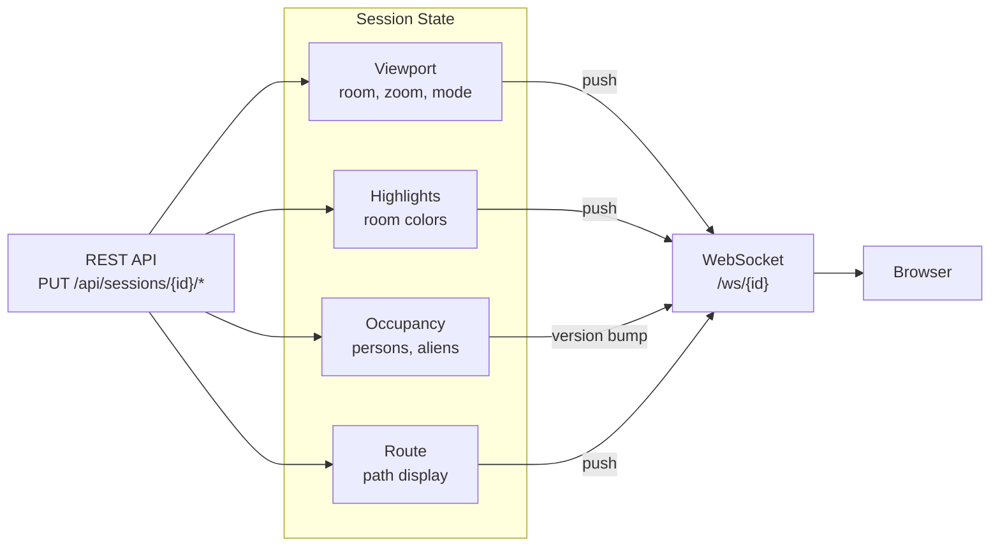

# Sessions API

Sessions control the browser viewer programmatically. A browser creates a session on load and subscribes via WebSocket. External clients can then modify the session state to control what the browser displays.





## Session Lifecycle

### Create Session

```
POST /api/sessions
```

```bash
curl -X POST http://localhost:9090/api/sessions
```

```json
{
  "id": "af6e90b8-bf72-4ecc-a35c-8d0c69c23515",
  "viewport": {"zoom": 1, "mode": "3d", "floor": "level0"},
  "highlights": [],
  "occupancy": {},
  "last_ws_active": "2026-04-11T12:00:00Z",
  "version": 0
}
```

### List Sessions

```
GET /api/sessions
```

Returns all active sessions. Useful for finding the browser's session ID.

```bash
# Find the most recently active session
curl -s http://localhost:9090/api/sessions | python3 -c "
import sys, json
sessions = json.load(sys.stdin)
sessions.sort(key=lambda s: s.get('last_ws_active', ''), reverse=True)
if sessions: print(sessions[0]['id'])
"
```

### Get Session

```
GET /api/sessions/{id}
```

```bash
curl http://localhost:9090/api/sessions/af6e90b8-bf72-4ecc-a35c-8d0c69c23515
```

### Delete Session

```
DELETE /api/sessions/{id}
```

```bash
curl -X DELETE http://localhost:9090/api/sessions/af6e90b8-bf72-4ecc-a35c-8d0c69c23515
```

Sessions are automatically purged after 1 hour of WebSocket inactivity.

---

## WebSocket

The browser subscribes to session state changes via WebSocket.

```
ws://localhost:9090/ws/{session_id}
```

### Server-to-Browser Messages

```json
{"type": "viewport", "data": {...}}
{"type": "highlights", "data": [...]}
{"type": "route", "data": {...}}
{"type": "occupancy", "version": 17}
{"type": "equipment", "version": 42}
```

- `viewport`, `highlights`, `route` -- full data pushed directly
- `occupancy`, `equipment` -- version number only; browser fetches latest via REST

---

## Viewport

Controls the camera position and zoom. Specify a room name to center on.

```
PUT /api/sessions/{id}/viewport
```

### Zoom to a Room (3D)

```bash
curl -X PUT http://localhost:9090/api/sessions/$SESSION/viewport \
  -H 'Content-Type: application/json' \
  -d '{
    "room": "A2306",
    "zoom": 2.0,
    "mode": "3d"
  }'
```

### Zoom to a Room (2D)

```bash
curl -X PUT http://localhost:9090/api/sessions/$SESSION/viewport \
  -H 'Content-Type: application/json' \
  -d '{
    "room": "1542",
    "zoom": 3.0,
    "mode": "2d",
    "floor": "level0"
  }'
```

### Viewport Object

| Field | Type | Description |
|-------|------|-------------|
| `room` | string | Room name to center on (e.g. `"A2306"`) |
| `zoom` | float | Zoom level (1.0 = default, higher = closer) |
| `mode` | string | `"2d"` or `"3d"` |
| `floor` | string | Floor to show in 2D mode (e.g. `"level0"`) |

The browser animates smoothly to the new viewport (1.5s ease-in-out-cubic).

---

## Room Highlights

Set colored highlights on rooms.

```
PUT /api/sessions/{id}/highlights
```

```bash
curl -X PUT http://localhost:9090/api/sessions/$SESSION/highlights \
  -H 'Content-Type: application/json' \
  -d '[
    {"room_id": 5, "color": "#ff0000", "opacity": 0.8},
    {"room_id": 10, "color": "#00ff00", "opacity": 0.5},
    {"room_id": 15, "color": "#ffaa00", "opacity": 0.6}
  ]'
```

### Highlight Object

| Field | Type | Description |
|-------|------|-------------|
| `room_id` | int | Room ID (from floor plan data) |
| `color` | string | Hex color (e.g. `"#ff0000"`) |
| `opacity` | float | 0.0 to 1.0 |

To clear highlights, send an empty array: `[]`

---

## Room Occupancy

Set persons and aliens in rooms. Uses version-based notification -- the browser receives a version bump and fetches the latest state.

```
PUT /api/sessions/{id}/occupancy
```

```bash
curl -X PUT http://localhost:9090/api/sessions/$SESSION/occupancy \
  -H 'Content-Type: application/json' \
  -d '{
    "5": {
      "persons": [
        {"id": "person-1", "name": "Johan"}
      ],
      "aliens": []
    },
    "10": {
      "persons": [
        {"id": "person-2", "name": "Alice"},
        {"id": "person-3", "name": "Bob"},
        {"id": "person-4", "name": "Charlie"}
      ],
      "aliens": []
    },
    "15": {
      "persons": [],
      "aliens": [
        {"id": "xeno-1"}
      ]
    }
  }'
```

The key is the room ID (as string). Icons displayed:

| Condition | Icon |
|-----------|------|
| 1 person | Single person icon |
| 2+ persons | Group icon with count |
| 1+ aliens | Xenomorph icon with count |
| Persons + aliens | Both icons side by side |

To clear occupancy, send `{}`.

---

## Route Display

Set a route to display on the map. This is for displaying a pre-computed route -- use the [Graph API](graph.md) to compute routes.

```
PUT /api/sessions/{id}/route
```

```bash
curl -X PUT http://localhost:9090/api/sessions/$SESSION/route \
  -H 'Content-Type: application/json' \
  -d '{
    "path": [
      {"room_id": 5, "name": "1542", "x": 117.5, "y": 424.6},
      {"room_id": 8, "name": "1544", "x": 110.0, "y": 415.0},
      {"room_id": 15, "name": "1550", "x": 130.0, "y": 400.0}
    ],
    "distance": 35.2
  }'
```

---

## Full Example: Control a Browser Session

```bash
BASE=localhost:9090

# Find the browser's session (most recently active)
SESSION=$(curl -s http://$BASE/api/sessions | python3 -c "
import sys, json
s = json.load(sys.stdin)
s.sort(key=lambda x: x.get('last_ws_active',''), reverse=True)
print(s[0]['id']) if s else print('')
")
echo "Session: $SESSION"

# Fly to room A2306 in 3D
curl -X PUT http://$BASE/api/sessions/$SESSION/viewport \
  -H 'Content-Type: application/json' \
  -d '{"room": "A2306", "zoom": 2.0, "mode": "3d"}'

# Highlight rooms
curl -X PUT http://$BASE/api/sessions/$SESSION/highlights \
  -H 'Content-Type: application/json' \
  -d '[{"room_id": 5, "color": "#ff0000", "opacity": 0.8}]'

# Place people and an alien
curl -X PUT http://$BASE/api/sessions/$SESSION/occupancy \
  -H 'Content-Type: application/json' \
  -d '{"5": {"persons": [{"id": "p1", "name": "Johan"}], "aliens": [{"id": "x1"}]}}'

# Clean up
curl -X PUT http://$BASE/api/sessions/$SESSION/highlights \
  -H 'Content-Type: application/json' -d '[]'
curl -X PUT http://$BASE/api/sessions/$SESSION/occupancy \
  -H 'Content-Type: application/json' -d '{}'
```
