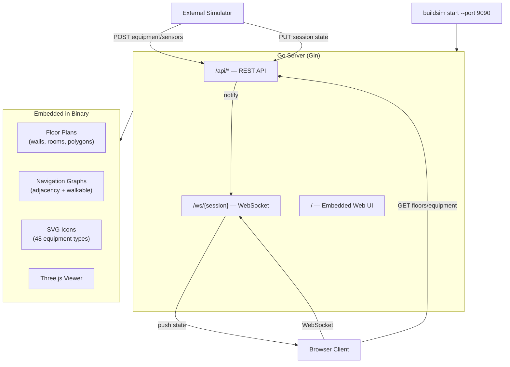
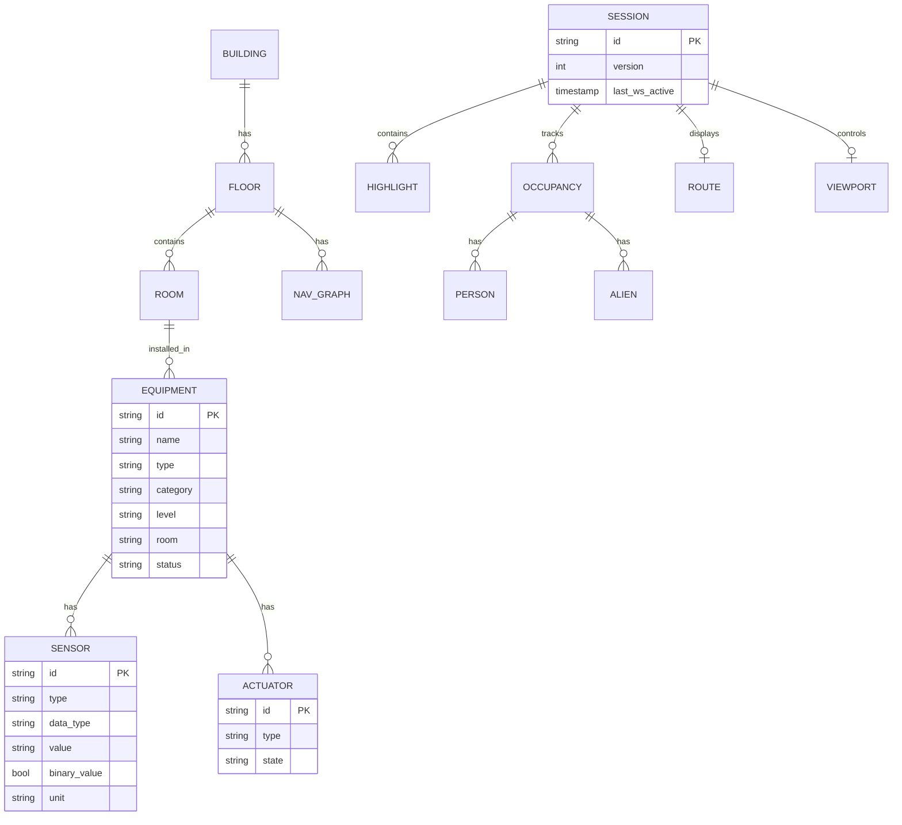
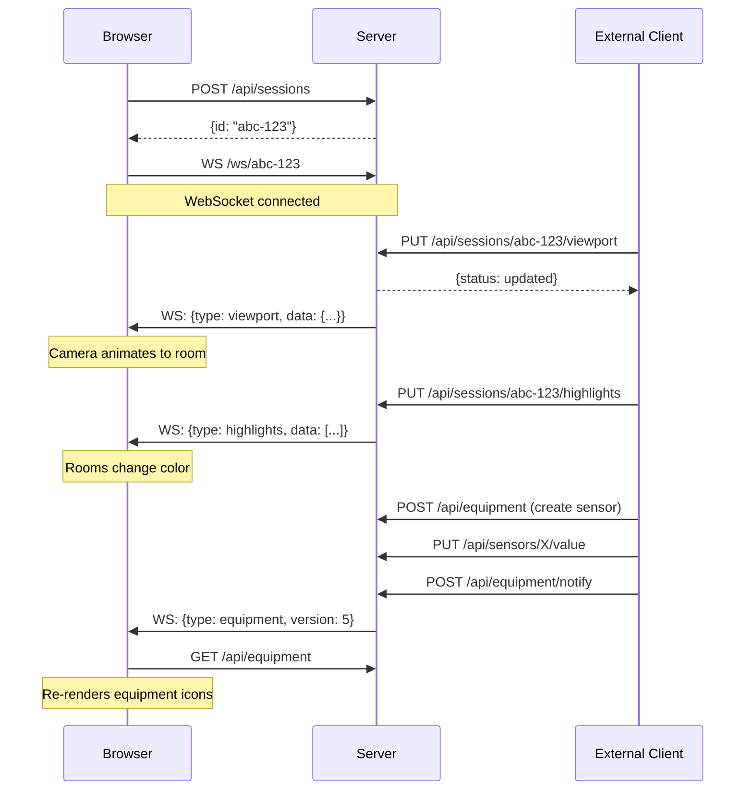
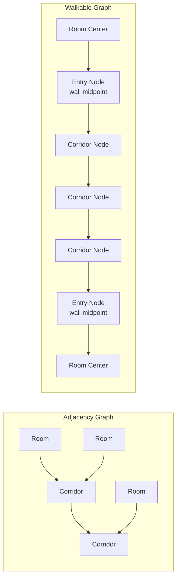
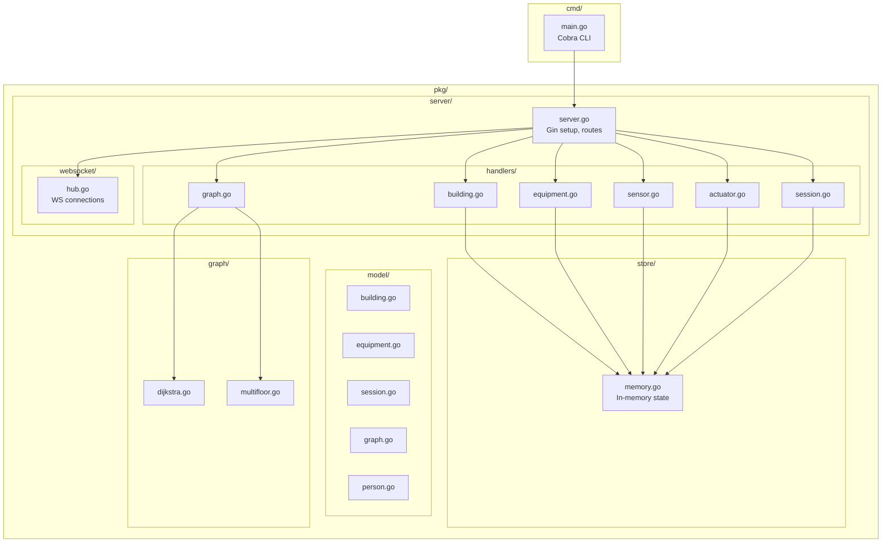

# Architecture

## System Overview

```mermaid
graph TB
    CLI["buildsim start --port 9090"]
    CLI --> Server

    subgraph Server["Go Server (Gin)"]
        API["/api/* — REST API"]
        WS["/ws/{session} — WebSocket"]
        Static["/ — Embedded Web UI"]
    end

    subgraph Embedded["Embedded in Binary"]
        FP["Floor Plans<br/>(walls, rooms, polygons)"]
        NG["Navigation Graphs<br/>(adjacency + walkable)"]
        Icons["SVG Icons<br/>(48 equipment types)"]
        WebUI["Three.js Viewer"]
    end

    Server --> Embedded

    Browser["Browser Client"]
    Simulator["External Simulator"]

    Browser -- "WebSocket" --> WS
    Browser -- "GET floors/equipment" --> API
    Simulator -- "POST equipment/sensors" --> API
    Simulator -- "PUT session state" --> API
    API -- "notify" --> WS
    WS -- "push state" --> Browser
```

## Data Model

```mermaid
erDiagram
    BUILDING ||--o{ FLOOR : has
    FLOOR ||--o{ ROOM : contains
    FLOOR ||--o{ NAV_GRAPH : has
    ROOM ||--o{ EQUIPMENT : installed_in

    EQUIPMENT ||--o{ SENSOR : has
    EQUIPMENT ||--o{ ACTUATOR : has

    SESSION ||--o{ HIGHLIGHT : contains
    SESSION ||--o{ OCCUPANCY : tracks
    SESSION ||--o| ROUTE : displays
    SESSION ||--o| VIEWPORT : controls

    OCCUPANCY ||--o{ PERSON : has
    OCCUPANCY ||--o{ ALIEN : has

    EQUIPMENT {
        string id PK
        string name
        string type
        string category
        string level
        string room
        string status
    }

    SENSOR {
        string id PK
        string type
        string data_type
        string value
        bool binary_value
        string unit
    }

    ACTUATOR {
        string id PK
        string type
        string state
    }

    SESSION {
        string id PK
        int version
        timestamp last_ws_active
    }
```

## Session Control Flow

```mermaid
sequenceDiagram
    participant B as Browser
    participant S as Server
    participant E as External Client

    B->>S: POST /api/sessions
    S-->>B: {id: "abc-123"}
    B->>S: WS /ws/abc-123
    Note over B,S: WebSocket connected

    E->>S: PUT /api/sessions/abc-123/viewport
    S-->>E: {status: updated}
    S->>B: WS: {type: viewport, data: {...}}
    Note over B: Camera animates to room

    E->>S: PUT /api/sessions/abc-123/highlights
    S->>B: WS: {type: highlights, data: [...]}
    Note over B: Rooms change color

    E->>S: POST /api/equipment (create sensor)
    E->>S: PUT /api/sensors/X/value
    E->>S: POST /api/equipment/notify
    S->>B: WS: {type: equipment, version: 5}
    B->>S: GET /api/equipment
    Note over B: Re-renders equipment icons
```

## Navigation Graphs

```mermaid
graph LR
    subgraph Adjacency["Adjacency Graph"]
        R1[Room] --> C1[Corridor]
        R2[Room] --> C1
        C1 --> C2[Corridor]
        R3[Room] --> C2
    end

    subgraph Walkable["Walkable Graph"]
        RM1[Room Center] --> E1[Entry Node<br/>wall midpoint]
        E1 --> CN1[Corridor Node]
        CN1 --> CN2[Corridor Node]
        CN2 --> CN3[Corridor Node]
        CN3 --> E2[Entry Node<br/>wall midpoint]
        E2 --> RM2[Room Center]
    end
```

## Project Structure

```mermaid
graph TB
    subgraph "cmd/"
        main["main.go<br/>Cobra CLI"]
    end

    subgraph "pkg/"
        subgraph "server/"
            srv["server.go<br/>Gin setup, routes"]
            subgraph "handlers/"
                bh["building.go"]
                eh["equipment.go"]
                sh["sensor.go"]
                ah["actuator.go"]
                ssh["session.go"]
                gh["graph.go"]
            end
            subgraph "websocket/"
                hub["hub.go<br/>WS connections"]
            end
        end
        subgraph "model/"
            mb["building.go"]
            me["equipment.go"]
            ms["session.go"]
            mg["graph.go"]
            mp["person.go"]
        end
        subgraph "store/"
            mem["memory.go<br/>In-memory state"]
        end
        subgraph "graph/"
            dj["dijkstra.go"]
            mf["multifloor.go"]
        end
    end

    main --> srv
    srv --> hub
    srv --> bh & eh & sh & ah & ssh & gh
    bh & eh & sh & ah & ssh --> mem
    gh --> dj
    gh --> mf
```
