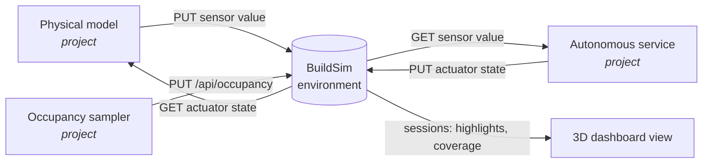

# BuildSim for the D7065E Lab, a Quickstart

This maps the lab architecture, the environment, sensors, autonomous service, actuators,
occupancy, and dashboard, onto concrete BuildSim endpoints. It is the bridge between the
[lab assignment](../../lab-assignment/) and the [API reference](README.md); read it before
wiring the first component.

## The mental model

BuildSim **is the environment**. It holds the shared building state, rooms, equipment,
current sensor values, current actuator states, and occupancy, and renders the 3D view.
BuildSim does **not** simulate physics, generate occupancy, or keep a history; those are
provided by the project. Everything the project builds wraps around BuildSim as a control
loop:



The loop closes because the physical model reads back the actuator states BuildSim holds, so
a ventilation command actually changes the next CO₂ reading. Without that read-back the
control loop is open and the evaluation means nothing.

## Endpoint map (lab concept → API)

| Lab concept | BuildSim endpoint | Direction |
|---|---|---|
| Register a device in a room | `POST /api/equipment` (or `/bulk`) | project → BuildSim |
| Attach a sensor / actuator | `POST /api/equipment/{id}/sensors` / `.../actuators` | project → BuildSim |
| **Sensor publishes a reading** | `PUT /api/sensors/{id}/value` | project → BuildSim |
| **Read current sensor values** | `GET /api/equipment/{id}` (read its `sensors[]`) | BuildSim → project |
| **Actuator writes to the environment** | `PUT /api/actuators/{id}/state` | project → BuildSim |
| **Read actuator state (physics feedback)** | `GET /api/equipment/{id}` (read its `actuators[]`) | BuildSim → project |
| Occupancy (density sampler output) | `PUT /api/occupancy` | project → BuildSim |
| People-movement routing (optional) | `GET /api/graph/route?from=&to=&level=` | BuildSim → project |
| Dashboard overlay | `PUT /api/sessions/{id}/highlights`, `/coverage`, `/viewport` | project → BuildSim → browser |

Full request/response details for each are in [equipment.md](api/equipment.md),
[sessions.md](api/sessions.md), and [graph.md](api/graph.md).

## Step 1: one server per team

BuildSim is a single Go binary with **in-memory** runtime state (equipment, sensors,
occupancy reset on restart; the building floor plan is read-only and always present).

```bash
go build -o buildsim ./cmd
./buildsim start --port 9090
```

Each team runs its own instance; there is no authentication or tenancy, so a shared server
means a shared namespace. Keep a seed script (see `examples/api/scenario/populate_building.py`)
and re-run it after each restart.

## Step 2: register equipment, sensors, actuators

One `POST /api/equipment/bulk` can set up a room. Sensor values are **text** (see the
conventions below), so a temperature reading is `"21.5"`, not `21.5`.

```bash
curl -X POST http://localhost:9090/api/equipment/bulk -H 'Content-Type: application/json' -d '[
  {
    "id": "hvac-A109", "name": "HVAC A109", "type": "ac_unit", "category": "hvac",
    "level": "level0", "room": "A109", "status": "running",
    "sensors": [
      {"id": "A109-temp", "name": "Temperature", "type": "temperature", "data_type": "text", "unit": "°C",  "value": "21.0"},
      {"id": "A109-co2",  "name": "CO2",         "type": "co2",         "data_type": "text", "unit": "ppm", "value": "650"}
    ],
    "actuators": [
      {"id": "A109-setpoint", "name": "Heating setpoint", "type": "setpoint",    "state": "21"},
      {"id": "A109-damper",   "name": "Ventilation damper", "type": "fan_speed", "state": "0"}
    ]
  }
]'
```

## Step 3: the simulation loop

Two processes run against BuildSim. Pseudocode:

```
# Physical model (one tick)
occ   = GET /api/occupancy                       # how many people per room
state = GET /api/equipment/A109-...              # current actuator states
co2   = step_co2(co2, people=occ, vent=damper)   # actuator feeds back into physics
temp  = step_temp(temp, hvac=setpoint, ...)
PUT /api/sensors/A109-co2/value   {"data_type":"text","value": str(co2)}
PUT /api/sensors/A109-temp/value  {"data_type":"text","value": str(temp)}

# Autonomous service (one decision)
temp, co2 = read sensors via GET /api/equipment/hvac-A109
damper, setpoint = decide(temp, co2, occ)
PUT /api/actuators/A109-damper/state   {"state": str(damper)}
PUT /api/actuators/A109-setpoint/state {"state": str(setpoint)}
```

There is no `GET /api/sensors/{id}`; a sensor value is read by fetching its parent equipment
and reading the `sensors[]` array.

## Step 4: occupancy (mind the room identifier)

`PUT /api/occupancy` takes a map keyed by **integer room id**:

```bash
curl -X PUT http://localhost:9090/api/occupancy -H 'Content-Type: application/json' -d '{
  "12": {"persons": [{"id": "p1", "name": "Alice"}, {"id": "p2", "name": "Bob"}]}
}'
```

The integer id is **not** the room name. Equipment is placed by room **name** (`"A109"`),
but occupancy and dashboard highlights use the room's integer **id**. Build the mapping once
from the floor data:

```python
import requests
rooms = requests.get("http://localhost:9090/api/building/floors/level0").json()["rooms"]
name_to_id = {r["name"]: r["id"] for r in rooms}   # {"A109": 12, ...}
```

Routing for the optional navgraph-based movement uses the same integer ids:
`GET /api/graph/route?from=12&to=40&level=level0`.

## Step 5: the dashboard is mostly already built

The 3D viewer is driven through a session. Open the viewer in a browser, find the session id
via `GET /api/sessions`, then push overlays:

```bash
# colour rooms by CO2 status (room_id is the integer id from step 4)
curl -X PUT http://localhost:9090/api/sessions/{sid}/highlights -H 'Content-Type: application/json' -d '[
  {"room_id": 12, "color": "#e53935", "opacity": 0.5}
]'
```

Highlights, coverage zones, viewport, and occupancy all render live over WebSocket, so the
dashboard requirement is largely a matter of mapping state to colours rather than building a
viewer from scratch.

## Conventions and gotchas

- **Numbers are text.** A sensor `value` is a string and an actuator `state` is a string.
  Store `"820"`, parse on read. `data_type` is `"text"` or `"binary"` (binary uses
  `binary_value`, not `value`).
- **Two room identifiers.** `equipment.room` is the room **name** string; occupancy and
  highlights use the integer room **id**. Map between them with
  `GET /api/building/floors/{level}` (Step 4).
- **Notify refreshes the viewer.** After writing values, `POST /api/equipment/notify` bumps
  the version so the browser redraws. The value is stored either way; notify is only for the
  3D view, so it can be skipped in a tight control loop and sent periodically instead.
- **No history, no persistence.** BuildSim keeps only the current value per sensor. The
  project owns the time-series storage, and runtime state is lost on restart.
- **No physics, no occupancy generation.** BuildSim stores and displays; the project provides
  the physical model and the occupancy sampler. That is the core of the assignment.

## How this lands in the report

In the C4 diagrams, **BuildSim is an external system** (a dashed box in the context diagram).
The sensor services, autonomous service, actuators, data pipeline, and dashboard back-end are
the project's own containers; the arrows to BuildSim are exactly the endpoints in the map above.
