# Introduction and Model-Based Systems Engineering

Standalone notes for the first chapter of D7065E.

---

## Part 1 — Embedded Intelligence at the Edge

<figure class="diagram">
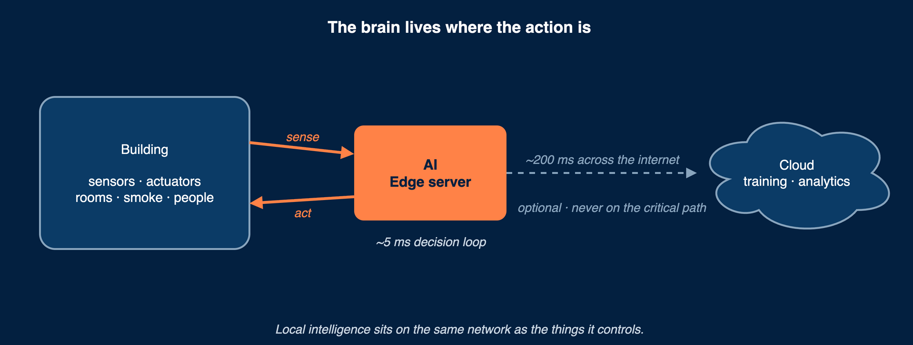
<figcaption><em>Local intelligence sits on the same network as the sensors and actuators it controls. The cloud helps with slow tasks, but the critical loop never depends on it.</em></figcaption>
</figure>

A modern building, a modern car, a modern factory — none of these are simple machines anymore. Each contains hundreds of sensors and actuators, and a continuous stream of small decisions is needed to keep it running safely, efficiently, and comfortably. The branch of computer science that deals with making those decisions on the same network as the physical system, rather than in a remote data centre far away, is called **embedded intelligence at the edge**.

The phrase has two halves worth unpacking.

**Embedded** means the software lives inside or right next to the physical system it controls. The control logic of a car's anti-lock brakes lives in the car. The thermostat's brain lives in the thermostat itself. There is no question of phoning home to ask permission. The software is part of the thing.

**At the edge** means on the local network — close to the sensors and the actuators — not in the cloud. A useful image: the difference between a self-driving car that can stop itself when something runs into the road, and one that has to ask a server in another country whether to brake. The first one is safe. The second one is a horror film waiting to happen.

Two ideas follow naturally. First, decisions happen fast and locally, in milliseconds, because the physical world cannot wait for a round trip across the internet. Second, the system keeps working when the wider network does not. If the building's broadband line is cut during a storm, the fire detector still detects fires.

The course's running project, autonomous building control, makes both points concrete. A simulated building called BuildSim provides rooms, sensors, and actuators. The job is to instrument that building with software that observes its state, decides what to do, and changes the state — all running on the same network as the building itself, without depending on any cloud service to make the decisions. Cloud services can help with slow tasks, like overnight model training, but they are never on the critical path.

Before any code is written, a discipline called Model-Based Systems Engineering is applied: the system is fully specified using structured diagrams and tables. The specification is reviewed and approved at week three. The approved design becomes the basis for both implementation and the final oral examination.

---

## Part 2 — A Building as a Cyber-Physical System

<figure class="diagram">
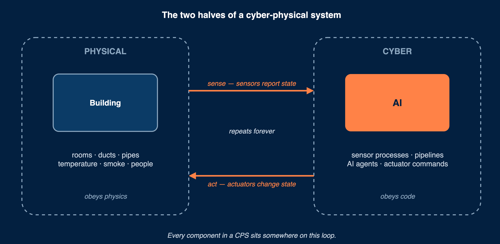
<figcaption><em>A continuous feedback loop joins the world the system lives in to the software that observes and changes it. Every component in a CPS sits somewhere on this loop.</em></figcaption>
</figure>

### The two halves of a CPS

A **cyber-physical system**, abbreviated CPS, is a system where computation and physical processes are tightly intertwined. Two halves live side by side and communicate forever.

The **physical half** is everything you can touch. In a building, that means rooms, walls, doors, HVAC ducts, ventilation fans, smoke and air, temperature gradients, water pipes, electrical loads, and the people walking around inside. Physical state evolves according to the laws of physics and the patterns of human behaviour. The temperature in a room does not stop changing just because no computer is watching.

The **cyber half** is the software. Sensor processes that read the physical state and report it. Data pipelines that store the readings. AI agents that reason about what should happen next. Actuator processes that issue commands. The cyber half is fast and flexible but has no direct access to physics — it only knows what sensors report, and it only acts through what actuators can do.

An analogy: the physical half is the room, the cyber half is the brain. The brain cannot feel the temperature directly. It can only ask the thermometer (a sensor) what the temperature is, and it can only warm the room by telling the heater (an actuator) to turn on. Everything in between is just words and electricity.

### The continuous feedback loop

A CPS is defined by the loop that joins the two halves. The cycle runs forever, and every component sits somewhere on it.

<figure class="diagram">
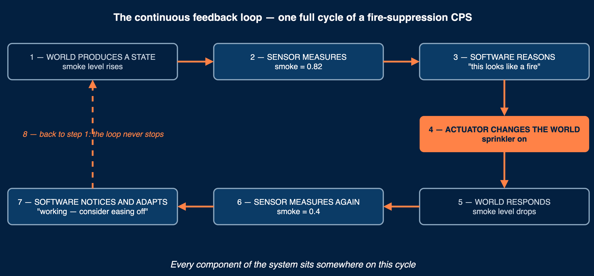
<figcaption><em>One full cycle of a fire-suppression CPS: the world produces a state, a sensor measures it, software reasons and acts, and the world responds — then the loop starts again.</em></figcaption>
</figure>

Riding a bicycle is the simplest everyday version of this loop. You sense your balance (eyes and inner ear are the sensors). You decide whether you're leaning too far left or right (the brain is the reasoner). You correct (your muscles are the actuators). And your balance changes — the world responds. The loop runs many times per second, automatically, and if any part of it breaks, you fall over.

A CPS is a bicycle for an entire building. The loop has to be fast enough that the physics can't run away (a fire-suppression loop in well under a second, a climate-control loop comfortable with one update every few minutes). It has to be reliable enough to keep working when a sensor crashes, a network drops, or a model gives the wrong answer. And it has to be correct enough that a wrong decision does not start a fire, lock people in during an emergency, or freeze a server room.

### Automation versus autonomy

A grandfather clock is automated. Every hour, it strikes the hour. It follows a fixed rule that was wound up once and changes nothing. Automation is predictable and easy to verify but brittle — the rule has to anticipate every situation, and any situation it didn't anticipate becomes a bug.

A modern smart thermostat is autonomous. It knows that the building is empty on Sunday morning, that the weather forecast is mild, that the family is on holiday. It predicts that nobody will want a warm room for the next eight hours. It learns from history. It adapts as patterns change.

The difference is bigger than it sounds. Two ways to think about it:

| Automation | Autonomy |
|---|---|
| `if temp < 20°C: turn on heater` | "It's 9 a.m. on a Tuesday, the office will fill in 30 minutes, outdoor temp is dropping, pre-heat now so the room reaches 22°C by then." |
| One rule, fixed forever | Many models, adapting over time |
| Predictable but brittle | Smarter but less predictable |

Real-world autonomous building systems include Johnson Controls' OpenBlue, Siemens Desigo CC, and the cooling controller that DeepMind built for Google's data centres — which reduced cooling-energy consumption by about 40 percent by reasoning over far more variables than a rule-based controller can hold.

The course's autonomous building control project asks for the autonomous version, not the automated one. Threshold rules ("if smoke > 0.7, alarm") are not sufficient. A real ML model or LLM reasoning step is required.

---

## Part 3 — Specification Before Code: Model-Based Systems Engineering

<figure class="diagram">
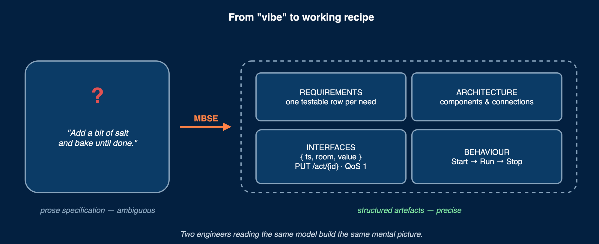
<figcaption><em>MBSE replaces ambiguous documents with structured, precise models. Two engineers reading the same model build the same mental picture.</em></figcaption>
</figure>

### Why prose breaks down

The default way to design software is to write a Word document describing what should be built, hand it to the developers, and hope they get the same picture from it.

This almost always fails. Prose is ambiguous, and the ambiguity is invisible until somebody tries to act on the document. Two engineers reading the same paragraph form different mental pictures. The product manager imagined a database; the developer built a spreadsheet. The architect assumed the broker held messages for a minute; the operations engineer configured it to drop them after a second. Three weeks into implementation, somebody discovers a contradiction. Six weeks in, the design and the code have parted ways completely.

Picture this: writing prose specifications is like cooking from a recipe that says "add a bit of salt and bake until done." Five cooks following this recipe produce five different dishes. The recipe didn't capture the actual instructions; it captured a vibe.

A working recipe says: "1.5 teaspoons of salt, bake at 180°C for 35 minutes." Five cooks following this recipe produce the same dish. The difference between a vibe and a working recipe is precision.

### What MBSE is

**Model-Based Systems Engineering**, abbreviated MBSE, replaces prose documents with structured, precise models of the system. A model is unambiguous — either it specifies a thing or it doesn't. Two engineers reading the same model build the same mental picture.

The models are not single documents but a small collection of structured artefacts:

- A **requirements table** listing every requirement with a unique ID, a type, a priority, and an acceptance criterion.
- An **architecture diagram** with labelled boxes for every component and labelled arrows for every connection.
- **Interface specifications** — JSON schemas for every message, REST endpoints with request and response shapes, MQTT topic names and payload formats.
- **Behaviour models** — sequence diagrams showing message exchanges over time, state machine diagrams showing what each component does in each state.
- A **validation matrix** linking each requirement to the test that proves it works.

A useful image: an architect designing a house doesn't write a 200-page essay about the house. They draw blueprints. The blueprints have measurements, labels, and conventions that any contractor in the world can read the same way. MBSE applies the same idea to software systems.

### Why this matters more for CPS

Two engineers building a typical web application can sometimes get away with ambiguity, because the consequences of a misunderstanding are usually a wrong-looking page that gets fixed in the next sprint.

A cyber-physical system is different. The interactions between physical processes and software components are complex, timing-sensitive, and have safety consequences. A sequence diagram showing a smoke sensor publishing a reading, a data pipeline storing it, an anomaly model evaluating it, and a safety agent commanding a sprinkler makes the design concrete in a way that no paragraph can. A state diagram of the sensor process specifies exactly what happens when the network drops and what happens when it recovers. These artefacts catch bugs that prose hides.

### The MBSE process

The work flows through six activities. They are not strictly sequential — work loops back as understanding deepens — but they are ordered in importance and dependence.

**Requirements analysis.** Write down what the system must do as testable statements, each with a unique ID. Three kinds appear: **functional** ("detect fire conditions within 30 seconds"), **non-functional** ("survive a sensor-process crash without losing data"), and **regulatory** ("comply with Swedish BBR fire protection requirements"). Think of it this way: requirements are the customer's wishlist, formalised so it cannot be misread. "Make the cake delicious" is not a requirement. "The cake must be 30 cm in diameter, contain no peanuts, and be ready by 6 p.m." is.

**Functional decomposition.** Take each high-level requirement and break it into the smaller operations needed to satisfy it. "Detect fire" decomposes into collecting smoke and temperature readings, validating them, applying a detection model, raising an alert, commanding sprinklers, and notifying occupants. A useful image: decomposing a recipe. "Make a cake" decomposes into "measure flour, beat eggs, mix, pour into tin, bake at 180°C for 35 minutes, cool, frost." Each step is small enough to assign to a worker.

**Architecture design.** Decide what software components exist, how they're organised, and where they run. A component diagram shows the parts. A deployment view shows which machine each part lives on. An analogy: the floor plan of a house. Walls, rooms, doors — but no furniture yet.

**Interface design.** Specify exactly how components talk to each other. The REST endpoint URL and the request and response shapes. The MQTT topic name and the payload format. The protocol, the message size, the rate. Ambiguity here is the most expensive kind. Two components that look connected on the diagram but disagree about the message format will work in isolation and fail when they meet. Picture this: a power plug and a wall socket. If the prongs don't match the holes, the lamp doesn't light. Better to discover that mismatch on paper than on the day the lamp is supposed to ship.

**Behaviour modeling.** Capture how the system acts over time. A **sequence diagram** is a comic strip with software components as the characters — it shows one specific scenario, with messages going back and forth in order. A **state machine** is a map of the moods a component can be in — `Starting`, `Running`, `Reconnecting`, `Stopped` — and the events that flip it between them. Both are precise; both expose timing bugs that static diagrams hide.

**Validation.** Close the loop by linking every requirement to a design element that satisfies it and a test case that verifies it. If a requirement has no owning component, the design has a gap. If it has no test, the requirement cannot be enforced. A useful image: tasting the soup before serving. Recipes that produce dishes nobody tests are recipes that produce surprises.

### Why design happens before code

Errors discovered during design cost minutes. Errors discovered during implementation cost days. Errors discovered after deployment cost weeks, or — in safety-critical systems — lives.

The cost curve is steep, and the MBSE process catches as many errors as possible while they are still cheap.

A second reason has emerged more recently. When code is generated with AI tools, the quality of the output is bounded by the quality of the input. A vague prompt produces clean-looking code that satisfies the prompt but not the underlying problem. A precise specification produces working code that solves the actual problem. The specification is also the test contract — the same artefact that describes the system also describes how to know whether it was built correctly.

Think of it this way: imagine asking a contractor to "build me a house." You will get a house, technically. It will not be the house you wanted. Now imagine handing the contractor a complete set of blueprints with measurements, materials, and electrical layout. You will get the house you wanted. The contractor is talented in both cases. The difference is the contract.

---

## Part 4 — Architecture Viewpoints

<figure class="diagram">
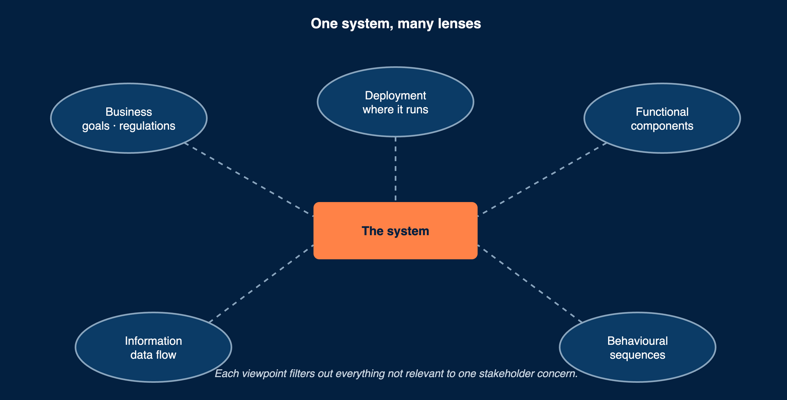
<figcaption><em>Different stakeholders need different views — no single diagram serves them all. Each viewpoint filters out everything not relevant to one specific concern.</em></figcaption>
</figure>

### Why one diagram is never enough

A single diagram cannot serve every audience. A developer writing code needs to see software components. An operator deploying the system needs to see machines and networks. A safety engineer needs to see failure modes. A building manager needs to see which components are responsible for regulatory compliance.

If one diagram tries to show everything at once, it becomes unreadable — a bowl of spaghetti with too many arrows. If it focuses on one perspective, it hides everything else. The solution is multiple diagrams, each tailored to one specific concern.

A useful image: a house seen by different people. The future home-owner needs a floor plan to imagine living there. The electrician needs a wiring diagram. The plumber needs a pipe diagram. The structural engineer needs a load-bearing-walls diagram. All four describe the same house, but each one filters out everything that doesn't matter for that audience. Trying to draw all four on one sheet of paper produces a mess.

The same idea applied to software systems is called **architecture viewpoints**. The concept is formalised in the international standard IEEE 42010, in Kruchten's influential 4+1 View Model (1995), and in enterprise frameworks like ArchiMate.

### What a viewpoint actually is

A **viewpoint** is a way of looking at the system that filters out everything not relevant to one stakeholder concern. Each viewpoint is a lens. Each catches design errors the others miss.

An analogy: a subway map and a street map of the same city. The subway map shows lines and stops — everything else is suppressed. The street map shows streets and addresses — the subway is barely visible. Both are correct. Neither one is enough on its own. A tourist needs both.

### ArchiMate's three layers

The ArchiMate framework organises architecture across three layers. Each layer answers a different stakeholder question.

| Layer | Concern | Building control examples |
|---|---|---|
| Business | Processes, actors, goals, regulations | The building manager monitors safety; the building must comply with BBR fire code |
| Application | Software components, data flows, interfaces | An AI agent, an anomaly detector, a data pipeline, the BuildSim API client |
| Technology | Infrastructure, devices, containers, networks | Docker containers on an edge server, a GPU server, an MQTT broker, a TimescaleDB instance |

The same system can be described at all three layers, and each description is useful to a different audience. A senior manager cares about the business layer. A developer cares about the application layer. A site reliability engineer cares about the technology layer.

### The five required viewpoints for a CPS architecture document

A complete architecture description for a building control system contains five viewpoints. Each answers a different question.

| Viewpoint | Question it answers | What it shows |
|---|---|---|
| Context | What interacts with the system? | The system as a single box, with users and external systems around it |
| Functional | What are the parts, and how do they connect? | All components inside, with their interfaces |
| Information | What data exists, and how does it flow? | Data models, storage, transformations |
| Behavioral | What happens when a specific event occurs? | The sequence of messages for one scenario |
| Deployment | What runs where? | Containers, hardware, network topology |

Each viewpoint is the lens that catches a different kind of mistake. A correct functional view can hide a broken deployment view — two components that look connected on paper might actually require a network link that does not exist. A clean data flow can mask a behavioural problem — a sequence diagram of a specific scenario can reveal a timing issue that no static diagram exposes. A complete business view can expose a compliance requirement that no component has been assigned to satisfy.

Picture this: five different home inspections of the same house. The structural inspector checks the foundation. The electrical inspector checks the wiring. The plumbing inspector checks the pipes. The roof inspector checks for leaks. The pest inspector checks for termites. Each one is looking for something different. Skipping any of them means certain defects will only be discovered after you move in.

---

## Part 5 — Modeling Notations

<figure class="diagram">
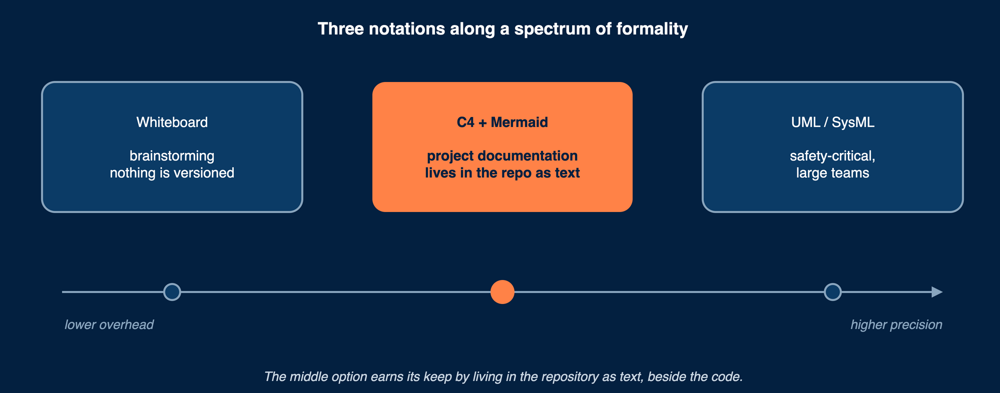
<figcaption><em>Three notations along a spectrum from informal to industrial. C4 with Mermaid is the chosen middle ground — enough precision to be useful, light enough to stay in version control.</em></figcaption>
</figure>

Picking the right notation is partly about precision and partly about overhead. Different tools sit at different points on that trade-off.

### Whiteboard sketches

A pen on a whiteboard is the right tool for early brainstorming. No formalism, no syntax to check, no learning curve. The trade-off is zero precision and zero versioning. Sketches are excellent for thinking; they are inadequate as the final architecture document.

A useful image: a napkin sketch over coffee captures an idea. It does not survive being passed across the office.

### UML and SysML

The **Unified Modeling Language**, abbreviated UML, has been the industry standard for modelling software systems since the late 1990s. It defines fourteen diagram types: class diagrams, sequence diagrams, state machine diagrams, activity diagrams, deployment diagrams, and many more.

**SysML** extends UML with diagrams for systems engineering — requirements traceability, physical constraints, hardware-software integration. UML and SysML are used in aerospace, defence, and automotive industries with heavyweight tools like Cameo Systems Modeler and Eclipse Papyrus.

Both have a steep learning curve and heavy tooling. For a small team working over a few weeks, the formalism adds more overhead than value. The strengths of UML and SysML — strict typing, simulation, automated code generation — pay off for a 200-engineer Airbus programme, not for a course project.

Think of it this way: UML is an industrial CNC machine. SysML is a CNC machine with extra accessories. Both are remarkable. Neither is what you want for a weekend furniture project, where a screwdriver and a level get the job done.

### The C4 model

The **C4 model** was proposed by Simon Brown specifically because UML felt too complex for most teams. C4 has exactly four levels of abstraction.

| Level | What it shows |
|---|---|
| 1. Context | The system as a single box surrounded by users and external systems |
| 2. Containers | The deployable units inside (processes, Docker containers, databases) |
| 3. Components | The internal structure of one container |
| 4. Code | Class-level detail (rarely drawn manually) |

C4 is technology-agnostic and focuses on structure and relationships. Levels 1 and 2 are sufficient for most software projects. Level 3 is useful when one container is complex enough to warrant its own diagram, such as an AI agent with multiple internal subsystems.

A useful image: C4 is Google Maps. Zoom out to see the country (Context). Zoom in to see the city (Containers). Zoom in further to see the streets (Components). Zoom all the way in to see individual buildings (Code). Same map, four levels of detail, each appropriate to a different question.

### Diagramming tools

The recommended diagramming tool for this course is **Mermaid**. Diagrams are written as plain text inside Markdown files, versioned with git alongside the code, and render automatically when the Markdown is viewed on GitHub.

The biggest advantage of Mermaid is that the diagrams live in the same repository as the code, get reviewed in the same pull requests, and stay synchronised with the system. A diagram pasted as a PNG into a Word document drifts out of sync within a week.

An analogy: a recipe taped to the inside of the kitchen cupboard, edited as the cook refines the recipe. The dish stays the recipe. The recipe stays the dish.

Other tools have specific niches. **draw.io** is open and free for more complex visual layouts. **Excalidraw** produces hand-drawn-looking diagrams useful for sketches and brainstorming. Neither matches Mermaid's advantage of living inside the repository as text.

### Comparing the choices

| Aspect | Whiteboard | C4 + Mermaid | UML / SysML |
|---|---|---|---|
| Learning curve | None | About an hour | Days to weeks |
| Precision | Low | Medium | High |
| Tooling | Pen | Markdown editor | Cameo, Papyrus |
| Best for | Brainstorming | Project documentation | Safety-critical, large teams |

For this course, C4 with Mermaid is the chosen middle ground.

---

## Part 6 — The Five Viewpoints in Practice

<figure class="diagram">
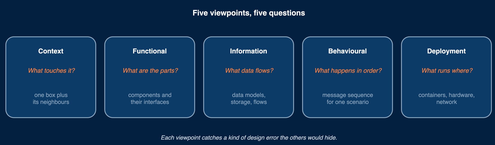
<figcaption><em>Each viewpoint asks a different question — and each catches a kind of design error the others would hide.</em></figcaption>
</figure>

Each viewpoint introduced in Part 4 looks like something specific when drawn. The following examples apply each viewpoint to building control.

### Context view (C4 Level 1)

The context diagram shows the entire system as a single box, surrounded by every person and every external system it interacts with. Nothing internal is shown.

<figure class="diagram">
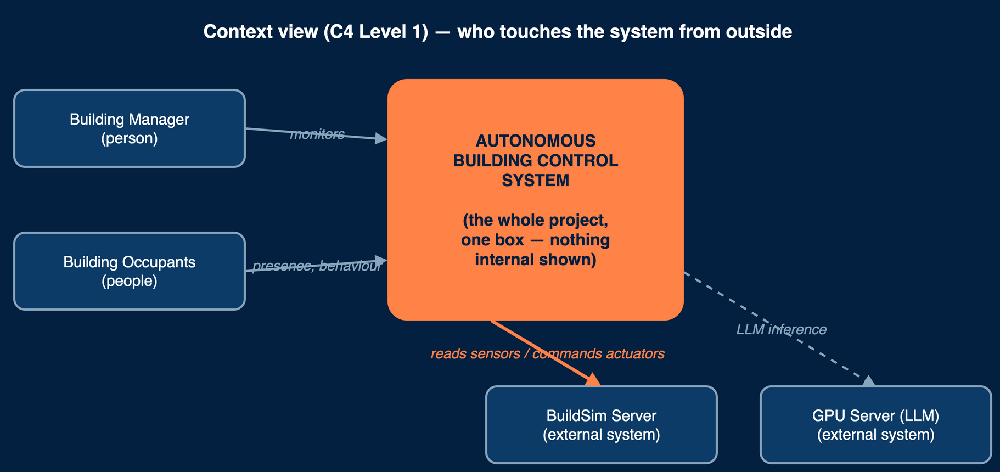
<figcaption><em>The whole project is one box. Only the people and external systems that touch it appear — nothing internal is shown yet.</em></figcaption>
</figure>

The diagram answers one question only — who or what touches the system from outside. Picture this: a country on a globe, with arrows showing where its trade goes. Nothing about cities is shown yet.

### Functional view (C4 Level 2)

The container diagram opens up the single box from the context view. Inside are the deployable units — each box typically maps to one Docker container.

<figure class="diagram">
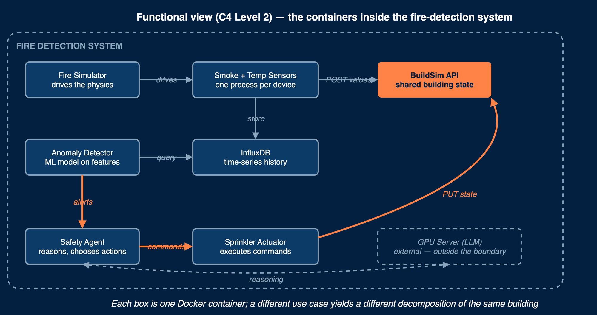
<figcaption><em>Inside the boundary, every deployable unit and every connection: simulator drives sensors, readings flow to BuildSim and storage, the anomaly detector alerts the agent, and the agent's commands close the loop.</em></figcaption>
</figure>

Two different use cases lead to two different container diagrams. A fire-detection system needs sensors, an anomaly detector, a safety agent, sprinkler actuators, and an LLM. An HVAC optimisation system needs temperature and occupancy sensors, an MQTT broker, a time-series database, a forecasting model, an HVAC controller, and HVAC actuators. The same physical building, the same BuildSim, but two different functional decompositions.

A useful image: zooming into the country on the globe and seeing its cities. Each city is one container. Lines between them are roads — the interfaces.

### Component view (C4 Level 3)

When one container is complex enough, it gets its own diagram showing its internal structure. A safety agent might contain a BuildSim API client, a set of tool definitions, an agent memory, a reasoning chain implementing the ReAct pattern, and a safety guardrail module. Each is internal to the agent and invisible from the outside.

Think of it this way: zooming further into one city and seeing its streets. The streets are not visible at the city-level view, but they exist.

### Behavioral view (sequence diagram)

A **sequence diagram** is a comic strip with software components as the characters. It shows one specific scenario as a series of messages, in order.

<figure class="diagram">
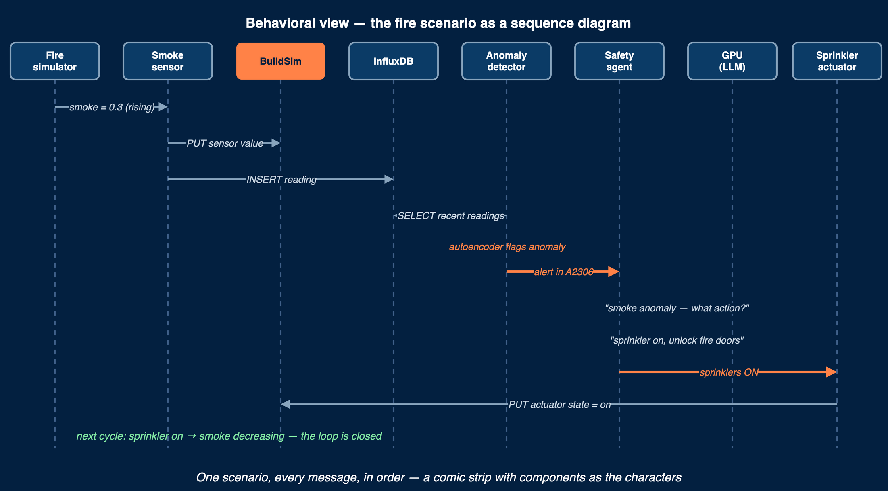
<figcaption><em>The fire scenario, message by message: from a rising smoke reading, through detection and LLM reasoning, to the sprinkler command that closes the loop.</em></figcaption>
</figure>

Each message arrow is one frame of the comic. The order of the lines is the order of events. Sequence diagrams are the right tool when the question is "what happens, in what order, for this scenario?" They expose timing issues that no static component diagram can.

A useful image: a film strip. Each frame is one moment in time. Played in order, the strip tells a story.

### State machine diagram

A **state machine** shows every state a component can be in and every event that moves it between states. The lifecycle of a sensor process might look like this:

<figure class="diagram">
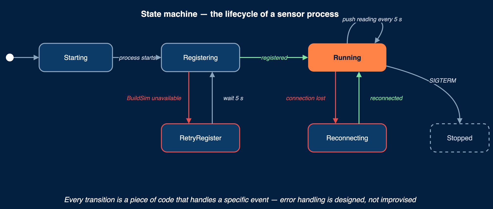
<figcaption><em>The sensor process lifecycle: registration, normal operation, and — most importantly — what happens when BuildSim is unavailable or the connection drops.</em></figcaption>
</figure>

An analogy: a traffic light. It has states (red, yellow, green) and events that flip it (timer expires, pedestrian button pressed). The state machine is the rulebook for the lamp.

Every transition in the diagram is a piece of code that handles a specific event. If the diagram is complete, the implementation can be written almost mechanically from it.

### Information view (requirements table)

The information viewpoint is sometimes a table rather than a diagram. The requirements table lists every requirement with its ID, type, statement, priority, and acceptance criterion.

| ID | Type | Requirement | Priority | Acceptance criterion |
|---|---|---|---|---|
| FR-01 | Functional | Detect fire within 30 seconds | Must | Anomaly detector flags within 30 s |
| FR-02 | Functional | Activate sprinklers in affected rooms | Must | Actuator state changes to "on" |
| FR-03 | Functional | Compute evacuation routes avoiding fire | Must | Route excludes fire rooms |
| NFR-01 | Non-functional | Recover from sensor crash within 60 s | Must | New reading within 60 s of kill |
| NFR-02 | Non-functional | False positive rate below 5 % | Should | Evaluated on 24 h of normal data |
| REG-01 | Regulatory | Fire doors close per BBR timing | Must | Door responds within 5 s |

Every requirement traces to a test case. FR-01 maps to a test called `test_fire_detection_latency`.

Picture this: an invoice with line items. Each line is a deliverable. The total at the bottom is the contract.

---

## Part 7 — The Architecture Document

<figure class="diagram">
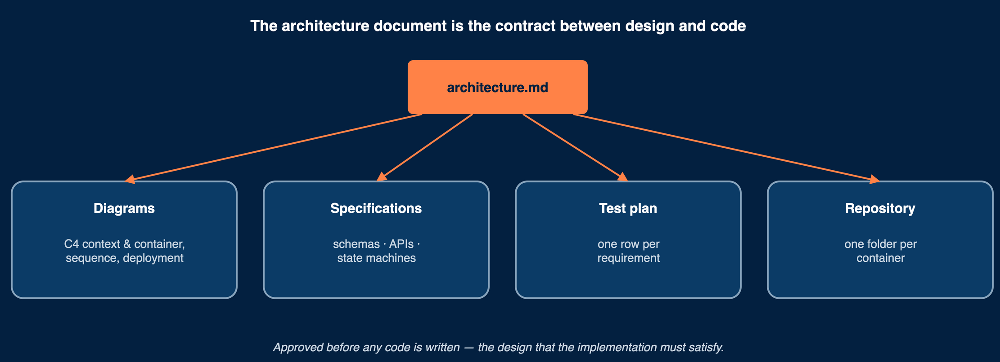
<figcaption><em>The architecture document carries diagrams, specifications, a test plan, and a repository structure — each binding the design to the running system.</em></figcaption>
</figure>

The architecture document is the contract between design and implementation. It is reviewed and approved before any code is written. It contains the five viewpoints described above, plus the specifications below.

### Diagrams and tables

The document includes:

- A **context diagram** (C4 Level 1) showing the system boundary, users, and external systems.
- A **container diagram** (C4 Level 2) showing every deployable unit and how they connect.
- A **requirements table** mapping each requirement to a priority, acceptance criterion, and test case.
- A **data flow diagram** showing how sensor data moves from measurement through storage to decision.
- One or more **sequence diagrams** for the key scenarios.
- A **deployment diagram** showing what runs where.

### Specifications

Beyond the diagrams, the design specification covers four additional artefacts.

**Data models.** JSON schemas for every message that crosses a boundary between components. Each schema specifies field names, types, units, and constraints. A useful image: a customs declaration form. Every field on the form has a defined meaning, and every package crossing the border must complete it correctly.

**API contracts.** Every REST endpoint and every MQTT topic in the system, with request and response shapes, status codes, QoS levels, and retention semantics. The plug-and-socket of the design — the prongs that have to match between components.

**State machines.** For the AI agent and for every component whose lifecycle matters, a state machine specifying every state and every transition. Especially important for error handling — the state machine is where you specify what happens when the network drops, when a sensor crashes, when a command fails.

**ML model specifications.** For each model, the input feature vector, the output, the source of training data, the training procedure, and the evaluation metrics that determine whether the model is good enough to deploy.

### Test plan

The test plan is written **before** implementation, not after. It links each requirement to one or more test cases. Each test case describes the initial state of the system, the stimulus that drives the test, the expected response, and the pass-or-fail criteria.

Think of it this way: a wedding-planner's checklist. Every item on the wishlist has a corresponding "yes/no — was it delivered?" tick. The wedding cannot be declared successful until every box is ticked.

### Repository structure

A consistent repository structure keeps the design and the code in sync. One folder per deployable container, plus a docs folder for the architecture document, plus a top-level docker-compose file that brings everything up.

```
project-root/
├── docs/
│   ├── architecture.md
│   ├── requirements.md
│   └── test-plan.md
├── sensor-process/
│   ├── Dockerfile
│   └── src/
├── ai-agent/
│   ├── Dockerfile
│   └── src/
├── actuator-process/
│   ├── Dockerfile
│   └── src/
├── docker-compose.yml
└── README.md
```

The structure mirrors the C4 container diagram. If the diagram shows five containers and the repository has one folder with everything jammed together, the design and the code have parted ways.

A useful image: the kitchen of a restaurant. Each station (grill, salad, dessert) has its own workspace, equipment, and chef. The menu (the design) is reflected in the kitchen layout (the code structure). A messy kitchen means slow, error-prone service.

---

## Part 8 — A Worked Example: Fire Detection End-to-End

<figure class="diagram">
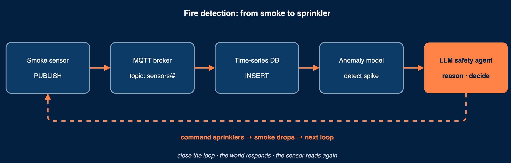
<figcaption><em>Every component of the fire-detection scenario, in the order they participate. The dashed arrow closes the loop — the sprinkler changes the world, the next sensor reading reflects it.</em></figcaption>
</figure>

To make the abstract MBSE process concrete, follow a fire-detection system through every step.

### Step 1 — Requirements

The system must detect fire within 30 seconds, activate sprinklers in the affected rooms, compute evacuation routes that avoid the fire, recover from a sensor crash within 60 seconds, keep false positives below 5 percent, and ensure fire doors close within the timing specified by the Swedish BBR fire code. Each becomes a row in the requirements table with a unique ID, a priority, an acceptance criterion, and a target test case.

### Step 2 — Functional decomposition

"Detect fire" decomposes into eight operations: collect smoke, CO, and temperature readings continuously; validate the readings; compute features (rolling means, gradients); apply an anomaly model; escalate positive readings to a language-model agent for severity assessment; decide actions (sprinkler, fire-door, evacuation route); apply commands through actuator processes; log the decision and the outcome.

Each operation maps to a software component.

### Step 3 — Architecture (Container diagram)

The components: a fire simulator that drives the physical model, sensor processes that read from it, an MQTT broker that decouples sensors from consumers, a time-series database that stores history, an anomaly detector running the Isolation Forest model, a safety agent that calls the LLM and chooses actions, sprinkler and fire-door actuator processes, and a dashboard process that visualises building state. Each is one container; everything is described in a single `docker-compose.yml`.

### Step 4 — Interfaces

Every connection is specified exactly. Sensors publish to MQTT topics named `sensors/{level}/{room}/{type}` with the payload `{ts, sensor_id, room, level, type, unit, value}` at QoS 1. A consumer subscribes to `sensors/#` and writes each reading to the `readings` hypertable in TimescaleDB. The anomaly detector queries with `SELECT value FROM readings WHERE room = $1 AND type = 'smoke' AND ts > now() - INTERVAL '60 seconds'`. The agent issues actuator commands via `PUT /api/actuators/{id}/state` with body `{"state":"on"}`.

Nothing is left to interpretation.

### Step 5 — Behaviour

A sequence diagram walks through the fire scenario: smoke rises in A2306, the sensor publishes, the consumer inserts, the anomaly detector flags, the agent calls the LLM, the agent commands the sprinkler, the sprinkler updates both BuildSim and the simulator, and the next sensor cycle shows reduced smoke. A state machine for the sensor process specifies registration, normal operation, network-failure handling, and reconnection.

### Step 6 — Validation

Every requirement maps to a test:

| Requirement | Test | Pass criterion |
|---|---|---|
| FR-01 | `test_fire_detection_latency` | Less than 30 s from smoke spike to actuator command |
| FR-02 | `test_sprinkler_fires` | Actuator state changes to "on" within 5 s of detection |
| NFR-01 | `test_sensor_crash_recovery` | New reading within 60 s of killing the sensor |
| NFR-02 | `test_false_positives` | Below 5 percent on 24 hours of normal data |

Each test runs against the actual deployed system, not a mock.

The entire fire-detection system — requirements through validation — is captured in roughly twenty pages of structured artefacts: tables, diagrams, and JSON schemas. None of it depends on any reader interpreting prose.

---

## Part 9 — Vocabulary Reference

Every term used in this chapter, defined.

| Term | Definition |
|---|---|
| **CPS (Cyber-Physical System)** | A system in which computation and physical processes are tightly coupled through a continuous feedback loop |
| **Embedded intelligence** | Software that runs inside or beside the physical system it controls, not in a remote data centre |
| **Edge** | The portion of a network physically close to the data source; the opposite of cloud |
| **Sensor** | A component that measures a physical quantity and reports it as data |
| **Actuator** | A component that performs a physical action when commanded |
| **Feedback loop** | A control structure in which the output of a process influences the next input |
| **Automation** | Behaviour produced by a fixed rule that does not adapt to context |
| **Autonomy** | Behaviour that adapts to context using data, prediction, and learning |
| **MBSE (Model-Based Systems Engineering)** | A methodology that replaces prose documents with structured, precise models |
| **Requirement** | A testable statement of what the system must do |
| **Functional requirement** | A requirement about behaviour: what the system does |
| **Non-functional requirement** | A requirement about quality: how well the system does it |
| **Regulatory requirement** | A requirement imposed by an external standard or law |
| **Functional decomposition** | Breaking a high-level requirement into smaller operations that satisfy it |
| **Architecture** | The high-level structure of components and their relationships |
| **Interface** | A precise specification of how two components communicate |
| **Sequence diagram** | A diagram showing the messages exchanged between components over time, for one scenario |
| **State machine** | A diagram showing the discrete states of a component and the events that cause transitions |
| **Validation** | Demonstrating that a requirement has been met by a design element and a test |
| **Viewpoint** | A perspective on the system that filters out everything not relevant to one stakeholder concern |
| **IEEE 42010** | The international standard defining architecture descriptions through multiple viewpoints |
| **ArchiMate** | An enterprise architecture framework with three layers: business, application, technology |
| **4+1 View Model** | An influential set of architectural views proposed by Kruchten in 1995 |
| **C4 Model** | A simple architectural notation with four levels: Context, Containers, Components, Code |
| **UML (Unified Modeling Language)** | A standard modeling language with fourteen diagram types |
| **SysML** | An extension of UML for systems engineering, used in aerospace and defence |
| **Mermaid** | A text-based diagramming tool that renders inside Markdown |
| **Container (Docker)** | A packaged, isolated runtime that bundles a service with all its dependencies |
| **Docker Compose** | A tool for running multiple containers together, configured by a YAML file |
| **Architecture document** | The contract between design and implementation, produced by the MBSE process |

---

## Part 10 — Summary in Five Sentences

1. A building is a cyber-physical system in which a continuous feedback loop joins the physical world and the software that observes and changes it; the loop must be fast enough that the physics cannot run away, reliable enough to survive component failures, and correct enough to avoid harm.
2. The right place for the software's brain is the edge, close to the physical system, because latency, reliability, privacy, and bandwidth all favour local processing over remote.
3. Useful systems are autonomous, not merely automated: they reason about context, learn from data, and adapt over time rather than following a single fixed rule.
4. The path from idea to working code runs through Model-Based Systems Engineering, in which structured artefacts — requirements tables, architecture diagrams, interface specifications, behaviour models, and validation matrices — replace prose documents that cannot be analysed or tested.
5. A complete architecture description requires multiple viewpoints (context, functional, information, behavioural, deployment), because no single diagram can serve every stakeholder, and each viewpoint catches errors the others hide.

These five ideas are the foundation for everything that follows.
