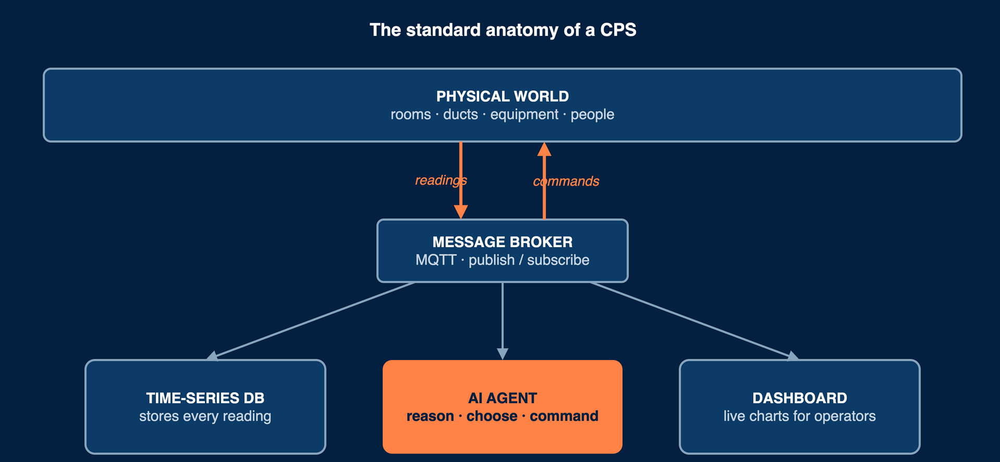
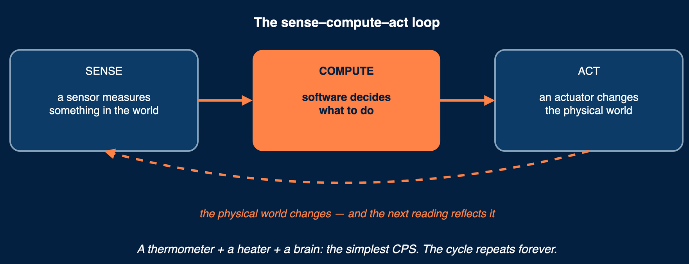
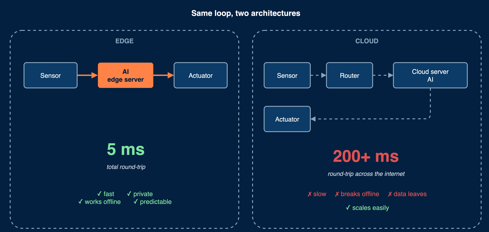
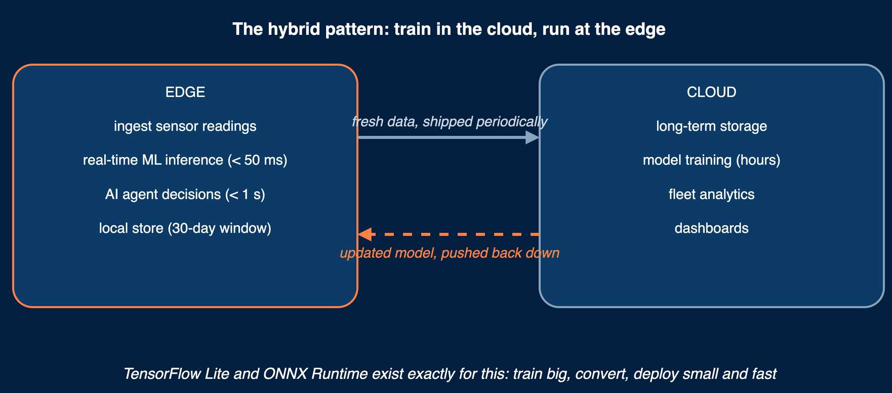
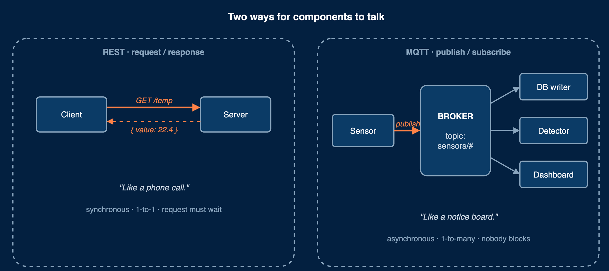
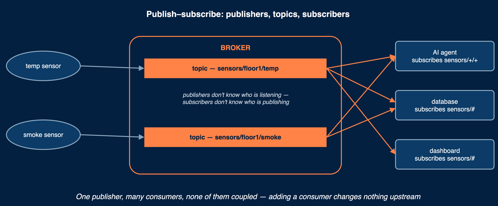
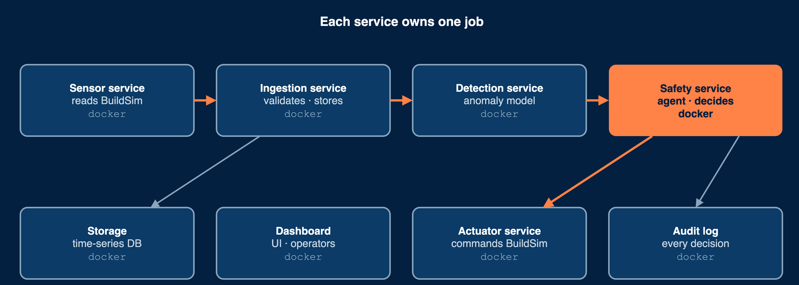
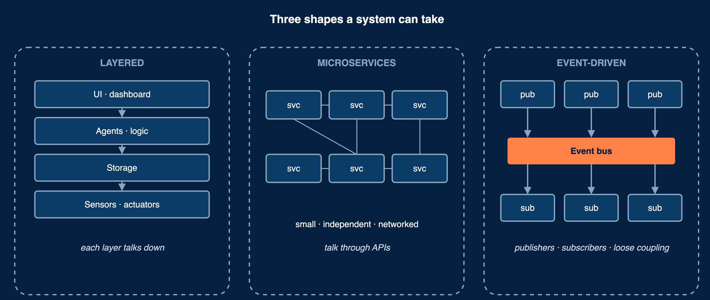
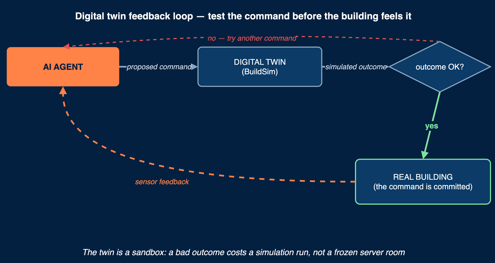
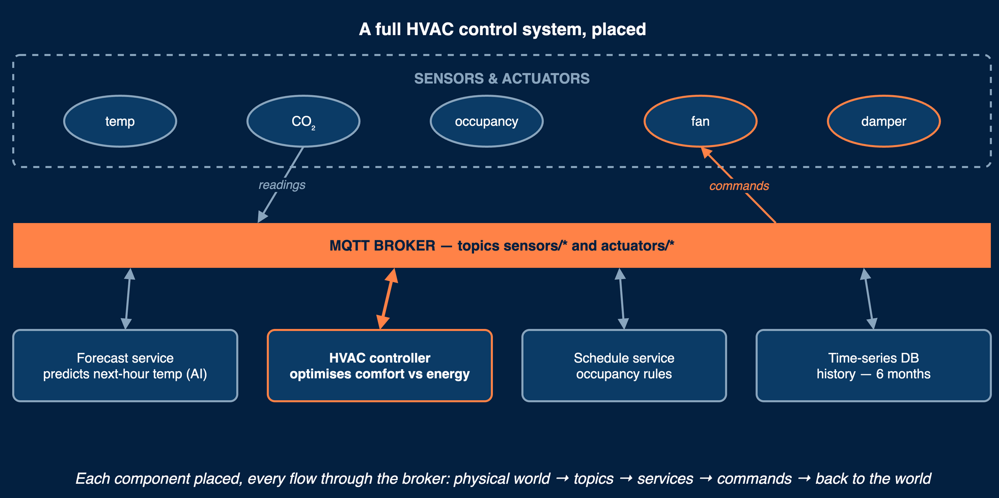

# Edge Intelligence & CPS Architecture

Standalone notes for the second chapter of D7065E.

---

## Part 1 — What a Cyber-Physical System Actually Is

<figure class="diagram">

<figcaption><em>Every CPS has the same anatomy: a physical layer at the top, sensors pushing readings down, a message broker fanning them out, storage and intelligence on the side, actuators pushing decisions back up.</em></figcaption>
</figure>

### The sense–compute–act loop

A cyber-physical system, or CPS for short, is software that reads the physical world, decides something, and changes the physical world. Then it reads the physical world again to see what changed. That cycle repeats forever.

<figure class="diagram">

<figcaption><em>Sense, compute, act — and the physical world's response becomes the next reading.</em></figcaption>
</figure>

A thermometer plus a heater plus a brain that says "turn on the heater when cold." That is the simplest CPS.

The cycle does not happen once. It happens millions of times a day. A safety-critical loop, like a fire suppression system, may run several times a second. A climate-control loop may run once every few minutes. The right speed depends on how fast the physical world can change.

### What makes a CPS hard

Three things separate CPS engineering from regular software:

**The physical world does not wait.** A web service can take 500 milliseconds to respond and nobody minds. A fire detector that takes 500 milliseconds to react to smoke is unacceptable. The clock is the physics of the room, not the developer's patience.

**The physical world has limits.** A fan cannot spin faster than its motor allows. A door cannot close faster than physically possible. A temperature cannot drop by 10 degrees in one second because there is not enough cooling power. Every command must respect those limits.

**The physical world has consequences.** A wrong decision in a web app means a wrong page renders. A wrong decision in a building control system can start a fire, lock people in during an emergency, or freeze a server room. Bugs cost more than money.

### A building as a CPS

A modern building has thousands of sensors and actuators. The physical layer includes the rooms themselves, HVAC ducts, temperatures, smoke concentrations, lighting levels, people moving around, and air flowing through vents. The cyber layer includes the software that observes all of that and decides what to do.

The two layers meet at one specific seam: the **API of the building control system**. Sensors report through this API. Actuator commands come back through this API. In production, that API is usually a field bus protocol — BACnet, KNX, or Modbus. In this course, the same role is played by **BuildSim**, a REST and WebSocket API that simulates a real building. The architecture above the API is identical whether the bottom layer is a simulated building or a real one. Only the wiring at the very bottom changes.

---

## Part 2 — Where the Brain Should Live: Edge vs Cloud

<figure class="diagram">

<figcaption><em>Putting the same control loop in two places gives wildly different latency. For anything safety-critical, the brain belongs on the edge.</em></figcaption>
</figure>

Many newcomers reach for "the cloud" as a default place to run software. For a CPS, that is usually the wrong default. The right place is the **edge** — a computer physically close to the building.

### Why local processing matters

Four reasons drive everything to the edge.

**Latency.** A round trip from a building in Sweden to a Google data centre in Belgium takes roughly 50 to 200 milliseconds when everything works. When the network is congested or the internet is degraded, it can be much worse. A fire suppression system that needs to respond within one second cannot tolerate a 200 ms baseline plus a model that takes another 200 ms plus a return trip. The budget runs out before the system has even started thinking.

**Bandwidth.** Imagine 500 sensors in a building, each producing a 200-byte reading every five seconds. That's about 20 kilobytes per second. Trivial to send to the cloud. Now imagine each sensor is a 1080p camera at 30 frames per second. That's 500 megabytes per second per camera. Sending that to the cloud continuously is physically impossible and expensive even if it were possible. The edge processes, compresses, and filters first.

**Privacy.** Video feeds and occupancy patterns are sensitive personal data. Cross-border data transfers are restricted by laws like the European GDPR. Processing on-premises eliminates the risk that someone's movement patterns leave the country.

**Reliability.** Cloud services go down. Internet connections go down. A building that cannot control its HVAC because Amazon Web Services is having an outage is an embarrassment. The edge keeps running when the wider network does not.

### The compute hierarchy

"Edge" is not a single place. It is a continuum with four tiers, each trading speed against compute power.

| Tier | Where it sits | Latency | Compute power | Typical examples |
|---|---|---|---|---|
| Device | On the sensor or actuator itself | <1 ms | Very low | Arduino, ESP32, Raspberry Pi |
| Edge | Local gateway, building server room | 1–10 ms | Medium | Intel NUC, Jetson, small industrial PC |
| Fog | Building or campus level | 10–50 ms | High | Rack server, mini data centre |
| Cloud | Regional data centre | 50–200 ms | Effectively unlimited | AWS, Azure, Google Cloud |

The terminology comes from two ideas that grew up separately. "Edge computing" was named by Shi et al. in their 2016 paper for IEEE IoT Journal. "Fog computing" was named by Cisco in 2012 and formalised by the OpenFog Consortium. For a single building, the distinction between edge and fog is mostly academic. The line gets sharper when one organisation manages many buildings.

A natural distribution in production looks like this. Simple threshold alarms and sensor firmware run at the device level. Real-time machine learning inference and agent decision-making run at the edge level. Long-term storage, model training, fleet analytics, and dashboards run in the cloud.

### The hybrid pattern: train in the cloud, run at the edge

The dominant real-world architecture is hybrid. Training a machine-learning model requires lots of data and significant compute time. That work is too slow to do at the edge and benefits from cheap cloud GPUs. Once trained, the model is downloaded to edge servers where it makes predictions in tens of milliseconds. Periodically, fresh data is shipped back to the cloud, models are retrained, and the new model is pushed down to the edge.

<figure class="diagram">

<figcaption><em>The edge owns the real-time loop; the cloud owns storage, training, and analytics. Data flows up, models flow back down.</em></figcaption>
</figure>

Tools like TensorFlow Lite and ONNX Runtime exist specifically to make this pattern smooth: train in the cloud with full TensorFlow or PyTorch, convert the model to a smaller, faster format, deploy to the edge.

### Compute continuum orchestration

The hybrid pattern creates a practical headache. Workloads need to run in different places — a sensor pre-processing job on a Raspberry Pi, a model-training job on a GPU cluster, a dashboard on a cloud VM. Each platform has different capabilities and different APIs. Manually deploying to each is painful.

**Compute continuum orchestrators** abstract this away. The developer submits a workload description that says "this job needs a GPU" or "this job needs to run at the edge." The orchestrator decides which machine fits, dispatches the workload there, and tracks it.

**ColonyOS** is one example, developed in Sweden and used in industrial settings. A "colony" is the orchestration boundary. **Executors** register the kinds of work they can do — GPU, edge, IoT, CPU. **Function specifications** describe what to compute, written as a small JSON document. A **broker** matches each function specification against available executors. Every message is cryptographically signed, so executors can run on untrusted infrastructure (zero-trust).

For a building control system, this enables a pattern like the following:
- Sensor data preprocessing runs on an edge executor in the building's server room.
- Anomaly model training is submitted as a function specification that the broker dispatches to a GPU executor in the cloud.
- The trained model is automatically deployed back to edge executors.
- If the GPU executor is busy, training queues or overflows to another GPU.

This is the architecture these notes refer to as "the edge–cloud continuum." It scales beyond a single machine without forcing every component into a specific cloud.

### When edge is essential vs when cloud is fine

Use edge processing when:
- Response time must be under one second (fire suppression, emergency unlock).
- The system must keep working without internet (safety-critical functions).
- Continuous data volume is too large to stream (video, high-frequency sensors).
- Data is sensitive and cannot leave the premises.

Use cloud processing when:
- Latency over five seconds is acceptable (dashboard updates, weekly reports).
- Compute requirements exceed local hardware (training a large model).
- Data must be aggregated across many buildings (fleet benchmarking).
- The job is rare or scheduled (disaster recovery, backup).

A common mistake is to over-edge — running everything on a single device because "it's the edge," then discovering that the device cannot run a large language model fast enough. The edge in a real building is not a Raspberry Pi. It is a rack server or a small cluster of industrial computers with serious compute. In a course-scale setup, a developer laptop plays this role.

---

## Part 3 — How Components Talk to Each Other

<figure class="diagram">

<figcaption><em>REST is a phone call: synchronous, one-to-one. MQTT is a notice board: one publisher, many subscribers, none of them blocking each other.</em></figcaption>
</figure>

Once components are placed at the right tier, the next question is how they communicate. Each communication pattern has different latency, scalability, coupling, and failure characteristics. Choosing the wrong one is one of the most common architectural mistakes.

### Request–response (REST over HTTP)

In this pattern, one component sends a request and waits for the answer. The simplest model and the default for most web APIs.

REST stands for Representational State Transfer. It uses the verbs of HTTP — GET, POST, PUT, DELETE — to express intent. Resources are identified by URLs. Responses carry standard status codes (200 for success, 404 for not found, 500 for server error). The BuildSim API is a REST API: `GET /api/equipment` lists equipment, `POST /api/actuators/{id}/state` commands an actuator.

Request–response works well for control commands (set the actuator's state, then verify the state changed), one-off queries (get the current temperature), and configuration (register a new sensor). It works badly for high-frequency data streams. Polling a REST endpoint at 10 Hz consumes resources for almost nothing, since most polls return the same value. It also works badly for fan-out, where one event needs to reach many subscribers — each subscriber would have to poll independently.

The crucial property of request–response is **tight coupling**: the client must know the server's address, the server must be reachable, and both sides block while the call is in progress. If the server is down, the client fails. There is no buffering, no retry semantics by default, no asynchrony.

### Publish–subscribe (MQTT, Kafka, RabbitMQ)

A different model entirely. Publishers send messages to a **topic** without knowing who is listening. Subscribers register interest in topics and receive all matching messages. A **broker** sits in the middle, routing messages from publishers to subscribers.

<figure class="diagram">

<figcaption><em>Publishers write to topics; subscribers read from them. Neither side knows the other exists — the broker does the routing.</em></figcaption>
</figure>

The temperature sensor does not know whether one, ten, or zero consumers are listening. An AI agent can subscribe to a wildcard pattern, `sensors/+/smoke`, and receive all smoke readings from all floors without those sensors knowing the agent exists.

This pattern offers **loose coupling**. Adding a new consumer requires no change to publishers. Subscribers can come and go. The broker buffers messages if a subscriber is briefly unavailable.

**MQTT** is the standard pub/sub protocol for IoT. It uses tiny message headers, just two bytes, which matters for battery-powered devices and constrained networks. It supports three quality-of-service levels: at-most-once delivery, at-least-once delivery, and exactly-once delivery. Mosquitto is the standard open-source MQTT broker.

**Kafka** is a different beast. It looks like pub/sub from the outside but is internally a distributed, durable, append-only log. Every message published to a topic is stored, and subscribers can replay history from any point. This makes Kafka the natural choice for analytics pipelines and event sourcing, at the cost of being heavier to operate than MQTT.

**RabbitMQ** sits between MQTT and Kafka. It is a general-purpose message broker that supports pub/sub, work queues, request-reply patterns, and complex routing. It speaks AMQP natively but can also speak MQTT through a plugin. Good when MQTT's simplicity is not enough but Kafka's scale is overkill.

Pub/sub is the right fit for sensor data distribution (one publisher, many consumers), system events (the building's fire alarm being triggered), and loose coupling between independently developed components.

### Event-driven architecture

An **event** is an immutable record of something that already happened. Not a command ("turn on the fan") but a fact ("the temperature exceeded 28°C at 14:32:05"). Components that care about that fact react independently.

Event-driven architecture, abbreviated EDA, is the pattern where components communicate only through events. Two key properties fall out of this.

**Temporal decoupling.** A component that reacts to an event does not have to be running at the moment the event is produced. If the event store keeps a history, the consumer can catch up later. Systems become resilient to partial failures.

**Event sourcing.** Storing every event in an append-only log means the entire state of the system can be reconstructed at any point in time. If a bug is discovered, replay the log up to the moment before the bug and analyse it. This is invaluable for debugging and auditability.

For a fire alarm, event-driven architecture is natural. The single event "fire alarm triggered in A2306" causes sprinklers to activate, doors to unlock, HVAC to shut down, and an alert to be sent to the fire department. Each is a separate reaction by a separate component, all triggered by one event.

### WebSocket

WebSocket provides a persistent, two-way TCP connection between a client and server. Once opened, either side can send data at any time. This is fundamentally different from HTTP, where the client must initiate every exchange.

The BuildSim API uses WebSocket to push live sensor readings and viewer state changes to the browser. The browser opens a WebSocket on page load and receives a continuous stream of updates without polling. Polling a REST endpoint at 10 Hz to achieve the same effect would be 600 requests per minute per client, most of them returning nothing new.

WebSocket is the right fit for real-time server-to-client push (sensor streaming, live dashboards), bidirectional real-time communication, and long-lived connections. It is the wrong fit for occasional queries, where the setup cost of opening the connection outweighs the benefit, and for stateless interactions, where every request is independent.

### gRPC

gRPC is a high-performance request–response protocol developed at Google. It uses HTTP/2 transport and Protocol Buffers for serialisation. The result is typed APIs with low latency and good multiplexing. It supports streaming in both directions, which lets it cover some of the WebSocket use cases too.

gRPC fits internal service-to-service communication where performance matters and both ends are controlled by the same team. It is less common in IoT, where MQTT dominates, but appears in modern microservice stacks.

### The pattern comparison table

| Pattern | Coupling | Latency | Scalability | Durability | Building use |
|---|---|---|---|---|---|
| REST | Tight | Low | Medium | No | Control commands, queries |
| MQTT pub/sub | Loose | Low | High | Optional | Sensor distribution |
| RabbitMQ | Loose | Low | High | Yes | Complex routing |
| Kafka | Loose | Medium | Very high | Yes | Multi-building log |
| WebSocket | Medium | Very low | Medium | No | Real-time streams |
| gRPC | Tight | Very low | High | No | Internal services |

The most useful rule of thumb: REST when one component asks another a specific question and waits; pub/sub when one source feeds many consumers; WebSocket when the server needs to push to a client. Kafka enters the picture only when the system needs durable event history at high throughput.

---

## Part 4 — How Components are Organised: Service-Oriented Architecture

<figure class="diagram">

<figcaption><em>Each service is independently deployable, owns one job, and talks through stable interfaces. Replace one without touching the others.</em></figcaption>
</figure>

The patterns above describe **how** components talk. The next question is **how big** each component should be.

### Monolith versus microservices

A **monolithic** architecture puts all functionality into a single deployable unit. One process, one binary, one deploy. Simple to operate when small, painful when large.

A **microservices** architecture decomposes that single binary into small, independently deployable services that communicate over the network. Each service does one thing. Each can be updated, scaled, and operated independently.

For a CPS like a building control system, microservices fit well for four reasons.

Different components have different scaling requirements. The data pipeline needs storage. The AI agent needs CPU or GPU. The dashboard needs nothing. Mixing them in one process means provisioning for the worst-case need everywhere.

Different components evolve at different speeds. The sensor process is stable — once it works, it rarely changes. The agent logic, by contrast, evolves rapidly as new use cases are added. Microservices let the agent be redeployed many times a week without touching the sensor process.

Different components are written by different teams or in different languages. A research team writing the ML model in Python should not be forced to write the high-frequency sensor ingestion in Python too. The sensor ingestion can be in Go for performance; the agent in Python for ML ecosystem; they talk over the network.

Failure isolation. A bug in the dashboard does not take down the safety agent. In a monolith, a memory leak in the dashboard module crashes the whole binary, including safety.

The cost of microservices is operational complexity. Multiple containers must be orchestrated. Network failures between services must be handled gracefully. Deployment configuration multiplies. For a course project, this complexity is instructive rather than a burden. It teaches real-world architecture.

### Containers and Docker

A **container** packages a service together with all its dependencies — libraries, runtime, configuration files — into a single image that runs identically on any machine that has Docker installed. The "works on my laptop" problem disappears, because the laptop and the production server run the same container image.

A **Dockerfile** is the recipe for building a container image. It specifies the base operating system, the libraries to install, the application code to copy in, and the command to run at startup. Running the Dockerfile produces an **image**, a static snapshot. Running the image produces a **container**, a live instance with its own filesystem, network, and process tree.

**Docker Compose** is the tool for running multiple containers together. A `docker-compose.yml` file lists every container, its image, its port mappings, its dependencies on other containers, and its environment variables. Running `docker compose up` starts all of them in the right order. The compose file is essentially the executable version of a C4 container diagram.

### Each sensor and actuator as a service

In a service-oriented building control system, every sensor and every actuator is treated as a service with a well-defined interface. The architecture might include `smoke-sensor-service`, `temperature-sensor-service`, `hvac-actuator-service`, and `door-actuator-service`, each as a separate container. They share the same patterns: each publishes or subscribes on agreed topics; each registers itself with the building's API on startup; each can be killed and restarted without affecting the others.

This has two important consequences. First, the AI agent does not need to know whether the smoke sensor reads from a real device, a BuildSim simulator, a CSV file replay, or a generative ML model. As long as `sensors/smoke` carries the same JSON shape, the agent reads the same way. Second, scaling is per-service. If a building has 500 smoke sensors, you can spin up 500 instances of the same `smoke-sensor-service` image, each with different configuration.

### Eclipse Arrowhead

For industrial CPS, a reference architecture called the **Eclipse Arrowhead Framework** treats every sensor, actuator, and service as a registered, discoverable, and authorised service. Three core systems make this work:

- **Service Registry.** Every service registers itself; consumers look up producers by service type rather than by hardcoded address.
- **Authorisation System.** Enforces which services are allowed to talk to which. A guest sensor cannot pretend to be the building's primary smoke detector.
- **Orchestration System.** Routes requests from consumers to appropriate providers, picking the best available.

Arrowhead is used in Swedish industrial automation and is worth knowing as the production analogue of what we sketch with Docker Compose and MQTT in the course.

---

## Part 5 — Higher-Level Architectural Patterns

<figure class="diagram">

<figcaption><em>Different shapes optimise for different things: layered for simplicity, microservices for scale, event-driven for loose coupling between components that come and go.</em></figcaption>
</figure>

The previous parts cover individual building blocks. This part describes whole-system patterns that combine them.

### Event-driven pub/sub architecture

The most common pattern for building control. Sensors publish readings to a message broker. Consumers — AI agents, databases, dashboards — subscribe to the topics they care about. The broker handles routing.

Advantages: loose coupling, easy extension (a new consumer is added without changing producers), and a natural fit for the one-to-many relationship between sensors and downstream systems. The default choice for sensor data collection, event distribution, and real-time alerting.

### Lambda architecture

The Lambda architecture splits data processing into two parallel paths. The **speed layer**, also called the hot path, processes events in real time and produces low-latency approximate results — current temperature, active alerts, anomaly scores in the last minute. The **batch layer**, also called the cold path, processes historical data in bulk and produces accurate long-term results — weekly energy reports, monthly trends, training data for the next model. A **serving layer** merges results from both paths when a query comes in.

For building control, the speed layer handles real-time ML inference and safety responses, while the batch layer trains models, generates reports, and populates the feature store for the next training run.

Lambda has been criticised because the same business logic ends up implemented twice — once in the streaming path and once in the batch path — which is hard to keep in sync. The **Kappa architecture**, proposed by Jay Kreps, simplifies this by using a single stream-processing layer for both real-time and historical processing, replaying historical data through the same code. (Lambda itself was proposed by Nathan Marz.) Apache Flink supports both patterns.

### Multi-agent architecture

Instead of one agent that controls everything, several specialised agents each focus on a single objective. A typical decomposition:

- A **Safety Agent** monitors smoke and fire sensors and responds to emergencies. It has the highest priority — it always overrides.
- An **Energy Agent** optimises HVAC schedules to minimise consumption.
- A **Comfort Agent** maintains temperature and air quality within occupant preferences.
- A **Coordination Layer** resolves conflicts. Safety always wins. Energy and comfort negotiate.

Each agent is a separate process. Each can be updated independently. The coordination layer is itself a separate component, which can be implemented as priority-based (the simplest), auction-based (each agent submits a bid), or consensus-based (agents converge through messaging). Multi-agent is the dominant pattern when the system has competing objectives.

### Digital twin feedback loop

A **digital twin** is a real-time simulation of the physical system that runs in parallel with the real one. The idea is to use the twin as a sandbox: before sending a command to a real actuator, send it to the twin and observe the predicted outcome. If the twin says the outcome would be bad, the agent tries a different command.

BuildSim is itself a digital twin of a building. The agent can ask it questions like "if I turn HVAC zone 3 on, what will the temperature be in ten minutes?" The agent uses the answer to choose better actions before committing them to the real building. For higher-fidelity simulation, tools like the Building Controls Virtual Test Bed and EnergyPlus exist in research labs.

<figure class="diagram">

<figcaption><em>Commands are rehearsed against the twin first. Only an outcome that looks good is committed to the real building, whose sensor feedback flows back to the agent.</em></figcaption>
</figure>

### Choosing a pattern

No single pattern fits every use case. A few rules of thumb help:

- A latency requirement below 100 milliseconds points to local processing with direct in-process calls.
- A latency budget below one second is comfortable on the edge with pub/sub.
- A latency budget above one second admits the cloud.
- When many consumers need the same data, prefer pub/sub over request–response.
- When the system must keep working without connectivity, all critical logic must be at the edge with local storage and an offline-first design.
- Simple threshold decisions fit rule engines. Contextual trade-offs fit LLM agents.
- A single objective is served by a single agent. Multiple competing objectives need multi-agent coordination.

---

## Part 6 — A Worked Example

<figure class="diagram">

<figcaption><em>A full HVAC control system, with each component placed and the data flowing top to bottom: physical world → broker → services → back to the world.</em></figcaption>
</figure>

To make all of the above concrete, walk through the architectural choices for a concrete use case. The figure above shows the result of this exercise for an HVAC system; the walkthrough below makes the same decisions for a fire detection system.

The use case: smoke sensors and temperature sensors are deployed in every room. When smoke is detected, the system must activate sprinklers in the affected room within one second, unlock fire doors on the evacuation path, and notify the building manager. False positives must be kept under 5 percent.

**Where does the brain run?** At the edge. The one-second latency budget rules out cloud reasoning on the critical path.

**How do components communicate?**
- Sensor readings: pub/sub via MQTT. Many consumers want the same readings (the database, the anomaly detector, the dashboard), and the natural fan-out makes MQTT a clean fit. Topics use a hierarchy: `sensors/level0/A2306/smoke`.
- Actuator commands: REST. One agent sends one command to one actuator and wants to know the result.
- Browser updates: WebSocket. The dashboard needs live updates without polling.

**How are components organised?** As microservices in Docker containers.
- One container per sensor type (`smoke-sensor-service`, `temp-sensor-service`).
- One container per actuator type (`sprinkler-service`, `door-service`).
- One MQTT broker container.
- One time-series database container.
- One anomaly-detection container (the ML model, edge-deployed).
- One safety-agent container (the LLM-driven reasoning, edge-deployed but calling out to the cloud LLM when needed).

**Which higher-level pattern?** Event-driven pub/sub for the data flow, with multi-agent on the decision side. A safety agent reacts to anomaly events. An energy agent monitors HVAC schedules. A coordination layer resolves conflicts. A digital twin (BuildSim) lets the agent test a sprinkler command in simulation before committing.

**Where does training happen?** In the cloud, on a GPU server, scheduled overnight. The trained anomaly model is downloaded to the edge and replaces the previous model on the next agent restart.

**What is the deployment plan?** A `docker-compose.yml` on the building's edge server brings up all containers. A ColonyOS executor running on the same server picks up nightly training jobs from a colony broker. The GPU server runs another executor that takes the heavy training jobs.

That sequence of choices — edge for inference, MQTT for sensor fan-out, REST for commands, microservices for failure isolation, multi-agent for competing objectives, digital twin for safety, ColonyOS for training orchestration — is the architecture these notes train readers to design.

---

## Part 7 — Vocabulary Reference

Every term used in this chapter, defined.

| Term | Definition |
|---|---|
| **CPS (Cyber-Physical System)** | A system where software directly senses and changes the physical world in a closed loop |
| **Sense-compute-act loop** | The continuous cycle: read sensor, decide action, command actuator, observe effect |
| **Edge computing** | Running software on hardware physically close to where the data is generated, instead of in a remote data centre |
| **Fog computing** | A distributed layer of compute spanning edge and cloud, typically at building or campus scale |
| **Compute continuum** | The unified abstraction across device, edge, fog, and cloud resources |
| **REST** | A request–response API style using HTTP verbs (GET, POST, PUT, DELETE) and JSON over HTTP |
| **MQTT** | A lightweight publish/subscribe protocol designed for IoT, using topics and a broker |
| **Kafka** | A distributed durable event log that looks like pub/sub from the outside but stores messages for replay |
| **RabbitMQ** | A general-purpose message broker that supports many messaging patterns through the AMQP protocol |
| **WebSocket** | A persistent bidirectional connection that allows the server to push data to the client |
| **gRPC** | A high-performance typed RPC framework using HTTP/2 and Protocol Buffers |
| **Event-driven architecture** | A pattern where components communicate only through immutable event records, never direct commands |
| **Event sourcing** | Storing every event in an append-only log, enabling full state reconstruction at any past moment |
| **Monolith** | A single deployable unit containing all of an application's functionality |
| **Microservice** | A small independently deployable service that does one thing and communicates with others over the network |
| **Container** | An isolated runtime that packages a service with all its dependencies; the standard packaging for microservices |
| **Docker** | The most common implementation of containers, with a build format (Dockerfile) and runtime |
| **Docker Compose** | A tool for defining and running multi-container applications, configured by a YAML file |
| **Eclipse Arrowhead** | A service-oriented framework for industrial IoT, with built-in service registry, authorisation, and orchestration |
| **ColonyOS** | A meta-orchestrator that dispatches workloads across edge, GPU, and cloud executors based on resource requirements |
| **Lambda architecture** | A pattern that splits data processing into a real-time hot path and a historical batch cold path |
| **Kappa architecture** | A simplification of Lambda using a single stream-processing layer for both real-time and historical data |
| **Multi-agent system** | An architecture with several specialised AI agents that coordinate through priority, auction, or consensus |
| **Digital twin** | A real-time simulation running in parallel with the physical system, used to predict outcomes of proposed actions |

---

## Part 8 — Summary in Five Sentences

1. A cyber-physical system is software that senses the physical world, decides, acts on it, and observes the result, in a continuous loop fast enough that the physics cannot run away from it.
2. The brain belongs at the edge, close to the sensors, because latency, bandwidth, privacy, and reliability all push against putting it in the cloud.
3. Communication patterns differ in coupling and durability — pick REST for control commands, pub/sub for sensor data, WebSocket for server-push to browsers, Kafka when history matters.
4. Components are small, single-purpose, independently deployable services in containers, communicating over well-defined interfaces, with no shared state.
5. Higher-level patterns combine these building blocks — event-driven pub/sub for data flow, Lambda or Kappa for the speed/batch split, multi-agent for competing objectives, digital twin for safety-critical command verification.

These five ideas, properly internalised, are the foundation for every architectural decision in the rest of the course.
