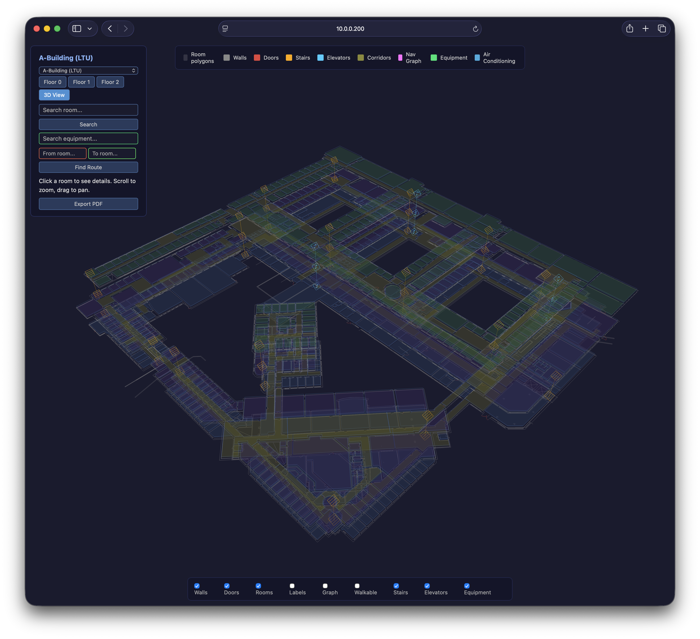
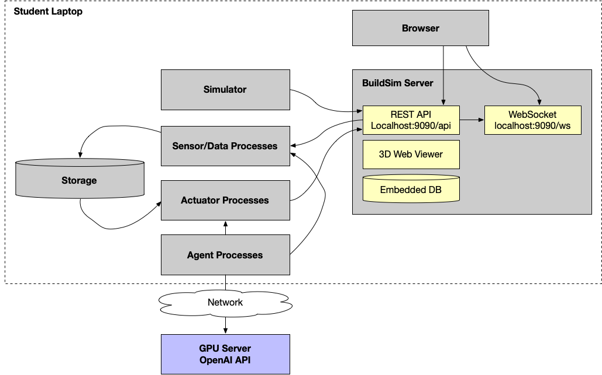

# D7065E Lab Assignment: Autonomous Building Control

## What You Will Build

You will build a **distributed autonomous building control system**. This means:

- **A physical simulator** that models the real-world behavior of your use case: temperature dynamics, smoke propagation, occupancy patterns, equipment degradation, etc. This is not random data. Your sensor readings must follow realistic physical models so that your AI has meaningful data to act on.
- **Multiple independent processes** (sensors, actuators, AI agents) running as standalone processes, communicating through a shared REST API. Each sensor/actuator process emulates a real IoT device. From an application point of view, they look like real devices.
- **AI agents** that autonomously observe sensor data, reason about building state, and take action — not just rules, but data-driven decisions using ML models and/or LLM-based reasoning
- **A data pipeline** that collects sensor readings, stores them, and feeds them to your AI models
- **A dashboard** that visualizes what your system is doing in the 3D building

The building structure is provided by [BuildSim](../buildingsim/eREADME.md) — a server with a REST API and 3D web viewer. **You** build the simulator that brings the building to life: what happens physically in each room, how sensors respond, how actuators affect the environment. BuildSim provides the building, rooms, and visualization — you provide the physics, the intelligence, and the control.

## Learning Objectives

After completing this assignment, you will be able to:

1. **Design** a distributed CPS architecture with justified communication patterns and data flows
2. **Implement** containerized IoT device simulators (sensor/actuator processes) that interact via REST APIs
3. **Integrate** AI agents that autonomously sense, reason, and act in a cyber-physical system
4. **Build** data pipelines that collect, store, and transform sensor data for ML/AI models
5. **Test** distributed systems, including fault injection and stress testing
6. **Present** and defend architectural decisions at a whiteboard

## What This Assignment Is (and Is Not)

- **This is a systems engineering assignment.** The architecture, communication patterns, data pipeline, and testing are the core — not the ML model itself.
- **Every component must run as its own process.** No monolithic script that does everything. Sensors, actuators, and agents are separate containers.
- **Every design choice must be justified.** Not just "we used MQTT" but "we used MQTT because pub/sub decouples our sensors from the agent, which means we can restart the agent without losing sensor data."
- **You must test it, including breaking it.** Not just happy-path demos. What happens when a sensor crashes? When the AI is wrong? When the network is slow?
- **The oral exam tests understanding.** You must draw your architecture on a whiteboard and explain it from memory. Both team members must be able to explain the full system.

## Group Size

Students work in pairs (2 persons). The oral examination is individual — both students must be able to explain the full system independently.

## Workflow

1. Choose a [use case](use-cases.md) (or propose your own)
2. Write an architecture document and design specification
3. Write a test plan
4. **Get your design approved** (week 3 checkpoint)
5. Implement the system
6. Demonstrate and present your results

## System Setup

Everything runs on the student's laptop. BuildSim is a single binary that embeds the building data and 3D web viewer. Your components — simulator, sensor/actuator processes, AI agents, storage, and dashboards — run as separate containers alongside BuildSim, communicating via REST API and WebSocket.

**How it works:**
1. Start BuildSim: `./buildsim start --port 9090`
2. Start your containers: `docker compose up`
3. Your **simulator** models the physical behavior (temperature dynamics, smoke propagation, etc.) and drives the sensor data processes
4. **Sensor/data processes** push readings to BuildSim via REST and store them in your data storage
5. **AI agent processes** query sensor data, reason (locally or via GPU server LLM), and command actuator processes
6. **Actuator processes** update state in BuildSim, which feeds back into the simulator
7. **Browser** shows the 3D building with real-time updates via WebSocket
8. The **GPU server** provides LLM inference (Gemma 4 via OpenAI-compatible API) over the network

**Key principles:**
- BuildSim is the **shared state** — it holds the current building state (sensors, actuators, sessions)
- Your components are **independent processes** that read from and write to BuildSim via REST
- The **simulator** creates the closed feedback loop: actuator commands affect the physical model, which changes sensor readings
- If a process crashes and restarts, it re-registers with BuildSim and continues

## Requirements

### Architecture & Design

Must be approved before implementation.

1. **Architecture Document** — system overview with component diagrams, communication patterns (pub/sub, REST, event-driven), data flow and storage strategy, scalability and resilience considerations. **Every design choice must be justified** — explain why you chose this pattern over alternatives, what trade-offs you made, and what the implications are.

2. **Design Specification** — data models, API contracts between components, ML/AI model selection with justification, sensor and actuator process design

3. **Test Plan** — component-level verification, end-to-end integration tests, ML/AI validation strategy, fault injection tests

### Physical Simulator

4. **You must build a simulator** that models the physical behavior of your use case. The simulator produces realistic sensor data that responds to actuator commands — creating a closed feedback loop. Examples:

   - **Fire scenario**: smoke concentration increases over time, spreads to adjacent rooms through corridors, temperature rises with fire intensity, sprinkler activation reduces smoke/temperature
   - **HVAC scenario**: room temperature is a function of outdoor temperature, occupancy (body heat), HVAC state, and thermal properties of the room. Turning on heating raises temperature gradually, not instantly.
   - **Air quality**: CO2 concentration rises with occupancy (~40 ppm/person/hour in a typical room), decreases with ventilation rate. Opening a window or increasing fan speed drops CO2.
   - **Security**: access events follow realistic patterns — employees arrive 7-9am, leave 16-18pm, with lunch patterns and meeting room usage
   - **Predictive maintenance**: equipment vibration gradually increases over days/weeks, with occasional spikes indicating developing faults

   **The simulator does not need to be physically perfect.** The goal is to produce data that has enough structure for your AI to learn from — trends, patterns, correlations, and responses to actuator commands. A simple model that captures the basic behavior is sufficient. Don't spend weeks perfecting the physics — spend your time on the architecture, AI integration, and testing.

   **Occupancy patterns:** Your simulator should model realistic occupancy. A typical office building:
   - Weekdays: employees arrive 7-9am, lunch break 11:30-13:00, leave 16-18pm
   - Weekends: building is empty (security guards only)
   - Meeting rooms: booked in 1-2 hour blocks, empty between meetings
   - Corridors: brief transient occupancy as people move between rooms
   - Seasonal: fewer people during holidays (midsommar, jul)

   Occupancy drives many other values — temperature (body heat), CO2, lighting demand, access events, WiFi load.

   **Approaches:**
   - **Physics-based model**: implement simplified physical equations (heat transfer, gas diffusion, etc.)
   - **Data replay**: use real-world datasets and replay them through your sensor processes
   - **Hybrid**: replay real data with injected events (e.g., real temperature data + simulated fire event)
   - **Generative**: train a model on real data and use it to generate realistic synthetic sensor streams

   **Public datasets for simulation:**

   | Dataset | Description | Link |
   |---------|-------------|------|
   | ASHRAE Energy Prediction | Building energy consumption with weather, hourly | [Kaggle](https://www.kaggle.com/c/ashrae-energy-prediction) |
   | Building Data Genome Project 2 | 3,053 energy meters from 1,636 buildings, 2 years | [GitHub](https://github.com/buds-lab/building-data-genome-project-2) |
   | Environmental Sensor Data | 132k readings: temperature, humidity, CO2, PM2.5 from IoT sensors | [Kaggle](https://www.kaggle.com/datasets/garystafford/environmental-sensor-data-132k) |
   | Occupancy Detection | Light, temperature, humidity, CO2 with occupancy labels | [Kaggle](https://www.kaggle.com/datasets/robmarkcole/occupancy-detection-data-set-uci) |
   | ECOBEE Thermostat | Residential thermostat data, indoor/outdoor temp, HVAC | [BBD](https://bbd.labworks.org/) |
   | Smart Building Dataset | Multi-sensor (temp, humidity, light, CO2) from smart offices | [Kaggle](https://www.kaggle.com/datasets/ranakrc/smart-building-system) |
   | Pump Sensor Data | Sensor data from pumps for predictive maintenance | [Kaggle](https://www.kaggle.com/datasets/nphantawee/pump-sensor-data) |
   | NASA Bearing Dataset | Vibration data for predictive maintenance | [NASA](https://www.nasa.gov/content/prognostics-center-of-excellence-data-set-repository) |
   | PRONOSTIA Bearings | Accelerometer data for remaining useful life prediction | [IEEE PHM](https://github.com/Lucky-Loek/ieee-phm-2012-data-challenge-dataset) |

### Implementation

5. **Each sensor and actuator must run as its own Unix process**, preferably containerized (Docker). Processes must be independently startable, stoppable, and restartable.

6. **AI/Agentic AI integration is mandatory.** Include at least one AI agent or ML model that makes autonomous decisions. The AI can reason about:
   - **Sensor data** — anomaly detection, prediction, pattern recognition
   - **Text documents** — building regulations (BBR, AFS 2020:1), maintenance manuals, safety protocols, equipment datasheets
   - **Both** — e.g., an LLM agent that reads sensor values AND checks compliance against regulatory text
   
   You are encouraged to combine multiple approaches (ML for real-time detection + LLM for reasoning about regulations and context).

7. **Data engineering** — your sensor data must flow through a proper architecture, not just direct REST calls. Choose and justify:
   - **Message broker** (MQTT, Kafka, Redis) for decoupling sensors from consumers
   - **Data storage** (InfluxDB, TimescaleDB, DuckDB, Parquet files) for historical sensor data
   - **Data pipeline** for transforming raw sensor data into features for your AI/ML models
   - **Integration patterns** — SOA framework (Arrowhead), event sourcing, stream processing
   - **Edge-cloud orchestration** — [ColonyOS](https://github.com/colonyos/colonies) for orchestrating workloads across edge devices, local servers, and cloud/HPC — enabling compute continuum architectures where sensor processing runs at the edge and ML training runs on GPU servers

8. **Dashboard / Visualization** — extend BuildSim using the session API or build a separate dashboard.

9. **Programming language is free choice.** Use of AI coding assistants is allowed and encouraged.

### Deliverables

8. **Written report** — architecture, design, test plan, test results, implementation, evaluation, reflection

9. **Oral presentation and demonstration** — see [oral-examination.md](oral-examination.md)

10. **Source code** in a git repository

---

## Use Cases

See [use-cases.md](use-cases.md) for the full catalogue with detailed technology breakdowns for each use case.

| Domain | Use Cases |
|--------|-----------|
| Safety & Emergency | Fire detection and response, Gas leak containment |
| Energy & Sustainability | Smart HVAC optimization, Intelligent lighting control |
| Security | Anomaly-based intrusion detection |
| Network & Infrastructure | WiFi coverage optimization, Predictive maintenance |
| Comfort & Wellbeing | Indoor air quality management |
| Building Regulation | Automated compliance monitoring (BBR, AFS 2020:1) |
| Environmental | Mold prevention |
| Health & Pandemic | Airborne infection risk, Contact tracing simulation |
| Digital Twin | Sensor drift and anomaly detection |
| Multi-Agent | Competing objectives with coordination |

Each use case lists the specific sensor processes, actuator processes, ML models, AI agents, data pipelines, and dashboard components you would build.

---

## Documents

| Document | Description |
|----------|-------------|
| [resources.md](resources.md) | Tools, frameworks, and links (BuildSim, AI frameworks, infrastructure, data engineering) |
| [grading.md](grading.md) | Detailed grading criteria for grades 3, 4, and 5 |
| [oral-examination.md](oral-examination.md) | Examination format: presentation, whiteboard session, questions |
| [timeline.md](timeline.md) | Weekly milestones and key dates |

### Grading Summary

| Grade | Summary |
|-------|---------|
| **3** | Design, implement, and **explain** a working system |
| **4** | Evaluate trade-offs and demonstrate quality |
| **5** | Synthesize, critically analyze, and find breaking points |

### Key Dates

- **Week 3** — Approval checkpoint: present architecture + test plan
- **Week 8** — Oral presentation and demonstration
