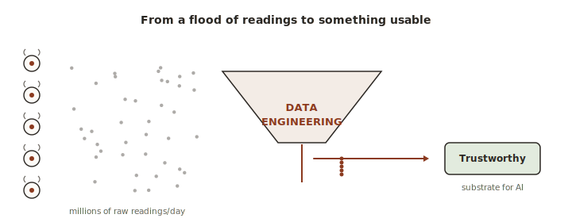
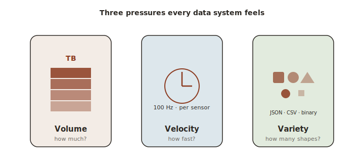
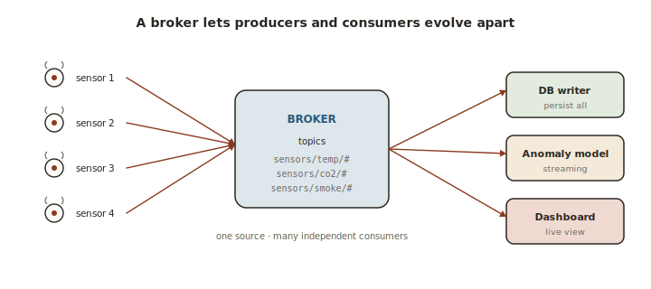
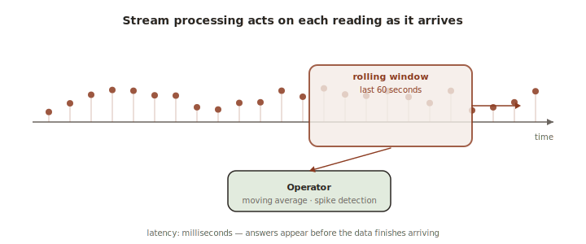
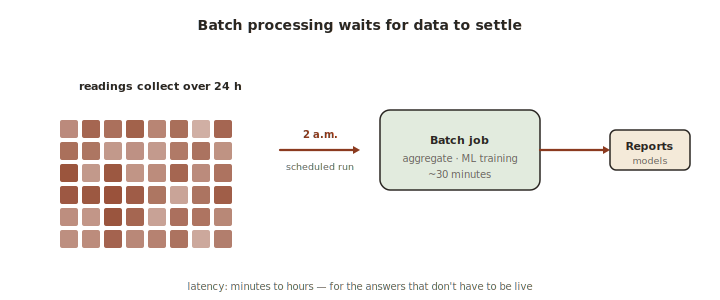
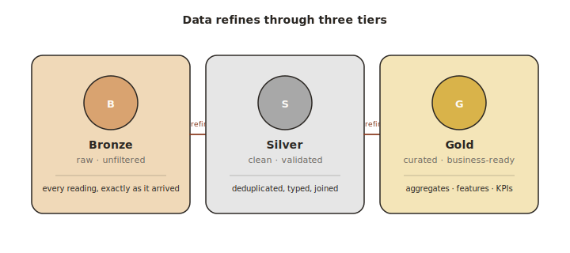
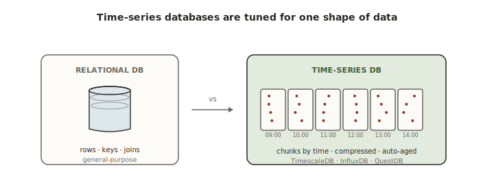
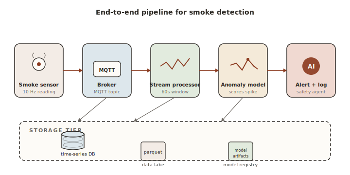

# Lecture 3 — Data Engineering for Cyber-Physical Systems

Standalone notes for the third lecture of D7065E. Read on its own or alongside `lectures/lecture-3-data-engineering.md`.

---

## Part 1 — Why a Whole Lecture About Data

<figure class="diagram">

<figcaption>A modern building generates millions of readings a day. Data engineering is the discipline that turns that flood into a trustworthy substrate an AI can act on.</figcaption>
</figure>

Before any AI agent can be smart, it needs data. Lots of it, well-organised, fresh enough to be useful, and clean enough to trust. The plumbing that gets raw sensor readings from the building into the agent's hands is called **data engineering**, and it is just as important as the agent itself. A brilliant model trained on bad data will produce bad predictions. A simple model trained on excellent data often beats a sophisticated model trained on garbage.

A useful analogy: think of the AI agent as a chef and the data pipeline as the kitchen staff who source ingredients, wash them, chop them, and lay them out on the counter. The chef gets the credit when the dish is good, but the dish was never going to be good if the ingredients arrived rotten, in the wrong portions, an hour late.

This chapter is the kitchen.

---

## Part 2 — The Three Pressures: Volume, Velocity, Variety

<figure class="diagram">

<figcaption>Volume, velocity and variety are the three pressures every data system has to absorb. They shape every choice that follows.</figcaption>
</figure>

A modest commercial building with 100 sensors, each reporting every 5 seconds, produces about 1.7 million readings per day. Multiply that across a year and the system holds half a billion data points. Add video cameras, vibration sensors at industrial frequencies, and access events, and the number reaches hundreds of millions of records per month.

The volume itself is not the hard part. The hard part is that data engineering for a cyber-physical system has to satisfy three demands at once, and the demands pull in different directions.

### Volume

How much data, total, accumulated over time. A weather station for one room is small. A building with thousands of sensors over several years is large. The architecture must store this without running out of disk space and without slowing down to a crawl.

A useful image: a single garden hose versus a fire hose versus a river. The amount of water you can collect determines whether you need a bucket, a tank, or a reservoir.

### Velocity

How fast new data arrives, and how fast decisions need to be made on it. A safety system that detects fire must process incoming readings in milliseconds. A weekly energy report can take its time. Both are valid, but they need different infrastructure.

A useful image: drinking a glass of water versus drinking from a fire hose. Same liquid, very different consequences.

### Variety

How many different shapes the data takes. Numeric readings, boolean states (door open/closed), strings (event types), images, time series. A pipeline that handles only one shape is brittle.

A useful image: a smoothie maker that takes apples, ice, yoghurt, and spinach — all of which need to go through different processing before they can be combined.

The fundamental tension: real-time decisions need data within seconds, machine-learning training needs months of clean labelled data, and long-term analytics needs years of queryable history. These three goals require different storage systems, different processing patterns, and different data representations. A well-designed pipeline serves all three without compromise.

---

## Part 3 — Getting Sensor Data Into the System (Ingestion Patterns)

<figure class="diagram">

<figcaption>A broker in the middle decouples sensor producers from the consumers downstream. New consumers can subscribe without anyone changing the sensors.</figcaption>
</figure>

The first step in any pipeline is **ingestion**: getting data from sensors into a durable store. Three patterns dominate, each fitting a different scale.

### Pattern A: Direct REST POST

Each sensor sends every reading directly to an HTTP endpoint that writes it into a database immediately.

```
   sensor  ───POST /readings───►  database
```

Easy to set up. Works fine at low volume. Breaks at scale: 100 sensors at 10 Hz means a thousand HTTP requests per second, which overwhelms most databases. There is also no buffer — if the database is slow or temporarily down, readings are lost.

Analogy: handing every letter directly to the postman, who must be standing on your doorstep every time you want to send one. Fine if you write one letter a week. Disastrous if you run a mail-order business.

### Pattern B: Message queue as buffer

Each sensor publishes to a message broker. A separate consumer process reads from the broker and writes into the database.

```
   sensor 1 ──┐                                     ┌──► database
   sensor 2 ──┼──►   broker (MQTT/Kafka)   ──►  consumer
   sensor 3 ──┘                                     └──► (other consumers)
```

The broker acts as a shock absorber. If the database is briefly slow, messages accumulate in the broker, and the consumer catches up later. The sensor doesn't care whether the database is up.

This is the recommended pattern for the course: MQTT (using Mosquitto as the broker) plus a Python consumer that writes into TimescaleDB or DuckDB.

Analogy: the postman is replaced by a mailbox in the village square. You drop your letter in any time, the postman collects them on a schedule, the receiving end opens its mailbox when ready. Three actors, each independent.

### Pattern C: Batch file upload

The sensor accumulates readings in memory and writes them to a file (typically a Parquet file) once a minute or once an hour. A separate process reads those files into a database.

```
   sensor accumulates 60 s in memory  ──►  writes one file per minute  ──►  batch loader
```

Highest throughput, lowest network overhead. Bad for real-time decisions because of the latency, excellent for historical training data.

Analogy: instead of sending one letter at a time, you wait until end-of-day and send a single envelope containing all your letters from that day. Cheap and efficient when nothing is urgent. Hopeless when something is.

Most real systems use **two patterns at once**: the broker for the real-time path, batch files for the historical path. The same reading is written into both places, and each place serves a different audience.

---

## Part 4 — Stream Processing: Working on Data as It Flows

<figure class="diagram">

<figcaption>Stream processing keeps a sliding window of recent readings in memory and produces answers continuously, with millisecond latency.</figcaption>
</figure>

Once data is flowing in, the next question is how to process it. Two main modes exist: streaming (processing each reading as it arrives) and batch (processing a large pile of stored data at once). This part covers streaming; the next covers batch.

A **stream** is an unbounded, time-ordered sequence of events. New events keep arriving forever. Stream processors apply operations to streams and produce either new streams or side effects (database writes, alerts, dashboard updates).

A useful image: a river flowing past a water-quality station. The station measures every drop as it goes past — there is no way to stop the river and inspect it all at once.

### Windowed aggregation

A single sensor reading is rarely useful by itself. It is noisy, missing context, and easily misleading. The fix is to compute statistics over a **window** of recent readings.

Three common window types:

**Tumbling windows** are non-overlapping, fixed-size buckets. Each reading falls into exactly one window.

```
   |----window 1----|----window 2----|----window 3----|
   |   00:00–00:05  |   00:05–00:10  |   00:10–00:15  |
   |                |                |                |
   readings...      readings...      readings...
```

Tumbling windows are useful for periodic reports: a 5-minute average that resets every 5 minutes.

**Sliding windows** are overlapping. Each new reading falls into multiple windows.

```
   |---window covers last 5 min---|
                |---window covers last 5 min---|
                          |---window covers last 5 min---|
   ...now                  ...now+1                ...now+2
```

Sliding windows are useful for continuous tracking: "the rolling 5-minute average, updated every second."

**Session windows** are dynamic. They grow as long as events keep arriving and close when there's a gap.

```
   |---session---|       gap        |---session---|
   read read read                   read read
```

Session windows are useful for grouping bursts of activity: "all access events for one person in one trip through the building."

A natural image: imagine watching a movie versus watching the news.
- Tumbling windows are like episodes — each one starts at a fixed time and runs a fixed length.
- Sliding windows are like a live ticker that always shows "the last 5 minutes."
- Session windows are like a phone call — they start when you pick up, end when you hang up, and have no fixed length.

### Complex event processing

Some patterns need to span multiple events over time. A fire detection rule might say: smoke above 0.7 for ten consecutive readings, combined with temperature rising at more than 2°C per minute, combined with a door opening in the same zone recently. No single reading triggers the rule; only the pattern across many readings does.

This is **complex event processing**, abbreviated CEP. Apache Flink has a CEP library that lets you describe these temporal patterns declaratively. For smaller systems, a stateful Python process maintaining a sliding window in memory is sufficient.

Analogy: a single yawn doesn't mean someone is bored. A yawn, followed by checking their phone, followed by looking at the exit, repeated three times in five minutes — that's a pattern. CEP is the skill of recognising the pattern, not the individual symptoms.

### Tools for stream processing

The right tool depends on scale.

**Apache Flink** is a distributed stream processing engine. Production-grade and feature-rich, but heavy to operate. Right when handling millions of events per second.

**Kafka Streams** is a stream processing library built directly on top of Apache Kafka. If Kafka is already in the architecture, Kafka Streams is the natural choice.

**Redis Streams** is a lightweight stream storage feature inside Redis. Built-in consumer groups, in-memory speed, easy to run.

**Plain Python with asyncio** is sufficient for the course. A simple consumer that reads from MQTT, computes windowed aggregations in memory, and writes to a database is entirely fine for one building.

---

## Part 5 — Batch Processing: Working on Data After It Settles

<figure class="diagram">

<figcaption>Batch processing waits for data to settle, then processes large windows at once. Cheaper, simpler, but the freshest answer is from yesterday.</figcaption>
</figure>

Batch processing operates on large volumes of stored data all at once. A daily job that prepares training data, a weekly report that summarises energy use, a monthly anomaly analysis. Batch jobs run on a schedule (nightly, weekly) or on demand.

A useful image: streaming is fishing with a line — one fish at a time, you react as each one bites. Batch is fishing with a net — you collect a lot at once and process them together.

For building control, the critical batch job is **training data preparation**: pulling ninety days of sensor readings out of the data lake, computing the features the ML model needs (rolling averages, occupancy patterns, time-of-day encodings), and producing a clean Parquet or CSV file for training. This job may take minutes to hours, which is fine because real-time isn't required.

### Tools for batch processing

**DuckDB** is the recommended tool for the course. It is an in-process SQL engine that queries Parquet files directly without a server. Fast, zero-configuration, full SQL. It treats a folder of Parquet files like a database table.

```sql
-- DuckDB reading directly from a folder of Parquet files
SELECT room, AVG(value) AS avg_temp
FROM read_parquet('data/bronze/temperature/*.parquet')
WHERE ts > now() - INTERVAL '24 hours'
GROUP BY room;
```

**pandas** is a Python DataFrame library. Flexible, interactive, great for prototyping. Limited to a single machine and single thread, so it doesn't scale to industrial volumes, but for a building it is more than enough.

**Apache Spark** is a distributed batch processing engine. The right tool when one machine isn't enough — multi-building analytics at industrial scale.

---

## Part 6 — The Data Lake (with the Medallion Architecture)

<figure class="diagram">

<figcaption>Bronze, silver, gold. Data gets more refined and more trustworthy at each tier — and the rules that produce each tier are versioned in code.</figcaption>
</figure>

So far the discussion has been about *moving* data and *processing* data. The next question is where to *store* it for the long term.

### The data lake philosophy

A **data lake** is a storage system that keeps raw data in its native format, exactly as it arrived, until somebody needs it. The philosophy is "store first, structure later." Unlike a data warehouse, which requires the schema to be decided up-front, a data lake lets the schema be decided at query time.

Why does this matter? Because in a real CPS, you don't know in week one that the 5-minute variance of CO2 readings will turn out to be a useful occupancy feature. By the time you discover it, you'd be furious if you had discarded that level of detail. The data lake keeps everything, in case you need it later.

The three core principles:

1. **Store raw data.** Never transform or discard the original sensor reading. Always keep the immutable raw record.
2. **Transform on read.** Apply cleaning, feature engineering, and aggregation at query time, not at write time. This way, if you find a bug in your transformation logic, you can fix it without re-collecting the data.
3. **Schema on read.** Define the data's shape when querying, not when storing. This accommodates evolving schemas without painful migrations.

Analogy: a data lake is like a pantry that stores raw ingredients — flour, eggs, vegetables — exactly as they arrived from the grocery store. A data warehouse is like a freezer full of pre-cooked meals: faster to serve, but if you decide tomorrow that you want to make a salad instead of lasagna, you're out of luck.

### The medallion architecture

Storing everything raw is helpful, but querying everything raw every time is expensive. The compromise is the **medallion architecture**, popularised by Databricks: organise the data lake into layers, each transformed a bit more than the previous one.

```
   BRONZE LAYER  ──►  SILVER LAYER  ──►  GOLD LAYER  ──►  MODEL ZONE
   ───────────       ────────────       ─────────       ───────────
   raw sensor        cleaned,            ML-ready        train/val/test
   readings,         deduplicated,       features:       datasets,
   exactly as        unified schema,     rolling avgs,   labelled,
   received,         missing values      time encodings, split
   IMMUTABLE         handled             cross-sensor
                                         relationships
```

**Bronze** is the raw zone. Each reading is stored exactly as it came off the wire, timestamped on arrival, and never modified. If a bug is found in a downstream pipeline, reprocessing from bronze is always possible.

**Silver** is the cleaned zone. Validated data (out-of-range values flagged), deduplicated (retransmissions removed), unified schema across sensors, missing values handled or marked. Silver is what most queries hit.

**Gold** is the features zone. Business-ready features for ML: rolling statistics, derived signals, time-of-day encodings, cross-sensor relationships. This is the input to model training.

**Model zone** holds ready-to-train datasets with labels and train/validation/test splits.

Analogy: bronze is your shopping receipts in a shoebox. Silver is the same receipts entered into a spreadsheet with consistent columns. Gold is a monthly summary showing categories, totals, and trends. Each is more useful than the last, but each was derived from the original receipts. If you discover an error in the gold report, you can always go back to the shoebox and reprocess.

---

## Part 7 — Storage Formats: How the Bytes Are Laid Out

A single number is just a number. A million numbers in a file is a layout decision. The chosen format affects how fast queries run, how much disk space is consumed, and how robust the data is to schema changes.

### CSV (comma-separated values)

The simplest format. One row per record, fields separated by commas, first row often contains column names.

```
ts,sensor_id,room,value
2026-04-27T13:42:00,smoke-A2306,A2306,0.82
2026-04-27T13:42:05,smoke-A2306,A2306,0.85
```

Universally readable, human-friendly, supported everywhere. But slow for large data, no schema enforcement, and stored as text (which means a 0.82 takes four bytes, not the eight bytes a double-precision float would take in binary).

Good for small exports and manual inspection. Bad for production pipelines.

### Parquet

The standard format for data lakes. Columnar binary, compressed, schema-enforced.

The key insight is **columnar storage**. CSV stores data row by row:

```
   row 1: ts=…, sensor_id=…, room=…, value=…
   row 2: ts=…, sensor_id=…, room=…, value=…
   row 3: ts=…, sensor_id=…, room=…, value=…
```

Parquet stores it column by column:

```
   column ts:        [ts1, ts2, ts3, ts4, ts5, ts6, ts7, ts8, ...]
   column sensor_id: [s1,  s1,  s1,  s2,  s2,  s2,  s3,  s3,  ...]
   column room:      [r1,  r1,  r1,  r1,  r1,  r1,  r2,  r2,  ...]
   column value:     [v1,  v2,  v3,  v4,  v5,  v6,  v7,  v8,  ...]
```

This matters for two reasons. First, queries that need only the `value` column don't have to read the rest. Second, columnar data compresses much better than row-based data, because consecutive values are similar (e.g., the `room` column has just a few distinct strings repeated millions of times).

Parquet files are typically 4 to 10 times smaller than equivalent CSV files, and queries that touch only a few columns run an order of magnitude faster.

Analogy: a CSV is a stack of paper forms. Each form has multiple fields, and if you want to compute the average of one field across a thousand forms, you have to flip through every form. Parquet is a spreadsheet with one column per variable; computing the average of a column is one operation on one column.

### JSON Lines (JSONL)

One JSON object per line.

```
{"ts":"2026-04-27T13:42:00","sensor_id":"smoke-A2306","value":0.82}
{"ts":"2026-04-27T13:42:05","sensor_id":"smoke-A2306","value":0.85}
```

Flexible schema, human-readable, easy to append. Useful for event logs and audit trails where new fields are added over time.

### ORC

Similar to Parquet, used in Hadoop ecosystems. Parquet is preferred unless an existing Hive/Spark environment requires ORC.

---

## Part 8 — A Self-Hosted Data Lake with MinIO and DuckDB

For the course, an entire data lake fits on a developer's laptop using two Docker containers.

**MinIO** is an open-source object storage system that speaks the Amazon S3 API. From any S3 client's perspective, MinIO looks identical to S3, but it runs locally. Storage organisation:

```
   bucket: building-data
   ├── bronze/
   │   ├── temperature/
   │   │   ├── date=2026-04-27/readings.parquet
   │   │   └── date=2026-04-28/readings.parquet
   │   └── smoke/
   │       └── date=2026-04-27/readings.parquet
   ├── silver/
   └── gold/
```

**DuckDB** queries this directly using the `httpfs` extension. No ETL server, no cluster, no managed service.

```sql
-- Query: peak smoke per sensor in the last 7 days
SELECT sensor_id,
       MAX(value) AS peak_smoke
FROM read_parquet('s3://building-data/bronze/smoke/date=*/readings.parquet')
WHERE ts > NOW() - INTERVAL '7 days'
GROUP BY sensor_id
ORDER BY peak_smoke DESC;
```

The recommended pattern for the course is to combine MinIO (the data lake) with TimescaleDB (the real-time store) and DuckDB (the SQL engine on top of MinIO). All three run in Docker. Together they cover the hot path (TimescaleDB), the cold path (MinIO + Parquet), and the analytical path (DuckDB).

---

## Part 9 — Time-Series Databases

<figure class="diagram">

<figcaption>Time-series databases store rows indexed by time, compressed per chunk, and discarded automatically after a retention period. Far faster than a general-purpose database for this shape of data.</figcaption>
</figure>

A general-purpose database like PostgreSQL or MySQL is built for a typical web-application workload: lots of lookups by primary key, joins between tables, transactional updates. Sensor data has a completely different shape.

### Why time-series data is different

Three properties of sensor data that don't fit a general database:

1. **Append-heavy.** Every write is a new row. Existing rows are never updated. A general database's update machinery is unused overhead.
2. **Time-range queries dominate.** Almost every question is "what happened between time A and time B?" Joining tables by primary key is rare.
3. **Downsampling.** Two-year-old 5-second data is rarely needed at full resolution. Hourly averages would do, freeing 99% of the storage.

A **time-series database**, abbreviated TSDB, is built for exactly this shape. Data is stored in time-ordered chunks. New data appends to the latest chunk. Time-range predicates immediately prune entire chunks outside the range. Retention policies automatically downsample or delete old data.

Analogy: a general-purpose database is like a filing cabinet where every paper is filed by topic. Finding "all papers about Project X" is fast; finding "all papers from last March" requires walking through every folder. A time-series database is like a diary, where every page is dated and finding "what happened in March" is just opening to March.

### TSDB options

**InfluxDB** is a purpose-built time-series database. Its own data model (measurements, tags, fields) and its own query languages (InfluxQL, Flux). Excellent built-in tooling — the Telegraf agent for automatic sensor ingestion, native Grafana integration. Industry-standard for IoT.

**TimescaleDB** is a PostgreSQL extension. It adds time-series capabilities to standard PostgreSQL — data lives in regular Postgres tables, queries use standard SQL, every PostgreSQL driver works. **Hypertables** automatically partition data by time under the hood. **Continuous aggregates** keep time-windowed summaries materialised so common queries don't have to recompute them.

For the course, TimescaleDB is the most pragmatic choice: standard SQL, easy to integrate with any Python script, and it runs in one Docker container.

```sql
-- TimescaleDB: create a hypertable
CREATE TABLE readings (
    time      TIMESTAMPTZ NOT NULL,
    sensor_id TEXT NOT NULL,
    value     DOUBLE PRECISION NOT NULL,
    unit      TEXT
);
SELECT create_hypertable('readings', 'time');

-- Insert one reading
INSERT INTO readings (time, sensor_id, value, unit)
VALUES (NOW(), 'smoke-A2306', 0.82, 'normalised');

-- Query: 5-minute averages over the last 24 hours
SELECT time_bucket('5 minutes', time) AS bucket,
       AVG(value) AS avg_value,
       MAX(value) AS max_value
FROM readings
WHERE sensor_id = 'smoke-A2306'
  AND time > NOW() - INTERVAL '24 hours'
GROUP BY bucket
ORDER BY bucket;
```

**ClickHouse** is a column-oriented analytical database, extremely fast for read-heavy analytical queries. Used in production at Cloudflare and Uber. Appropriate when analytics push beyond what TimescaleDB can comfortably handle.

**DuckDB on Parquet** is the lightest option for historical analytics. No server, runs in-process, full SQL, reads Parquet files directly. Right for the cold path; less suited to high-frequency ingestion.

The recommended setup for the lab is **TimescaleDB for the hot (real-time) path and DuckDB/MinIO for the cold (historical) path**. Both use SQL. Both run in Docker.

---

## Part 10 — ETL: Extract, Transform, Load

Once data is stored, getting it into a useful shape requires a small pipeline of its own. The classic name is **ETL** — extract, transform, load.

### Extract

Reading data from one or more sources. The time-series database for recent data, the data lake for historical data, external services for context (a weather API for outdoor temperature, a calendar API for occupancy schedules).

### Transform

The step where raw data becomes useful. This is also the step that students underestimate the most.

Raw sensor readings — a float every five seconds — are not informative on their own. They are noisy, high-dimensional, and lack context. Feature engineering converts them into signals that carry meaning:

| Raw data | Derived feature | Why it helps |
|---|---|---|
| Temperature readings | 5-minute rolling average | Removes noise, reveals trend |
| Temperature readings | Rate of change (°C per minute) | Detects rapid heating (fire signature) |
| Smoke readings | Count of readings > 0.5 in last 5 minutes | More robust than a single reading |
| CO2 readings | Similarity to daily cycle | Detects occupancy anomalies |
| Door events | Time between events | Detects unusual access patterns |
| HVAC + temperature | Residual (actual − expected) | Detects HVAC failure |

A useful image: feature engineering is what a chef does to crude ingredients before serving. The raw potato is not edible. Wash, peel, slice, and bake it, and now you have something useful.

### Temporal features

A surprising amount of building behaviour is predictable from the clock alone. Offices fill at 8 a.m. and empty at 6 p.m. on weekdays. CO2 rises and falls in a daily cycle. A model that knows the time of day can predict half the relevant variables before looking at any sensor.

But raw hour-and-minute values confuse machine-learning models. The model sees 23:59 and 00:01 as far apart, even though they're adjacent. The fix is **cyclical encoding** with sine and cosine.

```python
import numpy as np

def add_time_features(df):
    """Add cyclical time encodings."""
    t = df['timestamp']
    df['hour_sin'] = np.sin(2 * np.pi * t.dt.hour / 24)
    df['hour_cos'] = np.cos(2 * np.pi * t.dt.hour / 24)
    df['dow_sin']  = np.sin(2 * np.pi * t.dt.dayofweek / 7)
    df['dow_cos']  = np.cos(2 * np.pi * t.dt.dayofweek / 7)
    return df
```

The sine and cosine pair together place every hour on a unit circle. 23:59 and 00:01 end up close together on the circle, as they should.

Analogy: imagine writing the hours on a clock face. The model that uses the *clock face position* (which is what sin/cos gives it) understands that 11 o'clock and 1 o'clock are nearby. The model that uses *just the number* sees 11 and 1 as nine hours apart.

### Cross-sensor features

Relationships between sensors are often more informative than any single sensor. A few examples:

- Temperature difference between adjacent rooms — detects a door left open or an HVAC imbalance.
- CO2 combined with ventilation state — estimates occupancy without an occupancy sensor.
- Smoke level combined with temperature gradient — distinguishes cooking (high smoke, modest temperature rise) from a real fire (high smoke, fast temperature rise).

### Load

Writing the computed features to a feature store — a database or Parquet file ready for ML training — or feeding them directly into the model.

### ETL tools

**dbt (data build tool)** is a popular open-source tool that lets transformations be expressed as SQL queries. Dbt runs queries in the correct order, tests their outputs, and generates documentation. Free, well-supported, with a free 4-hour fundamentals course.

**pandas** is the standard Python DataFrame library. Flexible and interactive, ideal for exploratory work. Single-threaded and in-memory, so it doesn't scale to industrial volumes; production pipelines are usually rewritten in SQL (using dbt and DuckDB) once the transformations are stable.

**Apache Airflow** is a workflow orchestration platform. ETL jobs are defined as directed acyclic graphs of tasks, scheduled, retried on failure, and alerted on errors. Production-grade. For a course-scale system, a Python script scheduled with cron is sufficient; Airflow is the heavy-machinery version.

---

## Part 11 — Data Quality and Observability

Data quality is the silent killer of machine-learning systems. A model trained on bad data will produce bad predictions, and the failures are often subtle. The model performs well on the training data (because the training data is also bad), then fails mysteriously in production.

For a CPS, bad data is not just an ML problem. It is a safety problem. A smoke sensor stuck at zero will silently prevent the fire-detection system from ever responding.

### Five common data-quality failures

**Missing data.** A sensor goes offline because the network drops, the power fails, or the sensor itself dies. The pipeline receives no readings for some period. Handling options:

- *Forward-fill*: use the last known value. Reasonable for slowly changing quantities like temperature. Dangerous for fast-changing ones like door state.
- *Linear interpolation*: estimate values based on readings before and after the gap. Reasonable for smooth signals.
- *Mark as missing*: insert a null marker that the ML model handles explicitly.
- *Alert on absence*: if a safety sensor has not reported in 30 seconds, raise an alarm. Don't fill silently — react.

**Duplicate data.** MQTT's at-least-once delivery means a message may be delivered twice. Without protection, every duplicated smoke reading inflates the model's view of how often anomalies happen. The fix is idempotent inserts (write only if not already present) or dedup logic in the consumer that keys on `(sensor_id, ts)`.

Analogy: imagine if every time the postman wasn't sure whether a letter was delivered, he delivered it twice. Soon your filing cabinet has two of every letter. You need a rule: if the same letter arrives twice, throw the second one away.

**Stale data.** The sensor process is alive, the network is fine, but the value never changes. A frozen sensor reads the same value indefinitely. Detection: compute the standard deviation of readings over a 5-minute window — if it's exactly zero, the sensor is probably stuck. Monitoring: track each sensor's last-updated timestamp and alert if nothing has changed for N seconds.

**Clock drift.** Each sensor has its own clock, and clocks drift. A reading from sensor A timestamped 14:32:00 and one from sensor B timestamped 14:31:58 may have happened in the opposite order from what the timestamps suggest. Mitigations: run NTP (Network Time Protocol) on every device, store both the device timestamp and the time when the server received the message, and prefer the server timestamp for ordering.

Analogy: imagine a courtroom where every witness uses a different clock. Their statements about timing can't be compared without first synchronising the clocks.

**Schema evolution.** A new sensor type is added with an extra field. The existing pipeline doesn't know what to do with that field. Schema-on-read (typical for data lakes) handles this gracefully — old code ignores new fields. Schema-on-write (typical for relational databases) requires a migration to add the column.

### Monitoring the pipeline

A data pipeline that silently fails is worse than one that fails loudly. Production-quality pipelines instrument themselves with metrics, and a monitoring system alerts when something looks wrong.

Four metrics worth tracking:

- **Data freshness.** Age of the most recent reading for each sensor. Alert if it exceeds three times the expected interval.
- **Value range.** A temperature below -50°C or above 100°C inside a Swedish office building is impossible. Alert when readings violate physical bounds.
- **Volume.** Number of readings per minute. A sudden drop signals offline sensors or a broken consumer.
- **Error rate.** Number of readings rejected by validation. A spike suggests a schema change or a faulty sensor.

The standard stack for this is **Prometheus** (a metrics database that scrapes endpoints periodically) plus **Grafana** (a dashboard tool that visualises the metrics and triggers alerts). Both are free, both run in Docker, both are industry standard.

---

## Part 12 — A Worked Example: Smoke Detection Data Pipeline

<figure class="diagram">

<figcaption>Every component of the smoke-detection data pipeline: sensors at the top push readings down through ingestion, processing, modelling, and alerting — and everything is persisted to storage for replay and training.</figcaption>
</figure>

To make all of the above concrete, follow one use case — smoke detection — through every stage.

**Step 1: Ingestion.** Each smoke sensor (one per room) publishes a reading every 5 seconds. The reading is a JSON object:

```json
{
  "ts": "2026-04-27T13:42:00.250Z",
  "sensor_id": "smoke-A2306",
  "room": "A2306",
  "level": "level1",
  "type": "smoke",
  "unit": "fraction",
  "value": 0.04
}
```

Published to MQTT topic `sensors/level1/A2306/smoke` at QoS 1.

**Step 2: Stream consumer.** A small Python process subscribes to `sensors/#`. For every incoming message, it inserts a row into the TimescaleDB `readings` hypertable (the hot path) and appends to today's Parquet file in MinIO under `s3://building-data/bronze/smoke/date=2026-04-27/readings.parquet` (the cold path).

**Step 3: Stream processing.** A second small process keeps an in-memory 5-minute sliding window per sensor. For each new reading, it recomputes the count of readings above 0.5 in that window. If the count exceeds a threshold, it publishes to `alerts/anomaly/A2306`.

**Step 4: Anomaly model (real-time).** The safety agent subscribes to `alerts/anomaly/+`. When an alert arrives, it queries TimescaleDB for the last 60 seconds of smoke, temperature, and CO2 in that room, computes a feature vector, and runs the Isolation Forest model. If the score is above 0.8, it issues a sprinkler command.

**Step 5: Batch training (nightly).** A scheduled job runs at 3 a.m. each night. It reads the previous 24 hours of bronze data with DuckDB, cleans it (silver), computes ML features (gold), and writes the result to `s3://building-data/gold/smoke-features/date=2026-04-27/`. The training script reads the gold file, trains an updated anomaly model, and writes the new model to a model store. The safety agent picks up the new model on its next restart.

**Step 6: Monitoring.** A dashboard in Grafana shows per-sensor freshness, the readings-per-minute rate, the false-positive rate of the anomaly model over the last week, and the percentage of readings rejected by validation. An alert fires when any sensor's freshness exceeds 30 seconds or when the false-positive rate exceeds 5 percent.

That sequence is a complete, production-shaped data pipeline. Bronze, silver, gold, hot path, cold path, monitoring. Every step uses tools that fit on a laptop. Every step generates artefacts that survive across restarts.

---

## Part 13 — Vocabulary Reference

Every term used in this chapter, defined.

| Term | Definition |
|---|---|
| **Data engineering** | The discipline of designing, building, and maintaining the systems that move data from sources to consumers |
| **Ingestion** | The act of getting data from a producer (sensor) into a durable store |
| **Stream processing** | Operating on data as it arrives, one event at a time, without first storing it |
| **Batch processing** | Operating on large piles of stored data all at once on a schedule |
| **Window (in streaming)** | A time-bounded subset of a stream over which aggregations are computed |
| **Tumbling window** | A non-overlapping window of fixed size |
| **Sliding window** | An overlapping window of fixed size that updates continuously |
| **Session window** | A dynamic window that closes when events stop arriving for a gap |
| **Complex event processing (CEP)** | Detecting temporal patterns across multiple events |
| **Data lake** | A storage system that keeps raw data in its native format until it is needed |
| **Medallion architecture** | A pattern that organises a data lake into bronze (raw), silver (cleaned), gold (features), and model zones |
| **Bronze layer** | The raw, immutable copy of incoming data |
| **Silver layer** | Cleaned, deduplicated, validated data with a unified schema |
| **Gold layer** | ML-ready features derived from silver |
| **Parquet** | A columnar binary file format, compressed and schema-enforced, used for data lakes |
| **CSV** | Comma-separated text file format; simple but slow |
| **JSON Lines (JSONL)** | One JSON object per line; flexible schema for event logs |
| **Schema on write** | The schema is enforced when data is stored (e.g., relational databases) |
| **Schema on read** | The schema is applied when data is queried (e.g., data lakes) |
| **Object storage** | A storage system that holds files (objects) in flat buckets, with HTTP API |
| **MinIO** | An open-source object storage system compatible with the Amazon S3 API |
| **Time-series database (TSDB)** | A database optimised for time-stamped data, append-heavy writes, and time-range queries |
| **InfluxDB** | A purpose-built time-series database popular in IoT |
| **TimescaleDB** | A PostgreSQL extension that adds time-series capabilities |
| **Hypertable** | A TimescaleDB construct that partitions data by time automatically |
| **DuckDB** | An in-process SQL engine that reads Parquet files directly |
| **ClickHouse** | A column-oriented analytical database for read-heavy workloads |
| **ETL (Extract, Transform, Load)** | A pipeline that reads data, reshapes it, and writes it to a downstream store |
| **Feature engineering** | The process of converting raw data into informative signals for ML |
| **Rolling average** | The average of a value over a recent window of time |
| **Cyclical encoding** | Representing periodic variables (hour, day-of-week) using sine and cosine to preserve their adjacency |
| **Feature store** | A database that holds ML-ready features ready to be consumed by training and inference |
| **dbt** | A tool for expressing data transformations as SQL queries with built-in testing |
| **Apache Airflow** | A workflow orchestration platform that runs ETL pipelines as scheduled DAGs |
| **NTP (Network Time Protocol)** | A protocol for synchronising clocks across networked devices |
| **Prometheus** | A metrics database that scrapes data from instrumented services |
| **Grafana** | A dashboard tool that visualises metrics and triggers alerts |
| **Idempotent insert** | An insert that produces the same result whether performed once or many times |

---

## Part 14 — Summary in Five Sentences

1. Sensor data has a shape unlike most software data: high volume, fast velocity, mixed variety, and a hard tension between real-time decisions, ML training, and long-term analytics.
2. Ingestion uses a message broker as a buffer between sensors and storage, so that producers and consumers are independent and a slow downstream system does not lose data.
3. Storage is split between a hot path (TimescaleDB for real-time queries) and a cold path (Parquet on MinIO for historical analytics), with the medallion architecture (bronze, silver, gold, model) organising the cold path.
4. Feature engineering — rolling averages, rate of change, cyclical time encodings, cross-sensor relationships — turns raw readings into signals the ML model can learn from.
5. Data quality is a safety concern, not just an analytics concern; pipelines must detect missing, duplicate, stale, and clock-drifted data, and they must instrument themselves with metrics that signal when something is going wrong.

These five ideas are the foundation for every downstream use of data in this course — for AI agents, dashboards, training runs, and audit trails.
