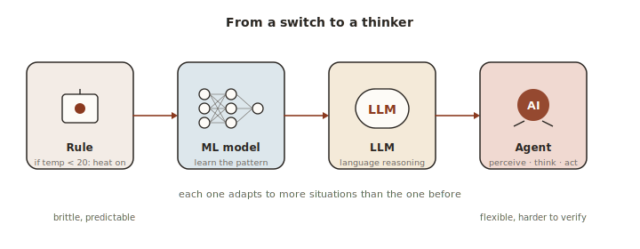
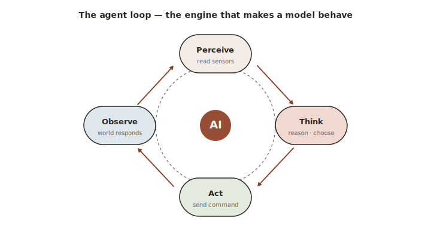
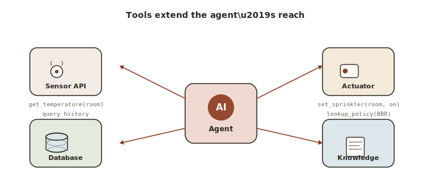
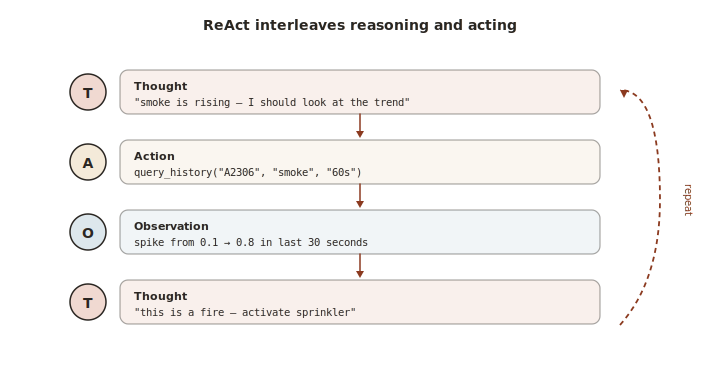
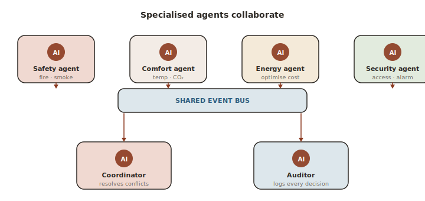
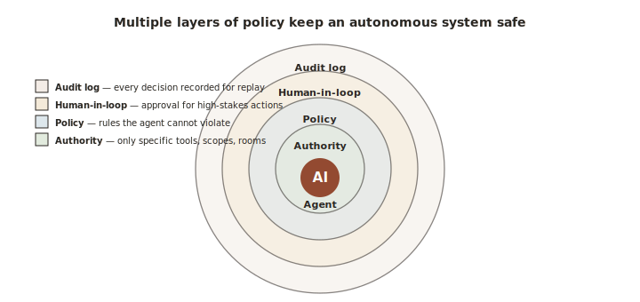
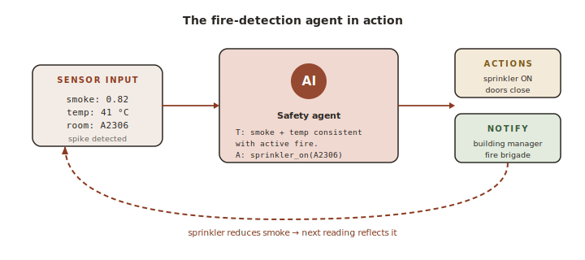

# Lecture 4 — Agentic AI for Autonomous Systems

Standalone notes for the fourth lecture of D7065E. Read on its own or alongside `lectures/lecture-4-agentic-ai.md`.

---

## Part 1 — From a Switch to a Thinker: Three Generations of Automation

<figure class="diagram">

<figcaption><em>Four generations of automation, each adapting to more situations than the one before. The trade-off is always: more flexible behaviour, harder to predict.</em></figcaption>
</figure>

The history of building automation is the history of decisions getting smarter. Three generations of automation describe where the field has been and where it is now.

### Generation 1: Rule-based automation

The oldest and simplest. A rule says: `if temperature > 25°C then turn on the AC`. A programmable logic controller (a small industrial computer) can evaluate thousands of these rules per millisecond. The behaviour is deterministic, predictable, and easy to verify. Engineers love rules because rules don't surprise them.

A useful image: a thermostat with a dial. You set the dial, the thermostat compares the room temperature against the dial, and the heater clicks on or off. There is no thinking happening. There is no context. The thermostat doesn't know it's three in the morning, or that the building is empty, or that today is a public holiday. It only knows the number.

Rules work beautifully until reality stops fitting into the rules. A rule that turns on the AC at 25°C is correct on most days. It is wrong at 3 a.m. when nobody is in the building. It is wrong on a holiday when the office is closed. It is wrong when a faulty ventilation duct is causing the heat — running the AC will only make the duct fault worse. Real buildings have hundreds of interacting rules, each trying to cover an edge case, and the interactions between them become impossible to maintain.

### Generation 2: Machine-learning inference

A learned model replaces hand-crafted rules. Instead of `if temperature > 25°C`, the model takes a list of features — temperature, occupancy, time of day, day of week, weather forecast, recent HVAC commands — and outputs a prediction. The model is trained on thousands or millions of examples of how the building behaves, and it learns patterns no rule-writer would have thought to capture.

A useful image: a doctor who has seen ten thousand patients. The doctor doesn't follow a single rule like "if temperature > 38°C, prescribe antibiotics." They take in a constellation of symptoms — temperature, blood pressure, the patient's history, the time of year — and recognise the pattern. The diagnosis comes from pattern recognition, not from a flowchart.

ML inference is much better than rules at handling situations the engineer didn't anticipate. But it is still, fundamentally, a function: input features in, prediction out. The model does not reason about *why*. It cannot explain itself in plain language. It cannot handle situations far outside its training data.

### Generation 3: Agentic AI

Agentic AI goes one step further. An **agent** observes the current situation, reasons about its context in natural language, plans a sequence of actions, calls tools to execute the plan, observes the outcome, and adjusts its approach. The brain of the agent is typically a large language model (an LLM).

A useful image: instead of a doctor following a flowchart, imagine a senior consultant. The consultant asks the patient questions, weighs trade-offs out loud, considers what would happen if they chose treatment A versus treatment B, runs a test to gather more information, and explains the reasoning to the patient in plain English. The consultant might encounter a case they have never seen before and still produce a sensible plan by reasoning from first principles.

An LLM-based agent can:
- Handle a situation it has never encountered in training.
- Explain its decisions in human language.
- Ask for clarification when the input is ambiguous.
- Adjust its plan after observing the result of an action.

These three generations are not in competition. A real building uses all three: hard-wired rules for the most safety-critical functions (because rules are fast and verifiable), ML models for real-time inference (because models are smarter than rules), and LLM agents for higher-level reasoning that needs context and explanation (because agents can think). The art is knowing which to use where.

---

## Part 2 — The Agent Loop

<figure class="diagram">

<figcaption><em>The agent loop is the engine that turns a model into a behaviour. Perceive, think, act, observe — and round again.</em></figcaption>
</figure>

Every agent, no matter the framework or the model, runs the same loop. Six steps, repeated forever.

```
   ┌──► PERCEIVE ──► REASON ──► PLAN ──► ACT ──► OBSERVE ──► UPDATE ──┐
   │                                                                   │
   └───────────────────────────────────────────────────────────────────┘
```

A useful image: a chess player thinking through a move. They look at the board (perceive). They reason about what's threatening and what's possible. They plan a sequence — capture the knight, then move the rook. They make the first move (act). They watch what the opponent does (observe). They update their mental notes about the opponent's style (update). Then the loop starts again with the new board state.

### Perceive

The agent gathers fresh information about its environment. For a building agent, this means querying the time-series database for recent sensor readings, checking the dashboard's pending alerts, looking at what other agents have done recently.

A useful image: walking into a room and noticing the temperature, the people present, the open door, the smell of food. You're not deciding anything yet — you're just taking it in.

### Reason

The agent thinks through what the perceptions mean. With an LLM-based agent, this is literally the LLM generating a "Thought" — a short natural-language sentence explaining its interpretation.

A useful image: muttering to yourself as you walk through the room. "Hot in here. Three people. Door's open to the hot corridor — that's probably why. They're working, not just passing through — I don't want to interrupt them."

### Plan

The agent decides on a sequence of actions that should achieve its goal. The plan might be one action ("close the door") or several ("close the door, increase ventilation, send a notification").

A useful image: drawing up a small to-do list. "Step one: close the door. Step two: check if it helped in five minutes."

### Act

The agent executes the plan by calling tools — functions that affect the world. A tool might command an actuator, query a database, send an alert, or compute a route.

A useful image: actually walking over and closing the door. Up until now everything has been in your head. Now you put your hand on the handle.

### Observe

After acting, the agent checks what happened. Did the actuator state change? Did the sensor reading respond? Was the alert sent?

A useful image: stepping back and watching the temperature display for a minute. Did closing the door cool the room?

### Update

The agent writes the result of this loop into its memory or audit log, so the next loop has the benefit of this experience. Without the update step, every loop starts from a blank slate.

A useful image: jotting in your notebook, "closed the door in room A2306 at 14:32, room temperature dropped 1.2°C in five minutes, conclude that the corridor was indeed the heat source." Tomorrow, you'll skip the diagnostic and close the door faster.

The update step is the one that turns inference into learning. Many beginner agents skip it, and they become elaborate functions that don't actually get smarter over time. A well-designed agent always closes the loop with a structured note that the next perceive step can read.

---

## Part 3 — Choosing the Right Tool: Rules vs ML vs Agents

A useful question to ask before any decision is "how fast must this be, and how much context does it need?" The answer points to one of three approaches.

| Decision type | Latency budget | Example | Best approach |
|---|---|---|---|
| Safety-critical | Under 100 ms | Fire suppression, emergency unlock | Hard-coded rule, possibly with ML on the edge |
| Real-time control | Under 1 second | Adjust temperature setpoint | Edge ML inference |
| Operational reasoning | 1 to 30 seconds | Optimise HVAC schedule for the next hour | LLM agent |
| Strategic planning | Minutes | Plan tomorrow's energy schedule | LLM agent + optimiser |
| Human-facing explanation | Interactive | Explain why heating changed | LLM |

A useful image: a hospital emergency department. The triage nurse follows a strict rule ("airway, breathing, circulation") because seconds count. The resident on call uses pattern recognition from training. The senior consultant reasons through complex cases. Three layers, three levels of cost and speed, each used where it fits.

A well-designed building control system uses all three layers in the same way:

- **Rules** for the fastest safety functions, where the cost of being slow is human harm and the cost of being wrong is catastrophic.
- **ML models** for real-time inference, where the situation is well-defined enough to train on and the latency budget rules out anything slower.
- **LLM agents** for higher-level reasoning, where context, trade-offs, and explanation matter more than raw speed.

---

## Part 4 — Why LLMs Make Good Controllers

Large language models bring four capabilities to building control that neither rules nor traditional ML can match. Each is worth understanding because it shapes when an LLM is the right tool.

### Contextual reasoning

An LLM can reason about trade-offs that involve many objectives at once. Consider this: "Energy cost is currently high because of peak pricing, but three occupants are complaining about the heat, and the outdoor temperature is forecast to drop in two hours. The optimal action is to tolerate the discomfort for 45 minutes, then pre-cool aggressively when the price drops." No rule system can express this kind of multi-dimensional weighing. No ML classifier can either, because the relevant facts are different every time.

A useful image: a chess grandmaster commenting on a position. "I'd normally trade queens here, but my opponent has shown they prefer endgames, and I'm slightly down on time — so I'll keep the queens and look for a tactical opportunity instead." The reasoning weaves together many considerations that no fixed rule could capture.

### Natural-language understanding

A building manager doesn't think in terms of CO2 sensor IDs. They think in terms of "the meeting room on the third floor feels stuffy." An LLM agent can take that sentence, translate it into a sensor query, diagnose the issue, and act — without anyone having to look up the sensor's ID.

A useful image: a smart assistant who understands "the room that gets afternoon sun" without being told which compass direction that is.

### Explainability

When an LLM makes a decision, it can explain it in a paragraph. "I turned off HVAC zone 4 because the CO2 sensor in that zone has been stuck at 450 ppm for the last 30 minutes despite three occupants being present according to the booking system, which suggests a sensor fault rather than genuine air quality. I have created a maintenance ticket." A traditional ML model cannot produce this. It outputs a number, not an explanation.

A useful image: the difference between a thermometer that beeps and a thermometer that says, "I'm beeping because the patient's fever rose 0.8°C in the last hour, faster than the usual recovery curve, so we should check for infection."

### Handling novel situations

A fire alarm in a building hosting a film shoot that uses artificial smoke. A CO2 sensor that has been painted over by accident. A building manager who manually overrode the HVAC last week and forgot. LLMs handle these because they reason from common sense. Rule systems and ML models fail because none of these are in the rules or the training data.

A useful image: a new employee on their first day, facing a situation nobody trained them for. They reason from first principles: "this seems unusual; let me check with someone before acting." That kind of cautious common sense is exactly what an LLM brings.

---

## Part 5 — The Limits of LLMs (and How to Work Around Them)

LLMs are powerful but flawed. Four problems matter for building control, and each has a known mitigation.

### Hallucination

LLMs sometimes produce plausible-sounding but incorrect outputs. An LLM might suggest activating an actuator that doesn't exist, claim a sensor is showing a value it isn't, or invent a regulation. Hallucination is not malice — the LLM is doing exactly what it was trained to do, which is produce text that *looks* right.

A useful image: a confident but unreliable witness in court. They speak with conviction. They're sometimes completely correct. They're sometimes completely wrong, and they don't know the difference.

Three mitigations:

- **Constrain the output to a JSON schema.** The LLM is forced to produce structured output with valid field types. It can't invent random tools or actuators because those aren't in the schema.
- **Validate every tool-call argument before execution.** The LLM might say "activate sprinkler in room ZZZ." The validation layer rejects this because room ZZZ doesn't exist. The LLM never reaches the actuator.
- **Never trust the LLM's claims about sensor values.** Always read ground truth from the API or database. If the LLM says "the temperature is 32°C," check the database. The LLM is the reasoner, not the source of truth.

### Latency

A cloud LLM API call takes 500 to 3000 milliseconds. That is far too slow for any decision on the critical safety path.

A useful image: imagine a thermostat that has to consult its lawyer before clicking on. The lawyer's advice might be excellent, but it arrives after the room has overheated.

Mitigations:

- **Use LLMs only for deliberative reasoning.** Decisions that can tolerate seconds of latency — HVAC scheduling, anomaly classification, planning — are fine.
- **Use ML models for real-time inference.** The ML model runs in milliseconds. When the ML model flags an anomaly, *then* the LLM is invoked to reason about whether it's a true positive.
- **Cache common reasoning patterns.** "Smoke above 0.7 plus rising temperature" is a frequent input. Cache the LLM's response.
- **Use smaller local models for routine decisions.** A local model like Llama 3.2 3B running on a GPU server takes 100-200 ms instead of 1000-2000 ms.

### Cost

Calling a cloud LLM API for every sensor reading is economically unsustainable. A building with 100 sensors reading every five seconds would make 1.7 million LLM calls per day. Even at one cent per call, that's $17,000 a day.

A useful image: you would not call a senior lawyer to review every email you send. You'd ask the lawyer about the hard ones and handle the rest yourself.

Mitigations:

- **Invoke the LLM only for novel or anomalous situations.** A simple ML or rule filter handles routine cases. The LLM is reserved for the unusual.
- **Use the ML model as a filter that escalates to the LLM only when needed.** This is the most common production pattern. Inference runs on every reading; the LLM runs only on the few that look interesting.

### Local models

A local model — running on the lab's GPU server or on a developer's laptop — solves both the latency and the cost problem. The model is slower and less capable than a frontier cloud model, but it's free and fast.

**Ollama** is the standard tool for running open-source LLMs (Llama, Gemma, Mistral, Qwen) locally with a simple API. The course's lab GPU server runs Ollama. For routine reasoning in a building control system, a local model is entirely adequate.

A useful image: having a librarian in the office building. They don't know everything that the New York Public Library would know, but they're available immediately and free.

### Structured output

The single most useful trick for working with LLMs reliably is to ask for JSON instead of free text. With OpenAI-compatible APIs (including Ollama), `response_format={"type": "json_object"}` forces the model to produce JSON. With Anthropic's API, `tool_choice="required"` forces a tool call that has a defined schema.

A useful image: asking a job applicant to fill in a form instead of writing a letter. The form has named fields and types. Even a poor candidate produces something parseable. A letter, by contrast, can be free-form and impossible to process automatically.

---

## Part 6 — Giving the Agent Hands: Tool Use and Function Calling

<figure class="diagram">

<figcaption><em>Tools let the agent reach into systems it can't operate by itself. Each tool is a typed function the model can call when it needs to act.</em></figcaption>
</figure>

An LLM, on its own, can only read text and produce text. It can't read a sensor, write to a database, or command an actuator. **Tool calling** — also called function calling — is the mechanism that extends the LLM with the ability to invoke external functions.

A useful image: a brilliant consultant who is locked in a room with only a phone. They can think and talk. They can call you and ask you to do things. You go and do those things, then come back and report what happened.

The protocol works in five steps:

1. The system defines a set of tools (functions) with names, descriptions, and parameter schemas.
2. The user sends a message to the LLM, along with the tool definitions.
3. The LLM reasons about what to do. If it needs to act, it generates a structured **tool call** — a JSON object with the function name and the arguments.
4. The calling code executes that function and gets a result.
5. The result is returned to the LLM as a **tool result** message. The LLM then either calls another tool or produces a final answer.

This loop — Thought, Action, Observation, Thought, Action, Observation — is the foundation of the **ReAct pattern**, introduced by Yao et al. in 2022. ReAct stands for "Reasoning + Acting", and it is by far the most common pattern for LLM agents.

A worked example:

```
   Thought: The smoke sensor in A2306 reads 0.82, which is above the alert
            threshold of 0.7. I should check if there are corroborating
            signals before activating sprinklers.
   Action:  read_sensors(room="A2306", sensor_types=["temperature", "co2"])
   Observ:  temperature=38.5°C (normal is 21°C), co2=890 ppm (normal is 450)
   Thought: Temperature is significantly elevated and CO2 is rising. Combined
            with smoke, this is consistent with a fire, not a false alarm.
            I should activate sprinklers and unlock evacuation doors.
   Action:  set_actuator(actuator_id="sprinkler-A2306", state="on",
                         reason="fire detected: smoke=0.82, temp=38.5C")
   Observ:  {success: true, state: "on"}
   Action:  set_actuator(actuator_id="doors-floor2", state="unlocked",
                         reason="fire evacuation")
   Observ:  {success: true, state: "unlocked"}
   Thought: Sprinklers activated and evacuation doors unlocked. I should
            alert the building manager.
   Action:  create_alert(severity="critical", message="Fire detected in
                         A2306. Sprinklers activated. Doors unlocked.")
```

The key insight is that the reasoning (Thought) is explicit. Every step has a sentence explaining why the next action is justified. For safety-critical systems this is the difference between a system you can audit and one you can't. Every decision the agent makes can be replayed and explained.

A useful image: a detective's case notebook. Every observation, every deduction, every action is written down in order. If the case goes to court, the notebook is the evidence.

---

## Part 7 — Designing Good Tools

Tool design is more important than agent design. A well-designed tool catalogue lets even a small LLM reason effectively. A badly-designed catalogue confuses even a frontier model. Four principles drive good tool design.

### One tool per concern

Don't write one big `control_building()` tool that does everything. Write narrow tools, each with a single job: `read_sensors`, `set_actuator`, `find_route`, `highlight_rooms`, `query_history`, `create_alert`. Each is small, validated, and easy to test.

A useful image: a Swiss Army knife with named tools versus a single blob marked "do something useful." When the LLM needs to cut wire, it picks the wire cutter. When it needs to open a bottle, it picks the bottle opener. Each tool's purpose is obvious from its name.

### Descriptive names and docstrings

The LLM decides which tool to call by reading its name and description. A tool called `get_data()` will be misused. A tool called `read_room_sensors(room_id, sensor_type, last_minutes)` will be used correctly. Spend time on the description — it is literally what teaches the LLM how to use the tool.

A useful image: jars in a kitchen pantry. If they're all labelled "stuff," the cook will pick at random. If each one is labelled clearly — "sea salt, fine" or "bicarbonate of soda" — the cook will reach for the right one.

### Validate inputs before execution

Never trust tool-call arguments unconditionally. Check that the room exists, that the sensor type is valid, that numeric arguments are within sensible ranges. If validation fails, return an error message — the LLM can read it and try again with corrected arguments.

A useful image: a bouncer at a club door. The bouncer doesn't care that the person is wearing a tuxedo. They check the guest list. If the name isn't on the list, the person doesn't get in, regardless of how confident they appear.

### Return rich, informative results

When a tool returns a result, the LLM uses that result to reason about what to do next. A bare result like `{"state": "on"}` is the bare minimum. A rich result is far more useful:

```json
{
  "state": "on",
  "previous_state": "off",
  "last_changed_at": "2026-04-27T13:42:05Z",
  "commanded_by": "safety_agent",
  "applied_within_ms": 230
}
```

The LLM can now reason about how recently the actuator changed, who else has commanded it, and whether the response time was normal.

A useful image: a good waiter doesn't just bring you the dish. They tell you what's in it and what it goes well with. The extra context lets you order better the next time.

### A complete example

A tool definition that follows all four principles, in OpenAI/Ollama function-calling format:

```python
tools = [{
    "type": "function",
    "function": {
        "name": "read_sensors",
        "description": (
            "Read current sensor values for a specific room. "
            "Returns temperature (°C), humidity (%), CO2 (ppm), "
            "smoke (0-1), and occupancy state."),
        "parameters": {
            "type": "object",
            "properties": {
                "room_id": {
                    "type": "string",
                    "description": "Room identifier, e.g. 'A2306'"
                },
                "sensor_types": {
                    "type": "array",
                    "items": {"type": "string"},
                    "description": ("List of sensor types to read. "
                                    "Options: temperature, humidity, "
                                    "co2, smoke, occupancy")
                }
            },
            "required": ["room_id"]
        }
    }
}]
```

---

## Part 8 — The Model Context Protocol (MCP)

A new agent project usually starts with the team defining their own tool format, their own way of registering tools, their own way of exposing them to the LLM. After a few projects, everyone has invented the same wheel a slightly different way.

The **Model Context Protocol**, abbreviated MCP, was proposed by Anthropic in 2024 to standardise this. It defines a single protocol for connecting AI models to external data sources and tools, so that any MCP-compatible model can discover and use tools from any MCP-compatible server.

The architecture has three components:

- **MCP Host** — the application that runs the LLM (Claude Code, an AI agent application).
- **MCP Client** — the protocol client inside the host that manages server connections.
- **MCP Server** — a server that exposes tools, resources, and prompts via the MCP protocol.

A useful image: think of MCP as a universal remote control standard. Before MCP, every TV maker shipped its own remote, and you needed a dozen remotes for your living room. MCP is HDMI-CEC for AI tools — one standard so that any device works with any controller.

For building control, an **MCP server** wraps the BuildSim API as MCP tools. The BuildSim MCP server in the course repository exposes 17 tools: `get_building`, `get_rooms`, `list_equipment`, `add_sensor`, `set_actuator_state`, `highlight_rooms`, `find_route`, and more. Any MCP-compatible agent — Claude, GPT-4, a local Ollama model with an MCP wrapper — can discover and use those tools automatically. No custom integration code.

The protocol itself uses JSON-RPC 2.0 over stdio or HTTP with server-sent events. Implementing an MCP server means defining tool schemas, implementing tool handlers (which usually wrap REST API calls), exposing a `tools/list` endpoint that returns the catalogue, and exposing a `tools/call` endpoint that executes a chosen tool.

The MCP Python SDK handles the protocol plumbing. Only the tool implementations have to be written.

---

## Part 9 — Agent Frameworks: What They Buy You and What They Cost

Agent frameworks provide scaffolding for building LLM agents: tool execution loops, memory management, state machines, multi-agent coordination, and integrations with many LLM providers. The right choice depends on the complexity of the use case.

### No framework

For simple agents that call one or two tools in a fixed sequence, plain Python with direct LLM API calls is often clearest. A 50-line Python script that reads sensors, constructs a prompt, calls the LLM, parses the tool call, executes the tool, and loops is simpler to understand, test, and debug than the same logic expressed in a framework's domain-specific language.

A useful image: cooking a single fried egg. You don't need a chef. You need a frying pan and basic technique.

### LangChain

The most widely used LLM application framework. Provides chains (sequential tool calls), agents (LLM-driven tool selection), memory (conversation history), and a huge ecosystem of integrations. Best when many integrations are needed quickly — connectors to databases, vector stores, cloud LLM providers, and so on.

A useful image: a well-stocked kitchen. Many tools, many ingredients, many recipes already half-prepared. Great for many dishes; overkill if you only ever fry eggs.

### LangGraph

A graph-based agent framework from the LangChain team. Agents are defined as nodes in a directed graph with cycles; the LLM decides which edge to follow at each step. Better than plain LangChain for complex workflows with branching, looping, and human-in-the-loop checkpoints.

```python
from langgraph.graph import StateGraph, END
from langgraph.prebuilt import ToolNode

class AgentState(TypedDict):
    messages: list
    sensor_readings: dict
    pending_actions: list

workflow = StateGraph(AgentState)
workflow.add_node("read_sensors", sensor_reading_node)
workflow.add_node("reason", llm_reasoning_node)
workflow.add_node("act", ToolNode(building_tools))

workflow.set_entry_point("read_sensors")
workflow.add_edge("read_sensors", "reason")
workflow.add_conditional_edges("reason", should_act,
                               {"act": "act", "done": END})
workflow.add_edge("act", "reason")

agent = workflow.compile()
```

A useful image: a board game with a movement map. Each square has rules for what moves are legal. The agent rolls the dice and moves; the framework enforces the rules of the board.

### CrewAI

A framework for role-based multi-agent systems. Agents are defined with **roles** (architect, designer, builder), **goals**, and **backstories**. **Tasks** have descriptions and expected outputs. **Crews** assign tasks to agents, and agents can delegate to each other.

A useful image: a film production team. The director, the cinematographer, the editor — each has a defined role, each can collaborate with the others, and the producer (the crew) coordinates them.

### AutoGen

Microsoft's conversational multi-agent framework. Agents exchange messages in a structured conversation; a coordinator directs the flow. Good for tasks where multiple agents critique each other — code review, report writing, multi-step debugging.

A useful image: a panel discussion. The moderator picks who speaks. Each panellist has a perspective. The conversation produces a richer answer than any single panellist alone.

### Pydantic AI

A newer framework built around Pydantic for structured outputs and type safety. Good for agents that need reliable, typed tool-call arguments and responses. Less feature-rich than LangGraph but simpler to use for straightforward agents.

A useful image: building furniture with a precision template. Less flexible than freehand work, but every joint fits.

---

## Part 10 — The ReAct Pattern in Detail

<figure class="diagram">

<figcaption><em>In the ReAct pattern, the agent alternates between reasoning (Thought) and acting (Action), with each Observation feeding the next Thought. The trace is also the explanation.</em></figcaption>
</figure>

The ReAct pattern — Reasoning + Acting — was introduced by Yao et al. in their 2022 paper. It is short, clear, and has become the de facto template for LLM agents.

The pattern interleaves three step types:

- **Thought**: the LLM's reasoning, in natural language.
- **Action**: a tool call.
- **Observation**: the result of the tool call.

Repeated until the LLM produces a final answer instead of another action.

The key insight is that the **reasoning is explicit and auditable**. For a safety-critical building control system, this is invaluable. After a fire incident, you can replay every Thought, every Action, every Observation, and see exactly what the agent did and why.

A useful image: a pilot's flight log. Every decision is timestamped, with the reason. If the plane lands safely, nobody looks at the log. If something goes wrong, the log is the first thing the investigators read.

The interleaving also helps the LLM stay on track. A pure plan-then-execute pattern is fragile: the plan is made once, and if reality doesn't match the plan, the agent fails. ReAct adapts continuously — every Observation feeds back into the next Thought, and the plan evolves.

---

## Part 11 — Multi-Agent Systems

<figure class="diagram">

<figcaption><em>Specialised agents own a slice of the problem and communicate through a shared bus. A coordinator resolves conflicts; an auditor records every decision.</em></figcaption>
</figure>

A single agent that controls every aspect of a building is fragile. It is hard to test, hard to update, and has a single point of failure. Multi-agent systems decompose the control problem into specialised agents that coordinate.

### Why multiple agents

Four reasons.

**Separation of concerns.** A **safety agent** handles fires and emergencies with highest priority. An **energy agent** optimises consumption. A **comfort agent** maintains temperature and air quality. Each agent has a clear responsibility and can be developed, tested, and updated independently.

**Parallel reasoning.** Multiple agents can reason simultaneously. The energy agent is continuously optimising the HVAC schedule while the comfort agent is processing an occupant feedback event, and they do not block each other.

**Robustness.** If the comfort agent crashes, the safety agent keeps running. Single-agent architectures have a single point of failure.

**Specialisation.** A small, fast model may be sufficient for routine energy optimisation, while a larger model is used only for complex safety decisions. Different agents use different models, optimising cost and latency.

A useful image: a hospital. The cardiologist handles hearts. The nephrologist handles kidneys. The emergency physician handles whatever walks in. Each specialist is excellent at their narrow domain. The patient benefits from all of them.

### How agents talk to each other

Three communication patterns.

**Shared state (the blackboard pattern).** All agents read and write to a shared data store (the time-series database, a Redis instance, the BuildSim API). Agents observe each other's actions through state changes.

A useful image: detectives in a precinct office sharing a whiteboard. Each adds clues; each sees what the others have added. Simple and decoupled, but with the risk that two detectives independently chase the same lead.

**Message passing.** Agents send structured messages to each other through a message queue (MQTT, Redis Streams). Explicit, auditable, decoupled.

A useful image: a customer-service team where every escalation is a ticket. The customer-service rep tickets a manager; the manager tickets engineering; engineering tickets the customer-service rep with a solution. Every step is recorded.

**Shared context in the LLM.** For LLM-based agents, the entire conversation history (including other agents' decisions) is included in each agent's context. Each agent sees what the others have decided. Expensive in tokens but produces well-informed decisions.

A useful image: a war-room briefing where every participant hears every report. Slow but coherent.

---

## Part 12 — Conflict Resolution and the Pathologies Multi-Agent Brings

The moment a system has multiple agents with different objectives, conflicts become possible. The energy agent wants the HVAC off. The comfort agent wants it on. Who wins?

### Conflict-resolution strategies

**Priority-based.** Each agent has a fixed priority. The safety agent's priority is 1000 — it always wins. Energy is 10. Comfort is 20. When agents conflict, the higher-priority agent's command is executed. Simple, predictable, but inflexible.

A useful image: emergency services priority. When the fire alarm rings, the fire brigade takes over the road. Nothing else competes.

**Auction-based.** Agents bid for actuator control with a numeric priority. The agent with the highest bid wins. Bids can be dynamic — the safety agent bids 1000 only when smoke is detected, 0 otherwise. This gives flexibility based on context.

A useful image: an auction house. The dynamic bid lets a normally-quiet bidder suddenly out-shout everyone when something special comes up.

**Consensus.** Agents negotiate a compromise. The energy agent proposes a temperature setpoint; the comfort agent counter-proposes; they converge. More complex but produces better outcomes when neither agent needs to win completely.

A useful image: two negotiators meeting in the middle. Each starts from their preferred outcome and walks halfway. Both leave slightly unhappy and entirely satisfied.

**Hierarchical (supervisor pattern).** A supervisor agent receives all proposed actions from subordinate agents, reasons about conflicts, and produces a final unified action set. The supervisor has the most context but is a bottleneck.

A useful image: a project manager arbitrating between team members. Slower than letting them work it out, but produces consistent decisions.

### Pathologies — failure modes that don't exist with a single agent

Multi-agent systems can fail in ways that single-agent systems cannot.

**Oscillation.** Agent A turns on the HVAC, which raises the temperature; Agent B turns it off to save energy; temperature drops; Agent A turns it on again. The loop repeats indefinitely.

A useful image: two thermostats with different setpoints, wired into the same room. Each fights the other forever. Neither room nor energy bill ever stabilise.

The prevention is **hysteresis** — refusing to change state unless the trigger condition has been true for at least N seconds. A shared decision log so each agent knows what the others recently decided also helps.

**Deadlock.** Agent A waits for Agent B to release an actuator; Agent B waits for Agent A to release a different one. Neither can proceed.

A useful image: two cars at a four-way stop, both waiting for the other to go.

Prevention: avoid circular dependencies in actuator ownership; use timeout-based locks.

**Thrashing.** Multiple agents issue conflicting commands in rapid succession, causing actuators to change state faster than the physical system can respond.

A useful image: flipping a light switch ten times a second. The bulb never has time to warm up; it just flickers.

Prevention: rate-limit actuator commands; enforce a minimum time between state changes for any actuator.

---

## Part 13 — Safety and Trust in Agentic AI

<figure class="diagram">

<figcaption><em>An autonomous agent is wrapped in concentric layers of policy. Authority limits what it can touch; policy says what it must never do; humans approve the rest; an audit log records everything.</em></figcaption>
</figure>

An AI agent controlling a building can cause real harm. It can leave emergency doors locked during a fire, over-cool a server room, or cause energy spikes that trip a breaker. Safety in agentic AI is not abstract — it is an engineering requirement, and there are well-established techniques to enforce it.

### Guardrails

**Guardrails** are constraints applied before an action is executed. The LLM never sees the guardrail; the validation code runs between the tool call and the actuator. Examples:

- Never lock all exits simultaneously, even if the LLM reasons that it should.
- Smoke suppression can only be deactivated by a human operator.
- Actuator commands above a certain rate are rejected.
- If any action would result in all HVAC units being off in winter, human confirmation is required.

A useful image: bumpers on a bowling lane. The LLM is the ball. The bumpers don't change the ball's spin or speed, but they catch a wild throw before it ends up in the gutter.

### Human-in-the-loop (HITL)

For high-stakes, irreversible actions — activating fire suppression in a particular zone, unlocking emergency exits — the agent proposes the action and waits for a human to approve. HITL adds latency, but the cost of a wrong decision is high enough that the latency is worth it.

A useful image: a customer-service rep needing manager approval to issue a refund over £500. Slows things down, but stops large mistakes.

### Audit trail

Every agent decision, tool call, and reasoning step must be logged immutably. When something goes wrong, reconstructing exactly what the agent decided and why is essential. The ReAct pattern is naturally audit-friendly: every Thought, every Action, every Observation is already a structured record.

A useful image: a bank ledger. Every transaction has a timestamp, an account, an amount, and a reference. If a discrepancy is found, the ledger is the source of truth.

### Graceful degradation

When the AI agent is unavailable — the LLM API is down, the agent process has crashed, the network is degraded — the system must fall back to a safe state without human intervention. All actuators remain in their current state. Rule-based fallbacks handle the most critical safety functions. Alerts notify operators that AI control is inactive. The system can still be operated manually via the BuildSim API.

A useful image: a hospital's manual procedures when the IT system goes down. Paper charts. Phone calls. Slower, less informed, but the patients still get cared for.

### Testing safety

Adversarial testing is essential. Inject sensor faults: what does the agent do when the smoke sensor reads 0 for ten minutes? Simulate network outages: what happens when the LLM API returns an error? Send conflicting commands: what does the coordinator do? Test with novel situations: what if a sensor reports a value the agent has never seen before?

A useful image: a fire drill in an office. You don't wait for a real fire to find out whether the evacuation plan works.

Tests for these scenarios are written **before** deployment, not after. They are part of the validation step of MBSE.

---

## Part 14 — A Worked Example: Fire-Detection Agent

<figure class="diagram">

<figcaption><em>The fire-detection agent in action: a sensor spike triggers reasoning, the agent calls actuator and notification tools, and the next sensor reading closes the loop.</em></figcaption>
</figure>

To make all of this concrete, walk a fire-detection agent through one complete cycle.

### Setup

- Smoke sensors per room, publishing readings every 5 seconds to MQTT.
- A consumer writing every reading to TimescaleDB.
- An anomaly model (Isolation Forest) that scores each sensor every 30 seconds.
- The safety agent, a ReAct agent using Ollama (Llama 3.2 3B locally) for reasoning.
- Six tools: `read_sensors`, `set_actuator`, `highlight_rooms`, `find_route`, `query_history`, `create_alert`.
- Guardrails: known actuator IDs only; legal states only; a `reason` field of at least 5 characters is required.
- Audit trail: every Thought, Action, Observation written to a `decisions` table in TimescaleDB.

### The trigger

Smoke level in room A2306 spikes to 0.85. The anomaly model scores 0.91, well above threshold. The safety agent wakes for its perceive cycle.

### Perceive

The agent calls `read_sensors(room="A2306", last_seconds=30)`. The result:

```json
{
  "room": "A2306",
  "sensors": {
    "smoke":       {"current": 0.85, "mean": 0.62, "trend": +0.41},
    "temperature": {"current": 38.5, "mean": 32.1, "trend": +6.4},
    "co2":         {"current": 890,  "mean": 670,  "trend": +220}
  }
}
```

### Reason

The agent generates a Thought:

> "Smoke at 0.85, temperature rising sharply (+6.4 °C in 30 seconds), CO2 also rising. This is a high-confidence fire signal across three independent sensor types. I should activate sprinklers and unlock the evacuation doors. Before acting, I want to know the safest evacuation route."

### Plan and act

The agent issues a tool call: `find_route(from_room="A2306", to_room="exit-stair-east")`. The result includes a path with five waypoints and a distance of 42 metres.

Then `set_actuator(actuator_id="sprinkler-A2306", state="on", reason="fire detected, smoke 0.85, temp 38.5, CO2 890, three signals concur")`. The guardrail checks that the actuator exists (yes), the state is legal (yes), and the reason is at least 5 characters (yes). The command goes through.

Then `set_actuator(actuator_id="firedoor-A2306-east", state="unlocked", reason="evacuation route to east stair")`.

Then `highlight_rooms(rooms=[{"room_id": 552, "color": "#ff0000"}, ...])` to make the fire zone visible on the 3D viewer.

Then `create_alert(severity="critical", message="Fire detected in A2306. Sprinklers active. Evacuation east via stair-east.")`.

### Observe

The agent calls `read_sensors` again 30 seconds later. Smoke level has dropped to 0.45. Temperature still high but stable. The sprinkler is working.

### Update

The full sequence — Thought, Actions, Observations — is written to the audit log. The agent's next cycle starts with this history available.

### When something goes wrong

If Ollama is unreachable when the agent tries to reason, the agent falls back to a pre-coded rule: `if smoke > 0.7 then sprinkler on`. The decision is logged with `step='fallback'` so the audit trail records that the LLM was bypassed. A separate watchdog process enforces hard safety rules independent of the agent: smoke above 0.9 always triggers sprinklers, regardless of what any agent does.

---

## Part 15 — Vocabulary Reference

Every term used in this chapter, defined.

| Term | Definition |
|---|---|
| **Agent** | A system that perceives, reasons, plans, acts, observes, and updates — using an LLM, ML model, or rules as its reasoning engine |
| **Agentic AI** | An AI system built around an agent that uses an LLM to reason about its situation and choose actions |
| **The Agent Loop** | Perceive → Reason → Plan → Act → Observe → Update — the six-step cycle every agent runs |
| **LLM (Large Language Model)** | A neural network trained on text that can generate plausible text in response to prompts |
| **Tool calling** | The mechanism by which an LLM invokes external functions through structured tool-call messages |
| **Function calling** | Synonym for tool calling, used by OpenAI |
| **ReAct pattern** | Reasoning + Acting — interleaving Thought, Action, Observation in the agent's output |
| **Thought** | The LLM's natural-language reasoning step, logged for audit |
| **Action** | A tool call invoked by the LLM |
| **Observation** | The result of a tool call, returned to the LLM as input for the next step |
| **Hallucination** | The LLM producing plausible but incorrect output |
| **Structured output** | Forcing the LLM to produce JSON that matches a schema, rather than free-form text |
| **Local model** | An LLM running on local hardware (Ollama) instead of a cloud API |
| **MCP (Model Context Protocol)** | An open standard for connecting LLMs to external tools, proposed by Anthropic in 2024 |
| **MCP Host** | The application that runs the LLM |
| **MCP Client** | The protocol client managing connections to MCP servers |
| **MCP Server** | A server that exposes tools, resources, and prompts via MCP |
| **Tool (in an agent)** | A function the LLM can call to read or change the world |
| **Tool schema** | The JSON-schema definition of a tool's name, description, and parameters |
| **LangChain** | The most widely used LLM application framework, with chains, agents, memory, and many integrations |
| **LangGraph** | A graph-based agent framework from the LangChain team for complex workflows |
| **CrewAI** | A framework for role-based multi-agent systems |
| **AutoGen** | Microsoft's conversational multi-agent framework |
| **Pydantic AI** | A framework focused on structured outputs and type safety |
| **Multi-agent system** | An architecture with several specialised agents that coordinate to control one system |
| **Coordination layer** | The component that resolves conflicts between agents |
| **Priority-based resolution** | Each agent has a fixed priority; highest priority wins conflicts |
| **Auction-based resolution** | Agents bid for control; highest bid wins |
| **Consensus resolution** | Agents negotiate a compromise rather than one winning outright |
| **Hierarchical (supervisor)** | A supervisor agent arbitrates decisions made by subordinates |
| **Oscillation** | A pathology in which two agents flip an actuator back and forth |
| **Deadlock** | A pathology in which two agents wait for each other forever |
| **Thrashing** | A pathology in which actuators change state faster than the physical system can respond |
| **Hysteresis** | Refusing to change state until the trigger condition has been true for a minimum time |
| **Guardrail** | A validation rule applied before an actuator command is executed |
| **Human-in-the-loop (HITL)** | Requiring human approval before high-stakes actions are executed |
| **Audit trail** | The immutable log of every agent decision, tool call, and reasoning step |
| **Graceful degradation** | The ability to fall back to a safe state when the AI agent is unavailable |
| **Adversarial testing** | Deliberately injecting faults to test how the agent handles them |
| **Ollama** | A tool for running open-source LLMs locally with a simple API |

---

## Part 16 — Summary in Five Sentences

1. Three generations of automation — rules, ML inference, and agentic AI — sit on a continuum from fast-and-rigid to slow-and-thoughtful, and a well-designed system uses all three where each fits.
2. Every agent runs the same six-step loop — Perceive, Reason, Plan, Act, Observe, Update — and the Update step is what turns inference into learning.
3. LLMs are powerful controllers because they handle context, novel situations, and natural language, but they hallucinate, are slow, and are expensive — every one of those weaknesses has a known mitigation through structured output, validation, ML pre-filtering, and local models.
4. Tools are the agent's hands, and the four design principles — one tool per concern, descriptive names, input validation, rich results — matter more than the choice of framework or model.
5. Multi-agent systems are stronger and more failure-resilient than single agents, but they require a conflict-resolution strategy (priority, auction, consensus, or hierarchy) and explicit mitigations for the pathologies they create (oscillation, deadlock, thrashing).

These five ideas are the foundation for every agent in the rest of the course.
