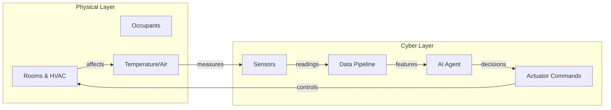
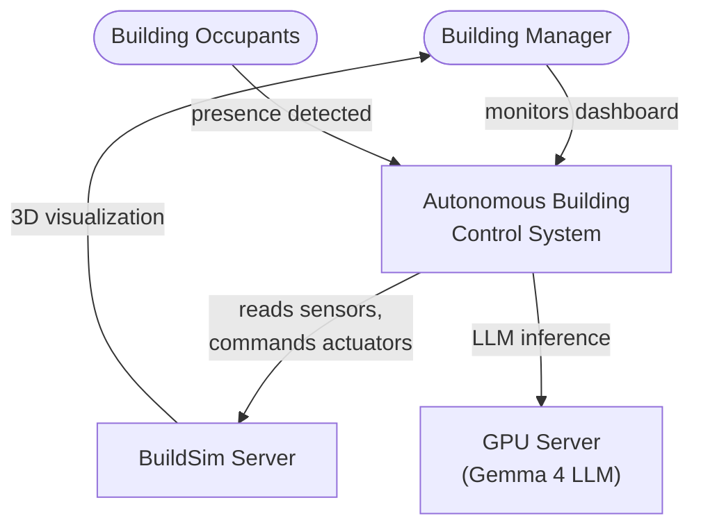
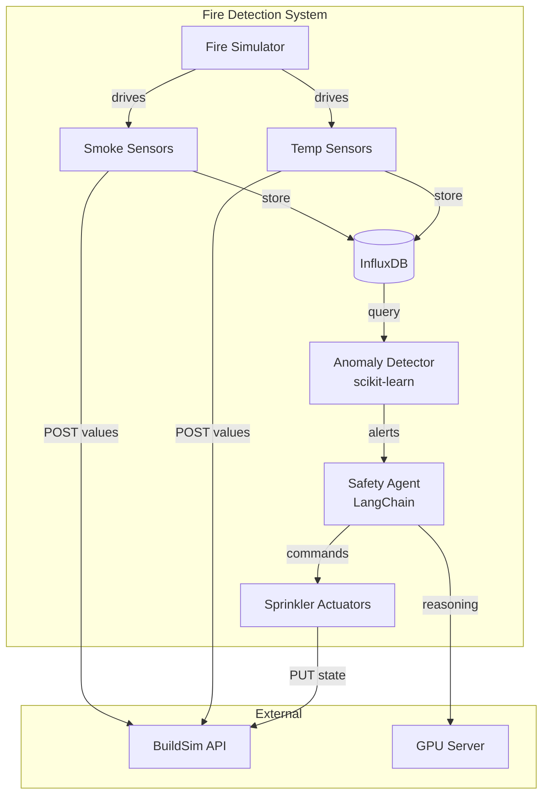
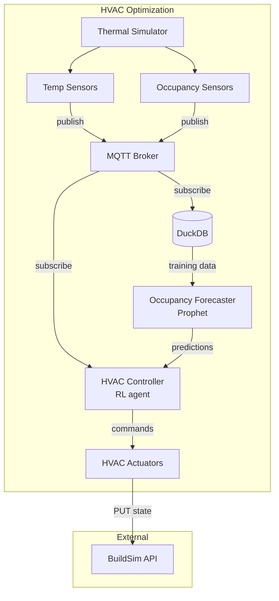
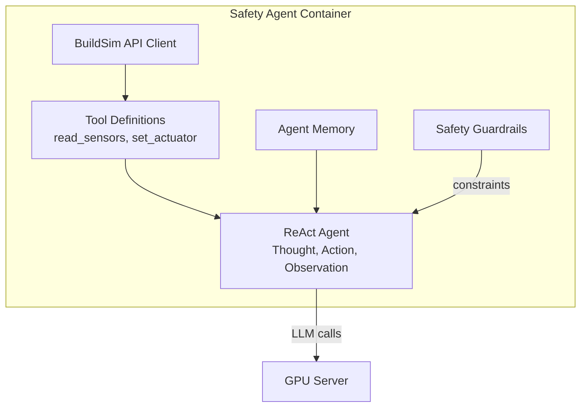
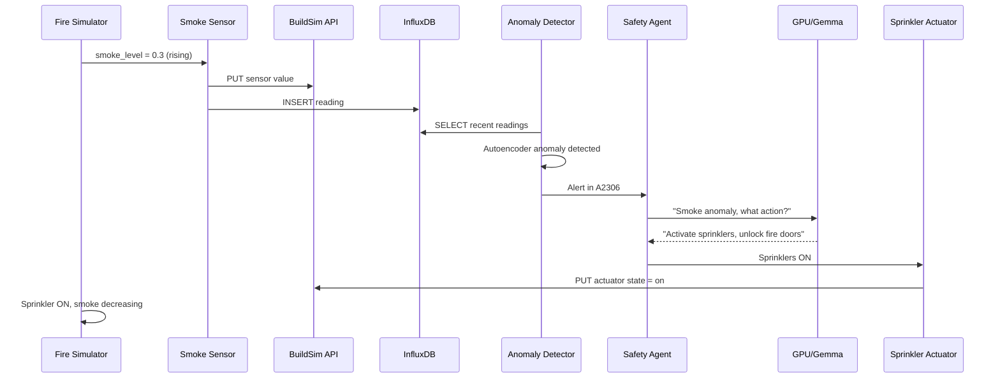
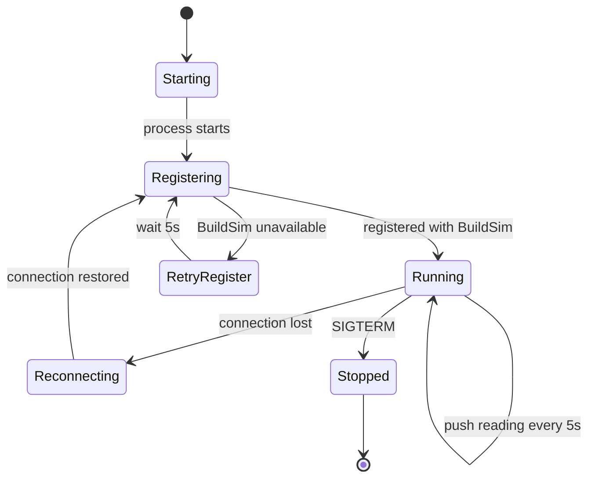

# Lecture 0: Introduction & Model-Based Systems Engineering

## Learning Objectives

After this lecture, students will be able to:
- Explain the course goals and the lab assignment
- Describe what autonomous building control means as a CPS problem
- Apply MBSE methods to analyze requirements, decompose systems, and validate designs
- Use architecture viewpoints to document a system from multiple perspectives
- Connect MBSE artifacts to the lab assignment deliverables

---

## 1. Course Introduction (15 min)

The course is built around one substantial lab assignment: designing and implementing an autonomous building control system using [BuildSim](https://github.com/eislab-cps/D7065E/tree/main/buildingsim), a simulated building with a REST/WebSocket API.

**Milestones:**
1. Architecture document (week 2), design your system before writing code
2. Architecture approval, instructor feedback and sign-off
3. Implementation (weeks 3-5), build the system using AI-driven development
4. Demo and oral exam (week 6), demonstrate the system, defend your design decisions

"Embedded intelligence at the edge" means that intelligence lives on the same network as the building, making decisions in under a second, without depending on the cloud. The physical world does not wait for a round-trip.

---

## 2. The Building as a Cyber-Physical System (15 min)

A **cyber-physical system (CPS)** is one where computation and physical processes are deeply intertwined. In a smart building, the physical layer includes rooms, HVAC ducts, occupants, temperature, smoke, and airflow. The cyber layer includes sensors, actuators, data pipelines, AI agents, and the software that orchestrates them.

These layers form a continuous feedback loop: sensors measure the physical world, software reasons about it, actuators change it, and sensors measure the result.



A thermostat is *automated*, it follows a fixed rule. An *autonomous* system uses data and models to reason about context (time of day, occupancy patterns, weather), predicts problems before they happen, and adapts over time.

Real-world examples: [Johnson Controls OpenBlue](https://www.johnsoncontrols.com/openblue), [Siemens Desigo CC](https://www.siemens.com/global/en/products/buildings/products/hvac-control-products/desigo-cc.html), [DeepMind cooling at Google data centres](https://deepmind.google/discover/blog/deepmind-ai-reduces-google-data-centre-cooling-bill-by-40/) (40% energy reduction).

---

## 3. Why Model-Based Systems Engineering? (10 min)

Traditional systems engineering relies on Word documents, informal diagrams, and verbal agreements. Requirements end up buried in prose. Two engineers reading the same document understand different things. By the time the system is built, the documentation is out of date.

**Model-Based Systems Engineering (MBSE)** replaces documents with models, structured and precise representations that can be analyzed, simulated, and used to generate code and tests. A model is unambiguous: it either specifies something or it does not.

For CPS, MBSE matters because interactions between physical and digital components are complex, timing-dependent, and hard to reason about informally. A sequence diagram showing a smoke sensor, data pipeline, and safety agent makes the design concrete in a way that prose cannot.

Reference: [INCOSE Systems Engineering Handbook](https://www.incose.org/products-and-publications/se-handbook)

---

## 4. Architecture Viewpoints (20 min)

A single diagram cannot capture everything about a system. Different stakeholders care about different things: a developer needs to see software components, an operator needs to see deployment, a safety engineer needs to see failure modes.

**Architecture viewpoints** address this by providing multiple perspectives on the same system, each tailored to a specific concern. The concept originates from [IEEE 42010](https://en.wikipedia.org/wiki/ISO/IEC/IEEE_42010) and is central to frameworks like [ArchiMate](https://pubs.opengroup.org/architecture/archimate3-doc/) and [Kruchten's 4+1 model](https://www.cs.ubc.ca/~gregor/teaching/papers/4+1view-architecture.pdf).

### ArchiMate's Three Layers

[ArchiMate](https://pubs.opengroup.org/architecture/archimate3-doc/) organizes architecture across three layers. For a building control system:

| Layer | What it covers | Building control examples |
|-------|---------------|--------------------------|
| **Business** | Processes, actors, goals, regulations | Building manager monitors safety, BBR compliance |
| **Application** | Software components, data flows, interfaces | AI agent, anomaly detector, data pipeline |
| **Technology** | Infrastructure, devices, containers, networks | Docker containers, GPU server, MQTT broker |

See [ArchiMate viewpoint examples](https://pubs.opengroup.org/architecture/archimate3-doc/ch-Viewpoints.html) for visual examples of each type.

### Common Viewpoints

Each viewpoint answers a different question:

| Viewpoint | Question it answers | What it shows |
|-----------|-------------------|---------------|
| **Context** | What interacts with our system? | System boundary, users, external services |
| **Functional** | What are the parts and how do they connect? | Components, interfaces, data flows |
| **Information** | What data exists and how does it flow? | Data models, storage, transformations |
| **Behavioral** | What happens when X occurs? | Sequence of interactions for a scenario |
| **Deployment** | What runs where? | Containers, hardware, network topology |

### Why Multiple Viewpoints Matter

Each viewpoint catches design flaws that others miss. A functional diagram might look correct, but the deployment view reveals two components need a network connection that does not exist. A data flow might seem clean, but the behavioral view reveals a race condition. The business view might show a compliance requirement that no component addresses.

For this course, you produce at least five viewpoints:

1. **Context**, who and what interacts with your system (C4 Level 1)
2. **Functional**, what components exist and how they connect (C4 Level 2)
3. **Information**, how sensor data flows through to decisions (data flow diagram)
4. **Behavioral**, how components interact for a key scenario (sequence diagram)
5. **Deployment**, what runs where (containers, hardware)

**Further reading:**
- [ArchiMate 3.2 Specification](https://pubs.opengroup.org/architecture/archimate3-doc/)
- Rozanski & Woods, [Software Systems Architecture](https://www.viewpoints-and-perspectives.info/), practical guide to viewpoints
- Kruchten, ["The 4+1 View Model of Architecture"](https://www.cs.ubc.ca/~gregor/teaching/papers/4+1view-architecture.pdf) (IEEE Software, 1995)

---

## 5. Modeling Notations (15 min)

### UML and SysML

**UML** ([uml.org](https://www.uml.org/)) defines 14 diagram types. **SysML** ([sysml.org](https://sysml.org/)) extends UML for CPS with diagrams for requirements traceability, physical constraints, and hardware/software integration. These are industry standards for aerospace, defense, and automotive. Tools include [Cameo](https://www.3ds.com/products/catia/no-magic/cameo-systems-modeler) and [Papyrus](https://eclipse.dev/papyrus/).

For this course, SysML is overkill. Know it exists, you will not use it.

### The C4 Model

The **C4 Model** ([c4model.com](https://c4model.com/)) was created by [Simon Brown](https://simonbrown.je/) because UML was too complex for most teams. It provides four zoom levels:

| Level | What it shows |
|-------|--------------|
| **Level 1, Context** | Your system as a single box, surrounded by users and external systems |
| **Level 2, Containers** | The deployable units inside (Docker containers, databases, processes) |
| **Level 3, Components** | Internal structure of a single container |
| **Level 4, Code** | Class-level detail (rarely needed) |

For this course, you need Levels 1 and 2. Level 3 is useful for your AI agent container.

**C4 resources:**
- [c4model.com](https://c4model.com/), official site with examples
- [The C4 Model for Visualising Software Architecture](https://www.infoq.com/articles/C4-architecture-model/) (InfoQ)
- [Software Architecture for Developers](https://softwarearchitecturefordevelopers.com/), the book behind C4
- [Structurizr DSL](https://structurizr.com/dsl), text-based C4 diagram tool
- [Mermaid C4 support](https://mermaid.js.org/syntax/c4.html), C4 diagrams in Markdown

### Comparison

| Aspect | Informal (whiteboard) | C4 Model | UML/SysML |
|--------|----------------------|----------|-----------|
| **Learning curve** | None | 1 hour | Days to weeks |
| **Precision** | Low | Medium | High |
| **Tooling** | Marker | Mermaid, draw.io | Cameo, Papyrus |
| **This course** | Workshop discussions | Architecture document | Know it exists |

### Tools

- [Mermaid](https://mermaid.js.org/), diagrams as code in Markdown, renders on GitHub. **Recommended.**
- [draw.io](https://app.diagrams.net/), free, visual, exports PNG/SVG
- [Excalidraw](https://excalidraw.com/), hand-drawn style, good for brainstorming
- [Mermaid live editor](https://mermaid.live/), preview before committing

---

## 6. Viewpoints in Practice (20 min)

The following examples show each viewpoint applied to building control scenarios.

### Context View (C4 Level 1)

Your system as a single box. Who interacts with it?



### Functional View (C4 Level 2), Fire Detection

Every deployable unit. Each box becomes a Docker container.



### Functional View (C4 Level 2), HVAC Optimization

A different use case with a different architecture. This one uses MQTT pub/sub instead of direct REST, because the controller needs to react to multiple sensor types simultaneously.



### Component View (C4 Level 3), AI Agent Internals

When a single container is complex, zoom into its internal structure:



### Behavioral View, Fire Detection Scenario

How components interact over time for a specific scenario:



### Deployment View, Sensor Process Lifecycle

A state machine showing what your sensor process code must handle:



### Information View, Requirements Table

| ID | Type | Requirement | Priority | Acceptance Criteria |
|----|------|------------|----------|-------------------|
| FR-01 | Functional | Detect fire within 30 seconds | Must | Anomaly detector flags within 30s |
| FR-02 | Functional | Activate sprinklers in affected rooms | Must | Actuator state changes to "on" |
| FR-03 | Functional | Compute evacuation routes avoiding fire | Must | Route excludes fire rooms |
| NFR-01 | Non-functional | Recover from sensor crash within 60s | Must | New reading within 60s of kill |
| NFR-02 | Non-functional | False positive rate below 5% | Should | Evaluated on 24h normal data |
| REG-01 | Regulatory | Fire doors close per BBR timing | Must | Door responds within 5s |

Each requirement ID traces to a test case. FR-01 maps to `test_fire_detection_latency()`.

---

## 7. Your Architecture Document (10 min)

Your architecture document is the contract between design and implementation. It is reviewed and approved before you write code.

**Required viewpoints:**

1. **Context diagram (C4 Level 1)**, your system, its users, and external dependencies
2. **Container diagram (C4 Level 2)**, every Docker container, database, and process, with protocols on each connection
3. **Requirements table**, minimum 10 requirements with IDs, types, and acceptance criteria
4. **Data flow diagram**, trace a sensor reading through the system to a decision and back to an actuator
5. **Sequence diagram**, at least one key scenario end-to-end
6. **Deployment diagram**, what runs where

**Design specification** (beyond diagrams):
- Data models: JSON schemas for messages between components
- API contracts: REST endpoints, methods, request/response formats
- State machines: for your AI agent and critical components
- ML model spec: inputs, outputs, training data, evaluation metric

**Test plan** (written before implementation):
- Requirements traceability matrix: every requirement maps to a test
- Test scenarios: initial state, stimulus, expected response, pass/fail
- Validation criteria: what does a successful demo look like?

---

## 8. Tools and Practicalities (5 min)

Mermaid in Markdown is the recommended diagramming tool. Diagrams live in `.md` files, are versioned with git, and render on GitHub. Use the [Mermaid live editor](https://mermaid.live/) to preview.

**Repository structure** for the lab:

```
├── docs/
│   ├── architecture.md
│   ├── requirements.md
│   └── test-plan.md
├── sensor-process/
│   ├── Dockerfile
│   └── src/
├── ai-agent/
│   ├── Dockerfile
│   └── src/
├── actuator-process/
│   ├── Dockerfile
│   └── src/
├── docker-compose.yml
└── README.md
```

---

## Lab Connection

- Run the BuildSim demo and explore the [API documentation](https://github.com/eislab-cps/D7065E/tree/main/buildingsim/docs/api)
- Choose your use case
- List at least 10 requirements before starting architecture design
- Architecture document is due week 2

---

## Recommended Reading

- [c4model.com](https://c4model.com/), the C4 model (read the whole site, it is short)
- [ArchiMate 3.2 Specification](https://pubs.opengroup.org/architecture/archimate3-doc/), enterprise architecture viewpoints
- [ArchiMate Viewpoint Examples](https://pubs.opengroup.org/architecture/archimate3-doc/ch-Viewpoints.html), visual examples of each viewpoint type
- Kruchten, ["The 4+1 View Model of Architecture"](https://www.cs.ubc.ca/~gregor/teaching/papers/4+1view-architecture.pdf) (IEEE Software, 1995)
- Rozanski & Woods, [Software Systems Architecture](https://www.viewpoints-and-perspectives.info/)
- [arc42 Architecture Documentation Template](https://arc42.org/), practical, free template
- Brown, [Software Architecture for Developers](https://softwarearchitecturefordevelopers.com/)
- Kleppmann, "Designing Data-Intensive Applications" (O'Reilly), Ch. 1
- [Mermaid syntax reference](https://mermaid.js.org/intro/syntax-reference.html)
- [Mermaid live editor](https://mermaid.live/)
