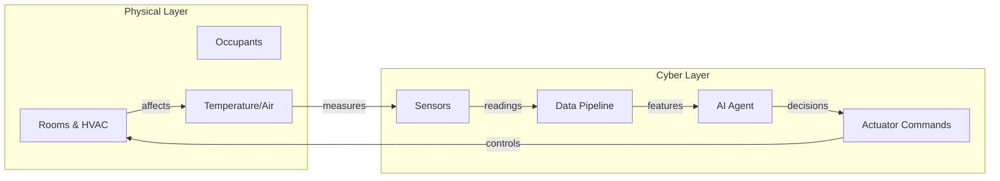
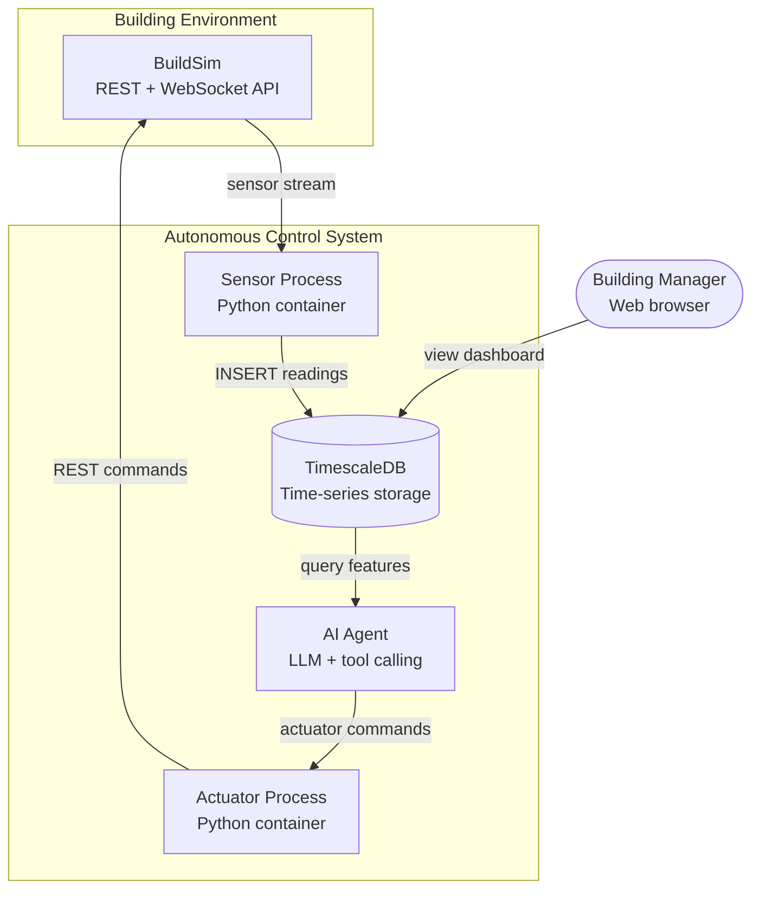
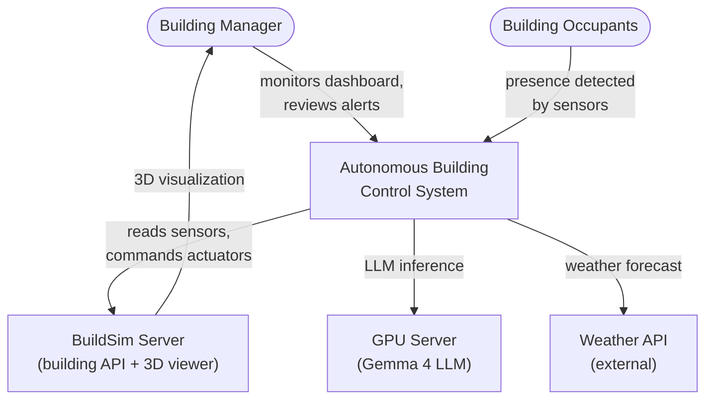
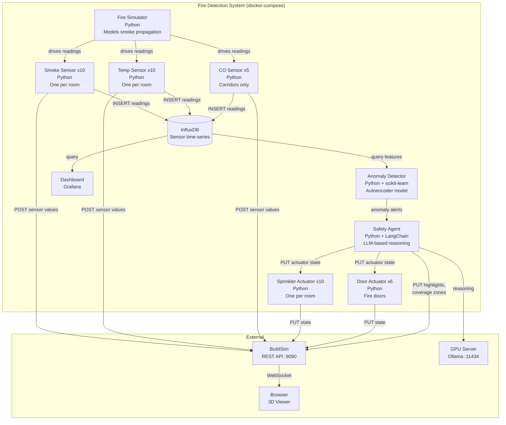
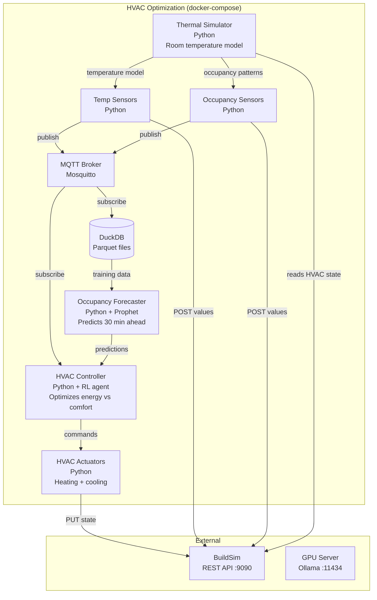
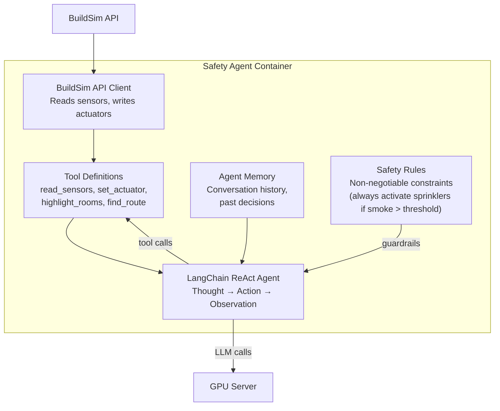
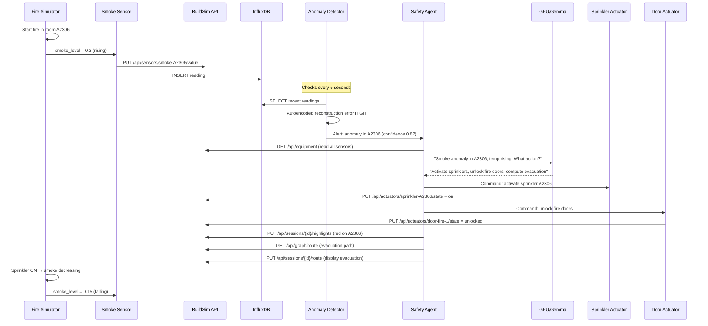
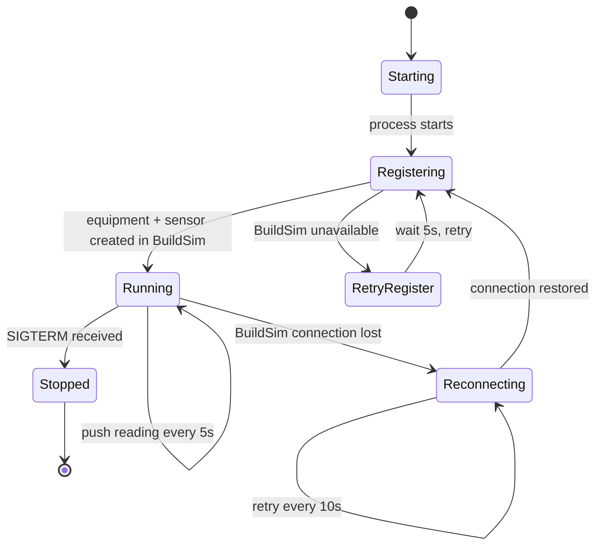
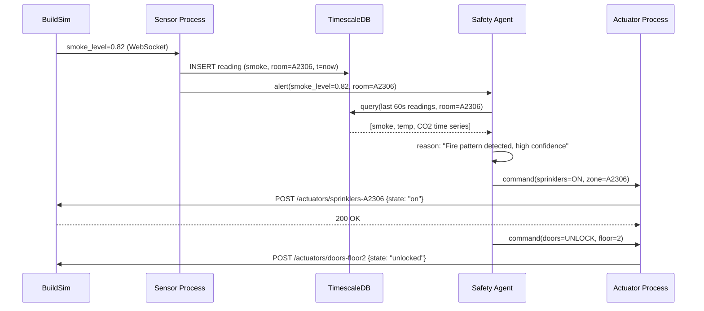

# Lecture 0: Introduction & Model-Based Systems Engineering

## Learning Objectives

After this lecture, students will be able to:
- Explain the course goals and the lab assignment
- Describe what autonomous building control means as a CPS problem
- Apply MBSE methods to analyze requirements, decompose systems, and validate designs
- Use practical modeling notations (block diagrams, sequence diagrams, C4 model) to document CPS architectures
- Connect MBSE artifacts to the lab assignment deliverables

---

## Topics

### 1. Course Introduction (20 min)

The course is structured around a single, substantial lab assignment: designing and implementing an autonomous building control system using [BuildSim](https://github.com/eislab-cps/buildsim), a simulated building environment with a REST/WebSocket API. Everything in the lectures feeds directly into this assignment.

**Course milestones:**
1. Architecture document (week 2) — design your system on paper before writing a line of code
2. Architecture approval — instructor feedback and sign-off
3. Implementation (weeks 3–5) — build the system using AI-driven development
4. Demo and oral exam (week 6) — demonstrate the system, discuss design decisions

**What "embedded intelligence at the edge" means in practice:** Intelligence does not live in the cloud. It lives in a process running on the same network as the building, making decisions in under a second, without depending on an internet connection. This is the defining constraint of cyber-physical systems — the physical world does not wait for a cloud round-trip.

BuildSim provides a 3D building viewer, a REST API for reading sensors and commanding actuators, and a WebSocket channel for streaming real-time sensor data. Your system wraps this API with intelligence.

---

### 2. Autonomous Building Control as a CPS (20 min)

#### The Building as a Cyber-Physical System

A cyber-physical system (CPS) is one in which computation is deeply integrated with physical processes. The physical world and the digital world are not separate — they continuously influence each other through a **sense → compute → act** feedback loop.

In a smart building, the physical layer includes rooms, walls, doors, HVAC ducts, occupants, temperature gradients, smoke particles, and airflows. The cyber layer includes temperature sensors, CO2 sensors, smoke detectors, door position sensors, HVAC actuators, ventilation fans, and the software that orchestrates them. Neither layer is meaningful without the other: a temperature reading is useless if nothing acts on it, and an HVAC command is dangerous if it is not based on accurate sensor data.

The feedback loop runs continuously: sensors produce readings → a data pipeline stores and processes them → an AI agent reasons about the current state → the agent commands actuators → actuators change the physical environment → sensors detect the new state. This loop must be fast (sub-second for safety), reliable (it must work when the network is unreliable), and correct (a wrong decision can cause harm).

#### What Makes It Autonomous?

Autonomy in a building control system is not just automation. A thermostat is automated but not autonomous — it follows a fixed rule. An autonomous system:

- **Takes action without human intervention** — it does not just monitor and alert, it acts
- **Uses data and models to decide** — it does not just follow rules, it reasons about context (time of day, occupancy patterns, weather forecast, energy prices)
- **Predicts and prevents** — it does not just react to problems, it anticipates them (pre-cool before occupants arrive, detect anomalous patterns before a fault develops)
- **Adapts over time** — it learns from past performance and improves

Real-world examples: [Johnson Controls OpenBlue](https://www.johnsoncontrols.com/openblue) (commercial building AI), [Siemens Desigo CC](https://www.siemens.com/global/en/products/buildings/products/hvac-control-products/desigo-cc.html) (building management system), [DeepMind cooling AI at Google data centres](https://deepmind.google/discover/blog/deepmind-ai-reduces-google-data-centre-cooling-bill-by-40/) (40% energy reduction).



---

### 3. Model-Based Systems Engineering (40 min)

#### Why MBSE?

Traditional systems engineering relies on Word documents, informal diagrams, and verbal agreements. Requirements are buried in prose. Interfaces are described ambiguously. Two engineers reading the same document understand different things. By the time the system is built, the documentation is already out of date.

Model-Based Systems Engineering (MBSE) replaces documents as the primary artifact with **models** — structured, precise representations of the system that can be analysed, simulated, and used to generate code and tests. A model is unambiguous: it either specifies something or it does not. It is also executable: you can run scenarios against it before building anything.

For CPS, MBSE is especially important because the interactions between physical and digital components are complex, timing-dependent, and hard to reason about informally. A sequence diagram showing the interaction between a smoke sensor process, the data pipeline, and the safety agent makes the design concrete in a way that a paragraph of prose cannot. The [INCOSE Systems Engineering Handbook](https://www.incose.org/products-and-publications/se-handbook) defines the formal discipline; for this course we use a practical, tool-agnostic subset.

> **Key term — MBSE:** Model-Based Systems Engineering. An approach to systems engineering where formal models (not documents) are the primary design artifact. Models are precise, traceable, and can drive implementation.

#### MBSE Process

**Requirements analysis** answers the question: what must the system do? Requirements are not vague wishes — they are testable statements. A good requirement has an ID, a priority, a source, and acceptance criteria.

- **Functional requirements** describe *what* the system does: "The system shall detect fire conditions and activate sprinklers within 30 seconds of smoke sensor threshold being exceeded."
- **Non-functional requirements** describe *how well* it does it: "The safety agent shall remain operational if the data pipeline process crashes."
- **Regulatory requirements** describe external constraints: "The system shall comply with [Boverkets Byggregler (BBR)](https://www.boverket.se/sv/lag--ratt/författningssamling/gallande/bbr---bfs-20116/) fire protection requirements."
- **Use case diagrams** capture who uses the system and for what purpose — actors (building manager, occupant, AI agent), scenarios (detect fire, adjust temperature, generate report), and the system boundary.

**Functional decomposition** breaks a high-level requirement into the functions needed to satisfy it. "Detect fire" decomposes into: collect smoke sensor readings → validate sensor data → apply detection model → trigger alert → command actuators → notify occupants. Each sub-function maps to one or more software components. This decomposition drives your architecture.

**Architecture design** answers: how are components organised and where do they run?

- **Block definition diagrams** show components and their interfaces (types of inputs/outputs)
- **Internal block diagrams** show how components connect inside a system
- **Deployment diagrams** show which software runs on which hardware (edge device, cloud VM, container)

**Interface design** specifies exactly how components communicate: REST endpoint URLs, JSON schemas, MQTT topic names, message formats. This is where ambiguity is most expensive — a wrong assumption about an interface wastes days.

**Behavior modeling** answers: how does the system behave over time?

- **Sequence diagrams** show the time-ordered exchange of messages between components for a specific scenario
- **State machine diagrams** show the discrete states a component can be in and the events that cause transitions (a sensor can be `nominal`, `offline`, `fault`, `alerting`)
- **Activity diagrams** show decision logic and parallel workflows

**Validation** closes the loop: does the design satisfy the requirements? Requirements traceability links each requirement to a design element and to a test case. If you cannot trace a requirement to a test, you cannot claim it is satisfied.

#### Modeling Notations: Choosing the Right Level of Formalism

There are many modeling notations available, ranging from informal sketches to formal specification languages. The key question is: **what level of formalism does your project need?** Too informal and your models are ambiguous. Too formal and you spend more time on the notation than on the design.

#### UML and SysML — the formal end

**UML** ([Unified Modeling Language](https://www.uml.org/)) is the standard for modeling software systems. It defines 14 diagram types including class diagrams, sequence diagrams, state machines, activity diagrams, deployment diagrams, and more. UML is powerful but complex — most teams use only 3-4 diagram types in practice.

**SysML** ([Systems Modeling Language](https://sysml.org/)) extends UML for systems engineering. It adds diagram types specifically for CPS and hardware/software systems:

| SysML Diagram | Purpose | When useful |
|--------------|---------|-------------|
| **Block Definition Diagram (bdd)** | System structure — components, their types, and relationships | Defining what exists in your system |
| **Internal Block Diagram (ibd)** | How blocks connect — ports, flows, interfaces | Specifying how components communicate |
| **Requirements Diagram (req)** | Requirements with satisfy/verify/trace relationships | Tracing requirements to design and tests |
| **Parametric Diagram (par)** | Constraint equations between physical properties | Modeling physics (heat transfer, airflow) |
| **Activity Diagram (act)** | Workflows, decision logic, parallel flows | Modeling agent decision processes |
| **State Machine Diagram (stm)** | States and transitions | Sensor states, system modes |
| **Sequence Diagram (sd)** | Time-ordered interactions | Scenario walk-throughs |
| **Use Case Diagram (uc)** | Actors and their interactions with the system | Defining system scope |

SysML is the industry standard for aerospace, defense, and automotive systems engineering. It is used with tools like [Cameo Systems Modeler](https://www.3ds.com/products/catia/no-magic/cameo-systems-modeler), [Papyrus](https://eclipse.dev/papyrus/), and [IBM Rhapsody](https://www.ibm.com/products/systems-design-rhapsody). For large-scale CPS with hundreds of engineers, the formalism pays off.

**For this course:** SysML is overkill. The tooling is heavy, the learning curve is steep, and the formalism adds more overhead than value for a 2-person team working for 8 weeks. You should know it exists and when it's appropriate, but you won't use it.

#### The C4 Model — the practical middle ground

The **C4 Model** ([c4model.com](https://c4model.com/)) was created by [Simon Brown](https://simonbrown.je/) specifically because UML/SysML was too complex for most software teams. It provides exactly four levels of abstraction:

| Level | What it shows | Analogy |
|-------|--------------|---------|
| **Level 1 — Context** | Your system as a single box, surrounded by users and external systems | Google Maps zoomed out to show a city |
| **Level 2 — Containers** | The deployable units inside your system (Docker containers, databases, processes) | Zoomed in to show buildings |
| **Level 3 — Components** | The internal structure of a single container (classes, modules, services) | Zoomed in to show rooms inside a building |
| **Level 4 — Code** | Class/function level detail | The furniture in a room |

C4 is **technology-agnostic** — it doesn't care if you use REST or MQTT, Python or Go. It focuses on structure and relationships.

**For this course, you need Levels 1 and 2.** Level 3 is useful for your AI agent container. Level 4 is rarely needed.

**C4 resources:**
- [c4model.com](https://c4model.com/) — the official C4 model site with examples and FAQ
- Simon Brown, ["The C4 Model for Visualising Software Architecture"](https://www.infoq.com/articles/C4-architecture-model/) (InfoQ)
- Simon Brown, ["Software Architecture for Developers"](https://softwarearchitecturefordevelopers.com/) — the book behind C4
- [Structurizr DSL](https://structurizr.com/dsl) — text-based tool for creating C4 diagrams
- [C4 with Mermaid examples](https://mermaid.js.org/syntax/c4.html) — Mermaid's built-in C4 diagram support



#### C4 Examples for Building Control

**Example: C4 Level 1 — Context Diagram**

This shows your entire system as a single box. Who interacts with it? What external systems does it depend on?



Key decisions visible in this diagram:
- The system depends on BuildSim for all building interaction
- LLM inference happens on a remote GPU server (not locally)
- Weather data is an external dependency — what happens if it's unavailable?

**Example: C4 Level 2 — Container Diagram (Fire Detection)**

This shows every deployable unit. Each box becomes a Docker container or process.



Key decisions visible:
- The simulator is a separate process that drives sensor behavior
- Anomaly detection (ML) is separate from the safety agent (LLM) — different response times
- Sensor data goes to both BuildSim (visualization) and InfluxDB (ML training)
- Each sensor type is its own container — can be scaled independently

**Example: C4 Level 2 — Container Diagram (HVAC Optimization)**

A different use case has a different architecture:



Notice the architectural difference: this system uses **MQTT pub/sub** instead of direct REST calls. Why? Because the HVAC controller needs to react to multiple sensor types simultaneously, and pub/sub decouples the sensors from the controller — sensors don't need to know who is listening.

**Example: C4 Level 3 — Component Diagram (AI Agent internals)**

When a single container is complex, zoom into its internal structure:



This shows that the agent isn't just "call the LLM" — it has memory, tools, and safety guardrails.

**Example: Sequence Diagram — Fire Detection Scenario**



**Example: State Machine — Sensor Process Lifecycle**



This state machine tells you exactly what your sensor process code must handle — not just the happy path.

**Example: Requirements Table**

| ID | Type | Requirement | Priority | Acceptance Criteria |
|----|------|------------|----------|-------------------|
| FR-01 | Functional | The system shall detect fire conditions within 30 seconds | Must | Anomaly detector flags smoke > threshold within 30s |
| FR-02 | Functional | The system shall activate sprinklers in affected rooms | Must | Sprinkler actuator state changes to "on" |
| FR-03 | Functional | The system shall compute evacuation routes avoiding fire zones | Must | Route API returns path that excludes rooms with active fire |
| NFR-01 | Non-functional | The system shall recover from sensor process crashes within 60 seconds | Must | Kill sensor container → new reading within 60s |
| NFR-02 | Non-functional | The anomaly detector shall have false positive rate < 5% | Should | Evaluated on 24h of normal data |
| REG-01 | Regulatory | Fire doors shall close within time limits per BBR | Must | Door actuator responds within 5s of command |

Each requirement has an ID, which traces to a test case. "FR-01 → test_fire_detection_latency()".

#### Architecture Viewpoints

A single diagram can't capture everything about a system. Different stakeholders care about different things: a developer needs to see code structure, an operator needs to see deployment, a safety engineer needs to see failure modes. **Architecture viewpoints** solve this by providing multiple perspectives on the same system, each tailored to a specific concern.

The concept comes from [IEEE 42010](https://www.iso.org/standard/50508.html) and is central to enterprise architecture frameworks like [ArchiMate](https://pubs.opengroup.org/architecture/archimate3-doc/). ArchiMate organizes viewpoints across three layers:

| Layer | What it covers | Building control examples |
|-------|---------------|--------------------------|
| **Business** | Processes, actors, roles, goals, regulations | Building manager monitors fire safety; compliance with BBR regulations |
| **Application** | Software components, data flows, interfaces | AI agent reads sensors via REST, anomaly detection model, data pipeline |
| **Technology** | Infrastructure, networks, devices, containers | Raspberry Pi sensors, Docker containers, GPU server, MQTT broker |

Each layer has specific viewpoints:

| Viewpoint | Shows | Example for building control |
|-----------|-------|------------------------------|
| **Organization** | Who is involved and their roles | Building manager, security guard, maintenance technician, AI agent |
| **Business process** | How work flows end-to-end | Fire detected → agent decides → sprinklers activate → manager notified |
| **Application cooperation** | How software components interact | Sensor process → MQTT → data pipeline → AI agent → BuildSim API |
| **Information structure** | What data exists and how it relates | Sensor readings, equipment state, room occupancy, alert history |
| **Technology** | What infrastructure runs the system | Edge server, containers, network topology, GPU server |
| **Layered** | All three layers together | Full stack from regulation to sensor hardware |

The key insight: **your architecture document should contain multiple viewpoints**, not one monolithic diagram. For this course, you produce at least:

1. A **context view** (who/what interacts with your system — C4 Level 1)
2. A **functional view** (what components exist and how they connect — C4 Level 2)
3. A **data flow view** (how sensor data moves through the system to decisions)
4. A **behavioral view** (how components interact for a key scenario — sequence diagram)
5. A **deployment view** (what runs where — containers, hardware)

This is not busywork. Each viewpoint catches design flaws that the others miss. A functional diagram might look correct, but the deployment view reveals that two components need a network connection that doesn't exist. A data flow view might seem clean, but the behavioral view reveals a race condition.

**Further reading:**
- [ArchiMate 3.2 Specification](https://pubs.opengroup.org/architecture/archimate3-doc/) — the full enterprise architecture modeling language
- [ISO/IEC/IEEE 42010](https://en.wikipedia.org/wiki/ISO/IEC/IEEE_42010) — the international standard for architecture descriptions and viewpoints
- Rozanski, N. & Woods, E. [Software Systems Architecture](https://www.viewpoints-and-perspectives.info/) — practical guide to viewpoints and perspectives
- Kruchten, P. ["The 4+1 View Model of Architecture"](https://www.cs.ubc.ca/~gregor/teaching/papers/4+1view-architecture.pdf) (IEEE Software, 1995) — the original multi-view architecture paper

#### Comparing the approaches

| Aspect | Informal (whiteboard) | C4 Model | UML/SysML |
|--------|----------------------|----------|-----------|
| **Learning curve** | None | 1 hour | Days to weeks |
| **Precision** | Low — ambiguous | Medium — clear structure | High — formal semantics |
| **Tooling** | Marker + whiteboard | Mermaid, draw.io, Structurizr | Cameo, Papyrus, Rhapsody |
| **Maintainability** | Low — photos get lost | Medium — version-controlled text | High — model repository |
| **Audience** | Your team | Developers + stakeholders | Systems engineers |
| **When to use** | Early brainstorming | Design documentation | Safety-critical systems, large teams |
| **This course** | Workshop discussions | Architecture document | Know it exists |

#### What we use in this course

For the lab assignment, use **C4 + sequence diagrams + state diagrams**. This gives you enough structure to communicate your design clearly without drowning in notation. Specifically:

- **C4 Context + Container diagrams** for system structure (Levels 1-2)
- **Sequence diagrams** for key scenarios (fire detection, HVAC control loop)
- **State diagrams** for component lifecycle (sensor states, agent modes)
- **Data flow diagrams** for tracing sensor data through the pipeline
- **Requirements tables** for traceability (not a diagram, but essential)

All of these can be drawn in Mermaid (version-controlled, renders on GitHub) or draw.io (more layout control).

#### Diagram types you need

| Diagram | Purpose | Tool |
|---------|---------|------|
| Context diagram (C4 L1) | System boundary, actors, external systems | Mermaid `graph` |
| Container diagram (C4 L2) | Deployable units, protocols, connections | Mermaid `graph` |
| Sequence diagram | Scenario walk-through (time-ordered) | Mermaid `sequenceDiagram` |
| State diagram | Sensor/agent/system states and transitions | Mermaid `stateDiagram-v2` |
| Data flow diagram | Sensor → pipeline → AI → actuator | Mermaid `graph LR` |
| Deployment diagram | What runs where (containers, hardware) | draw.io or Mermaid |
| Requirements table | ID, type, description, priority, test | Markdown table |

**Tools:**
- [Mermaid](https://mermaid.js.org/) — diagrams as code in Markdown, renders on GitHub, versioned with your code. **Recommended for this course.**
- [draw.io / diagrams.net](https://app.diagrams.net/) — free, web-based, exports to PNG/SVG/XML. Good for more complex layout.
- [Structurizr](https://structurizr.com/) — C4 model tool with a dedicated DSL. If you want to be rigorous about C4.
- [PlantUML](https://plantuml.com/) — text-based, good UML support. Alternative to Mermaid.
- [Excalidraw](https://excalidraw.com/) — hand-drawn style, good for early brainstorming.

---

### 4. MBSE Applied to the Lab Assignment (20 min)

#### Architecture Document (required before implementation)

Your architecture document is the contract between your design and your implementation. It is reviewed and approved before you write any code. A good architecture document makes implementation straightforward because all major decisions are already made. A bad one wastes implementation time on rework.

The architecture document must contain:

1. **Context diagram (C4 Level 1):** your entire system as a single box. Show: building occupants, BuildSim API, any external services you use (weather API, LLM API), and the building manager. One diagram, annotated with the communication protocols used.

2. **Container diagram (C4 Level 2):** every deployable unit in your system — Docker containers, databases, processes. Show the protocol used on each connection (REST, MQTT, WebSocket, SQL). This diagram drives your `docker-compose.yml`.

3. **Requirements table:** a table with columns: ID, Type (Functional/Non-functional/Regulatory), Description, Priority (Must/Should/Could), Acceptance Criteria. Minimum 10 requirements covering your core use case.

4. **Data flow diagram:** trace a sensor reading from BuildSim through your system to a decision and back to an actuator command. Show every transformation, storage step, and processing stage.

5. **Sequence diagram:** at least one key scenario — e.g., "fire detected → safety agent responds → sprinklers activated → building manager notified." Use `sequenceDiagram` in Mermaid.

6. **Deployment diagram:** which containers run where, on what hardware, connected by what network. If everything runs on one machine, say so — that is a valid deployment.

Example sequence diagram for fire detection:



#### Design Specification

Beyond the architecture diagrams, your design specification should nail down:

- **Data models:** the JSON schema for each message that flows between components. Define field names, types, and units. "Temperature: float, Celsius" is a data model.
- **API contracts:** for every REST endpoint your sensor or actuator process calls, document the URL, method, request body, and response format.
- **State machines:** for your AI agent (idle, monitoring, alert, responding, recovering) and for critical components. A state machine forces you to think about every failure mode.
- **ML model specification:** what are the inputs (features), outputs (classification or regression), training data source, evaluation metric, and acceptance threshold?

#### Test Plan (required before implementation)

The test plan is written before implementation, not after. It answers: "how will I know the system is correct?" without reference to any implementation details.

- **Requirements traceability matrix:** a table linking each requirement ID to one or more test case IDs. Every requirement must have at least one test.
- **Test scenarios:** for each test, describe the initial state, the stimulus, the expected response, and the pass/fail criteria. Cover: normal operation, boundary conditions, sensor failures, network outages, and adversarial inputs.
- **Validation criteria:** what does a successful demo look like? If the smoke level rises above threshold in room A2306, within how many seconds should the sprinkler be on? Be specific.

---

### 5. Tools and Practicalities (10 min)

**Mermaid in Markdown** is the recommended diagramming tool for this course. Diagrams live in `.md` files alongside your code, are versioned with git, and render automatically on GitHub. The [Mermaid live editor](https://mermaid.live/) lets you preview diagrams before committing. Supported diagram types include flowchart, sequenceDiagram, stateDiagram-v2, classDiagram, erDiagram, and C4Context/C4Container (via the `C4` extension).

**Git repository structure** for the lab assignment should follow a logical layout that mirrors your architecture. A suggested structure:

```
/
├── docs/
│   ├── architecture.md        # Your MBSE artifacts
│   ├── requirements.md        # Requirements table
│   └── test-plan.md           # Test plan
├── sensor-process/
│   ├── Dockerfile
│   └── src/
├── ai-agent/
│   ├── Dockerfile
│   └── src/
├── actuator-process/
│   ├── Dockerfile
│   └── src/
├── docker-compose.yml
└── README.md
```

Keep your architecture document and your code in the same repository so they evolve together. When you change the design, update the diagrams.

---

## Lab Connection

- Understand the lab assignment and BuildSim by running the demo server and exploring the [BuildSim API documentation](https://github.com/eislab-cps/buildsim)
- Choose your use case (fire safety, energy optimisation, comfort control, or a combination)
- Begin requirements analysis: list at least 10 requirements before starting architecture design
- Architecture document is due week 2 — start the C4 diagrams early

---

## Recommended Reading

- Brown, S. "The C4 Model for Visualising Software Architecture" — [c4model.com](https://c4model.com/) — the primary reference for C4; read the entire site (it is short)
- Brown, S. "Software Architecture for Developers" — [leanpub.com/software-architecture-for-developers](https://leanpub.com/software-architecture-for-developers) — practical, affordable, highly readable
- INCOSE Systems Engineering Handbook — [incose.org](https://www.incose.org/products-and-publications/se-handbook) — the formal reference; skim Ch. 1–3 for the MBSE overview
- Mermaid diagram syntax reference — [mermaid.js.org/syntax](https://mermaid.js.org/intro/syntax-reference.html) — bookmark this; you will use it every week
- Mermaid live editor — [mermaid.live](https://mermaid.live/) — try diagrams interactively before committing
- Kleppmann, M. "Designing Data-Intensive Applications" (O'Reilly) — Ch. 1 — the best introduction to why systems design matters
- Rozanski, N. & Woods, E. "Software Systems Architecture" — [viewpoints-and-perspectives.info](http://www.viewpoints-and-perspectives.info/) — freely available excerpts; good on architectural viewpoints
- "arc42 Architecture Documentation Template" — [arc42.org](https://arc42.org/) — a practical, free template for architecture documents used widely in industry
