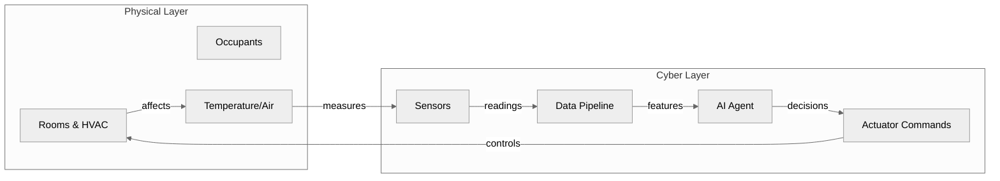
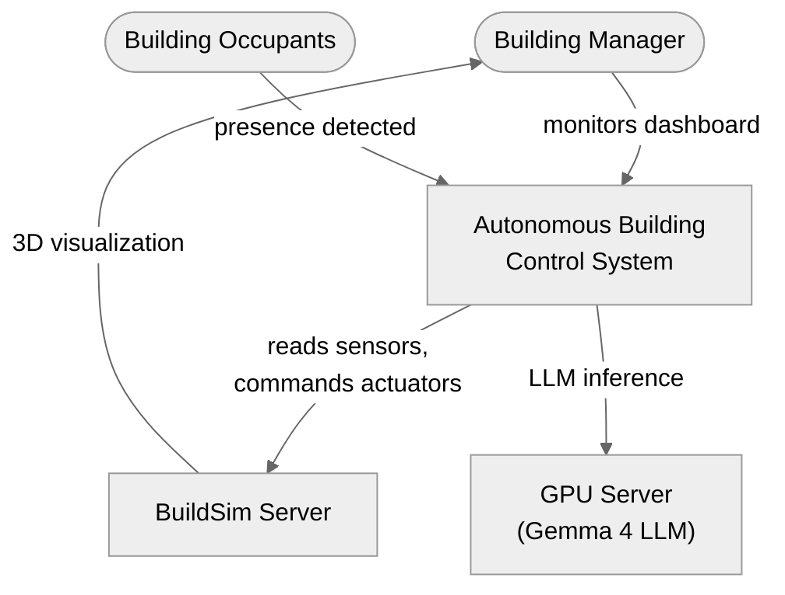
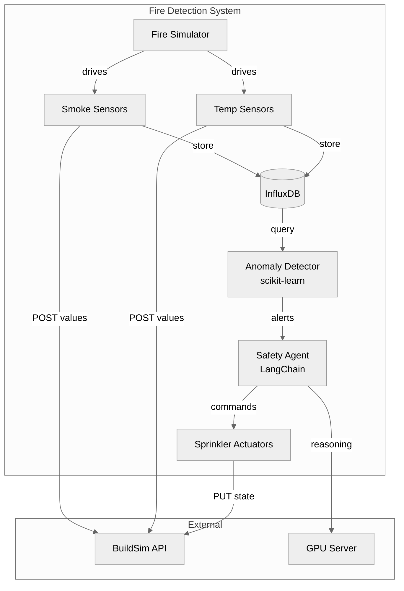
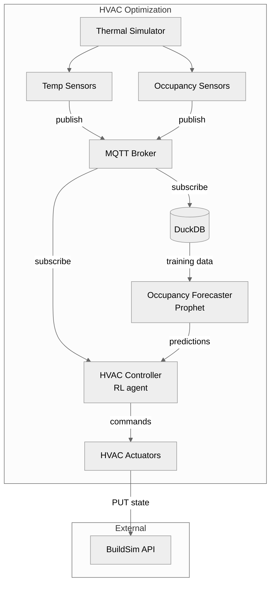
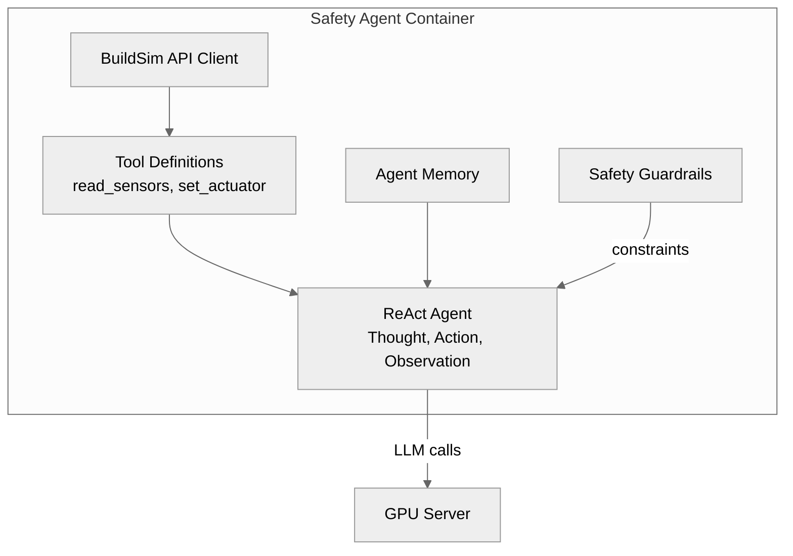
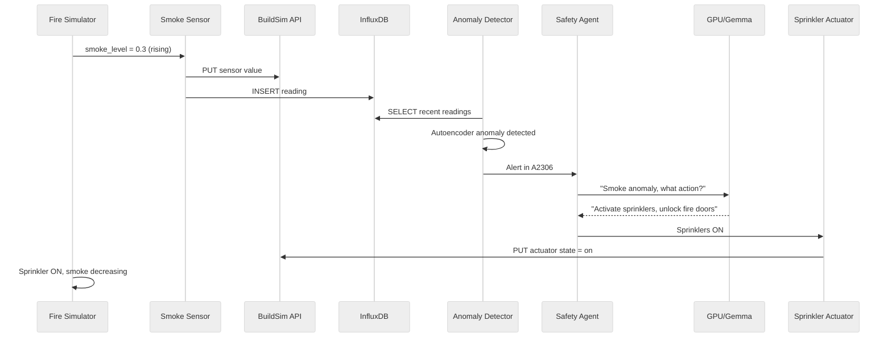
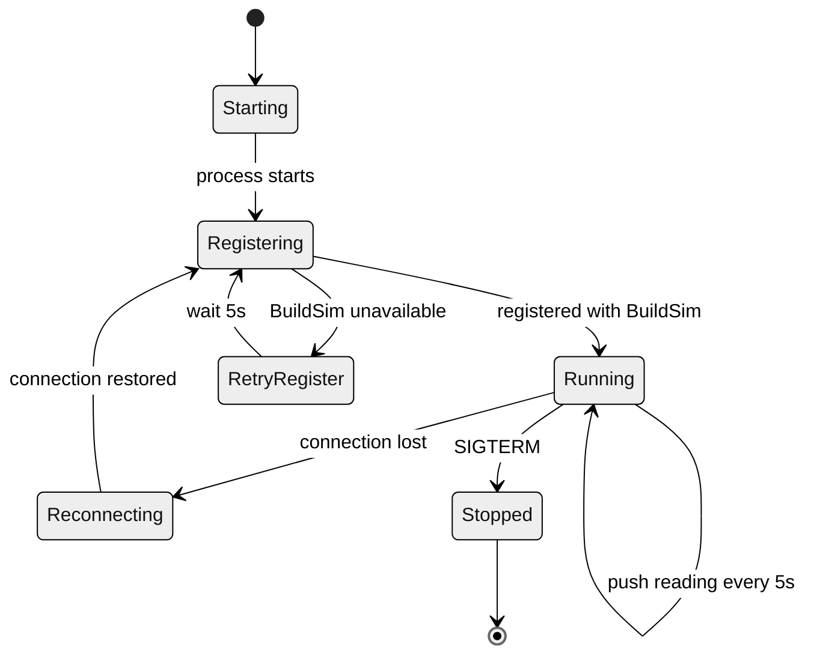

# Introduction & Model-Based Systems Engineering

## Course Overview

This course is built around one substantial lab assignment: designing and implementing an autonomous building control system using [BuildSim](https://github.com/eislab-cps/D7065E/tree/main/buildingsim), a simulated building with a REST/WebSocket API. The lectures provide the theoretical foundation, and the lab is where you apply it.

The course follows a specification-first workflow. You design your system with precise models before writing code, derive tests from the specification, then implement using AI-assisted development tools. Your architecture document is due in week 2, it must be approved before you start coding, and it forms the basis for the oral examination.

"Embedded intelligence at the edge" means that the intelligence lives on the same network as the building, making decisions in under a second, without depending on the cloud. The physical world does not wait for a round-trip to a remote server.

## The Building as a Cyber-Physical System

A cyber-physical system (CPS) is one where computation and physical processes are deeply intertwined. In a smart building, the physical layer includes rooms, HVAC ducts, occupants, temperature gradients, smoke, and airflow. The cyber layer includes sensors, actuators, data pipelines, AI agents, and the software that orchestrates them.

These two layers form a continuous feedback loop. Sensors measure the physical world, software reasons about what the measurements mean, actuators change the physical environment in response, and sensors measure the result. This loop must be fast enough for safety-critical decisions, reliable enough to work when components fail, and correct enough that a wrong decision does not cause harm.

<div style="max-width:400px">



</div>

It is important to distinguish between automation and autonomy. A thermostat is automated: it follows a fixed rule. An autonomous system uses data and models to reason about context such as time of day, occupancy patterns, and weather forecasts. It predicts problems before they happen and adapts its behaviour over time based on what it learns. Examples of autonomous building systems in production include [Johnson Controls OpenBlue](https://www.johnsoncontrols.com/openblue), [Siemens Desigo CC](https://www.siemens.com/global/en/products/buildings/products/hvac-control-products/desigo-cc.html), and [DeepMind's cooling system for Google data centres](https://deepmind.google/discover/blog/deepmind-ai-reduces-google-data-centre-cooling-bill-by-40/) which achieved a 40% reduction in energy consumption.

## Model-Based Systems Engineering

Traditional systems engineering relies on Word documents, informal diagrams, and verbal agreements. Requirements end up buried in prose. Two engineers reading the same document understand different things. By the time the system is built, the documentation is already out of date.

Model-Based Systems Engineering (MBSE) replaces documents with models: structured, precise representations of the system that can be analyzed, simulated, and used to generate code and tests. A model is unambiguous. It either specifies something or it does not. For cyber-physical systems this matters especially, because the interactions between physical and digital components are complex, timing-dependent, and difficult to reason about informally. A sequence diagram showing a smoke sensor, a data pipeline, and a safety agent makes the design concrete in a way that a paragraph of prose cannot.

The MBSE process follows a progression. You begin with **requirements analysis**, writing testable statements about what the system must do. Functional requirements describe what the system does ("detect fire conditions within 30 seconds"), non-functional requirements describe how well it does it ("survive a sensor process crash"), and regulatory requirements describe external constraints ("comply with [BBR](https://www.boverket.se/sv/lag--ratt/författningssamling/gallande/bbr---bfs-20116/) fire protection requirements").

From requirements, you perform **functional decomposition**: breaking a high-level requirement into the functions needed to satisfy it. "Detect fire" decomposes into collecting sensor readings, validating the data, applying a detection model, triggering an alert, commanding actuators, and notifying occupants. Each function maps to one or more software components. This decomposition drives your architecture.

**Architecture design** determines how components are organized and where they run. **Interface design** specifies exactly how components communicate: REST endpoint URLs, JSON schemas, MQTT topic names, message formats. This is where ambiguity is most expensive, because a wrong assumption about an interface wastes days of implementation time.

**Behaviour modeling** captures how the system behaves over time. Sequence diagrams show the exchange of messages between components for a specific scenario. State machine diagrams show the discrete states a component can be in and the events that cause transitions. **Validation** closes the loop by linking each requirement to a design element and to a test case.

Reference: [INCOSE Systems Engineering Handbook](https://www.incose.org/products-and-publications/se-handbook)

## Architecture Viewpoints

A single diagram cannot capture everything about a system. A developer needs to see software components. An operator needs to see deployment topology. A safety engineer needs to see failure modes. A building manager needs to see how the system relates to building regulations.

Architecture viewpoints solve this problem by providing multiple perspectives on the same system, each tailored to a specific stakeholder concern. The concept originates from [IEEE 42010](https://en.wikipedia.org/wiki/ISO/IEC/IEEE_42010) (the international standard for architecture descriptions) and is central to enterprise architecture frameworks like [ArchiMate](https://pubs.opengroup.org/architecture/archimate3-doc/) and to Kruchten's influential [4+1 View Model](https://www.cs.ubc.ca/~gregor/teaching/papers/4+1view-architecture.pdf).

### ArchiMate Layers

The [ArchiMate](https://pubs.opengroup.org/architecture/archimate3-doc/) framework organizes architecture across three layers. Applied to building control:

| Layer | What it covers | Building control examples |
|-------|---------------|--------------------------|
| **Business** | Processes, actors, goals, regulations | Building manager monitors safety, BBR compliance |
| **Application** | Software components, data flows, interfaces | AI agent, anomaly detector, data pipeline |
| **Technology** | Infrastructure, devices, containers, networks | Docker containers, GPU server, MQTT broker |

Visual examples of ArchiMate viewpoints can be found in the [ArchiMate specification, Chapter 14](https://pubs.opengroup.org/architecture/archimate3-doc/ch-Viewpoints.html).

### Common Viewpoints

Each viewpoint answers a different question about your system:

| Viewpoint | Question it answers | What it shows |
|-----------|-------------------|---------------|
| **Context** | What interacts with our system? | System boundary, users, external services |
| **Functional** | What are the parts and how do they connect? | Components, interfaces, data flows |
| **Information** | What data exists and how does it flow? | Data models, storage, transformations |
| **Behavioral** | What happens when a specific event occurs? | Sequence of interactions for a scenario |
| **Deployment** | What runs where? | Containers, hardware, network topology |

Each viewpoint catches design flaws that others miss. A functional diagram might look correct, but the deployment view reveals that two components require a network connection that does not exist. A data flow might seem clean, but the behavioral view reveals a timing issue. The business view might expose a compliance requirement that no component addresses.

For this course, your architecture document must contain at least five viewpoints:

1. **Context**, showing who and what interacts with your system (C4 Level 1)
2. **Functional**, showing what components exist and how they connect (C4 Level 2)
3. **Information**, showing how sensor data flows from measurement to decision (data flow diagram)
4. **Behavioral**, showing how components interact for a key scenario (sequence diagram)
5. **Deployment**, showing what runs where (containers, hardware, networks)

For further reading on viewpoints, see Rozanski & Woods, [Software Systems Architecture](https://www.viewpoints-and-perspectives.info/).

## Modeling Notations

There are many notations available for creating architecture models, ranging from informal sketches to formal specification languages. The choice depends on how much precision your project needs.

### UML and SysML

**UML** ([uml.org](https://www.uml.org/)) is the standard for modeling software systems, defining 14 diagram types. **SysML** ([sysml.org](https://sysml.org/)) extends UML for systems engineering with diagrams for requirements traceability, physical constraints, and hardware/software integration. These are industry standards in aerospace, defence, and automotive, used with tools like [Cameo Systems Modeler](https://www.3ds.com/products/catia/no-magic/cameo-systems-modeler) and [Papyrus](https://eclipse.dev/papyrus/).

For this course, SysML is overkill. The tooling is heavy, the learning curve is steep, and the formalism adds more overhead than value for a two-person team working for eight weeks. You should know it exists and understand when it is appropriate, but you will not use it here.

### The C4 Model

The **C4 Model** ([c4model.com](https://c4model.com/)) was created by [Simon Brown](https://simonbrown.je/) specifically because UML was too complex for most software teams. It provides exactly four levels of abstraction:

| Level | What it shows |
|-------|--------------|
| **Level 1, Context** | Your system as a single box, surrounded by users and external systems |
| **Level 2, Containers** | The deployable units inside (Docker containers, databases, processes) |
| **Level 3, Components** | Internal structure of a single container |
| **Level 4, Code** | Class-level detail (rarely needed) |

C4 is technology-agnostic and focuses on structure and relationships. For this course, you need Levels 1 and 2. Level 3 is useful for complex containers like your AI agent.

**C4 resources:**
- [c4model.com](https://c4model.com/), the official site with examples and FAQ
- [The C4 Model for Visualising Software Architecture](https://www.infoq.com/articles/C4-architecture-model/) (InfoQ)
- [Software Architecture for Developers](https://softwarearchitecturefordevelopers.com/), the book behind C4
- [Structurizr DSL](https://structurizr.com/dsl), a text-based tool for creating C4 diagrams
- [Mermaid C4 support](https://mermaid.js.org/syntax/c4.html), C4 diagrams directly in Markdown

### Choosing a Notation

| Aspect | Informal sketches | C4 Model | UML/SysML |
|--------|------------------|----------|-----------|
| **Learning curve** | None | About an hour | Days to weeks |
| **Precision** | Low | Medium | High |
| **Tooling** | Whiteboard, pen | Mermaid, draw.io | Cameo, Papyrus |
| **Best for** | Early brainstorming | Design documentation | Safety-critical systems, large teams |

### Recommended Tools

[Mermaid](https://mermaid.js.org/) is the recommended diagramming tool for this course. Diagrams are written as text in Markdown files, versioned with git, and render automatically on GitHub. The [Mermaid live editor](https://mermaid.live/) lets you preview diagrams interactively.

Other useful tools include [draw.io](https://app.diagrams.net/) for more complex visual layouts and [Excalidraw](https://excalidraw.com/) for informal hand-drawn style diagrams during brainstorming.

## Viewpoints in Practice

The following examples show how each viewpoint applies to building control scenarios.

### Context View (C4 Level 1)

The context diagram shows your entire system as a single box, surrounded by the people and systems it interacts with.

<div style="max-width:400px">



</div>

### Functional View (C4 Level 2), Fire Detection

The container diagram shows every deployable unit. Each box becomes a Docker container or process in your `docker-compose.yml`.

<div style="max-width:400px">



</div>

### Functional View (C4 Level 2), HVAC Optimization

A different use case leads to a different architecture. This system uses MQTT pub/sub instead of direct REST calls, because the HVAC controller needs to react to multiple sensor types simultaneously and pub/sub decouples the sensors from the controller.

<div style="max-width:400px">



</div>

### Component View (C4 Level 3), AI Agent Internals

When a single container is complex enough to warrant its own diagram, you zoom in to show its internal structure.

<div style="max-width:400px">



</div>

### Behavioral View, Fire Detection Scenario

A sequence diagram shows how components interact over time for one specific scenario.

<div style="max-width:400px">



</div>

### Deployment View, Sensor Process Lifecycle

A state machine diagram shows the states a component can be in and the events that cause transitions. This tells you exactly what error handling your code must implement.

<div style="max-width:400px">



</div>

### Information View, Requirements Table

| ID | Type | Requirement | Priority | Acceptance Criteria |
|----|------|------------|----------|-------------------|
| FR-01 | Functional | Detect fire within 30 seconds | Must | Anomaly detector flags within 30s |
| FR-02 | Functional | Activate sprinklers in affected rooms | Must | Actuator state changes to "on" |
| FR-03 | Functional | Compute evacuation routes avoiding fire | Must | Route excludes fire rooms |
| NFR-01 | Non-functional | Recover from sensor crash within 60s | Must | New reading within 60s of kill |
| NFR-02 | Non-functional | False positive rate below 5% | Should | Evaluated on 24h normal data |
| REG-01 | Regulatory | Fire doors close per BBR timing | Must | Door responds within 5s |

Each requirement ID traces to a test case. FR-01 maps to `test_fire_detection_latency()`.

## The Architecture Document

Your architecture document is the contract between your design and your implementation. It is reviewed and approved before you write code.

It must contain the five viewpoints described above: context diagram, container diagram, requirements table, data flow diagram, sequence diagram, and deployment diagram.

Beyond the diagrams, the design specification should include data models (JSON schemas for messages between components), API contracts (REST endpoints with request/response formats), state machines for your AI agent and critical components, and an ML model specification covering inputs, outputs, training data, and evaluation metrics.

The test plan is written before implementation, not after. It links each requirement to one or more test cases, describes test scenarios with initial state, stimulus, expected response, and pass/fail criteria, and defines what a successful demonstration looks like.

## Repository Structure

```
├── docs/
│   ├── architecture.md
│   ├── requirements.md
│   └── test-plan.md
├── sensor-process/
│   ├── Dockerfile
│   └── src/
├── ai-agent/
│   ├── Dockerfile
│   └── src/
├── actuator-process/
│   ├── Dockerfile
│   └── src/
├── docker-compose.yml
└── README.md
```

## Recommended Reading

- [c4model.com](https://c4model.com/), read the entire site, it is short and practical
- [ArchiMate 3.2 Specification](https://pubs.opengroup.org/architecture/archimate3-doc/), the enterprise architecture modeling language
- [ArchiMate Viewpoint Examples](https://pubs.opengroup.org/architecture/archimate3-doc/ch-Viewpoints.html), visual examples of each viewpoint type
- Kruchten, ["The 4+1 View Model of Architecture"](https://www.cs.ubc.ca/~gregor/teaching/papers/4+1view-architecture.pdf) (IEEE Software, 1995)
- Rozanski & Woods, [Software Systems Architecture](https://www.viewpoints-and-perspectives.info/)
- [arc42 Architecture Documentation Template](https://arc42.org/)
- Brown, [Software Architecture for Developers](https://softwarearchitecturefordevelopers.com/)
- Kleppmann, "Designing Data-Intensive Applications" (O'Reilly), Chapter 1
