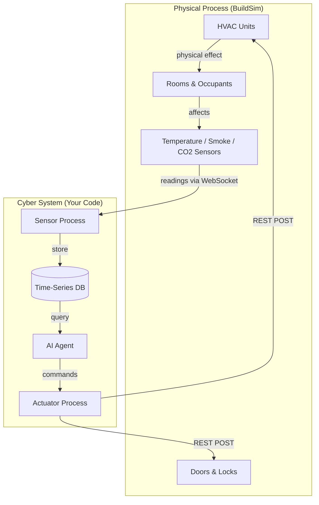
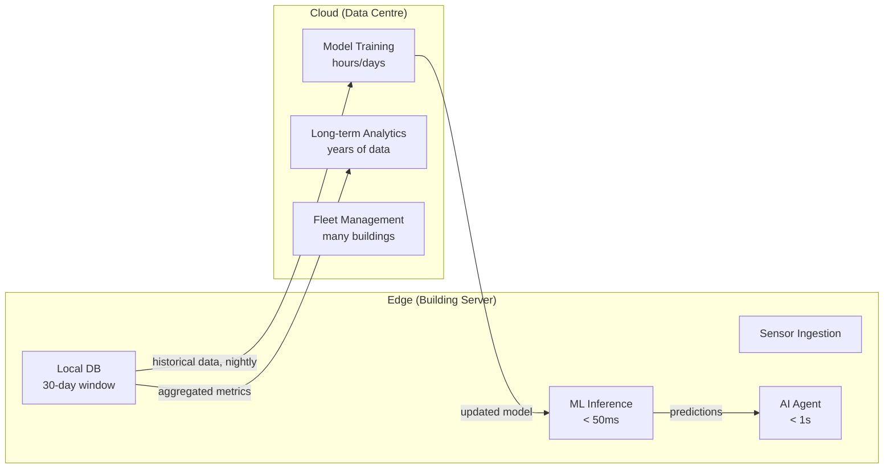
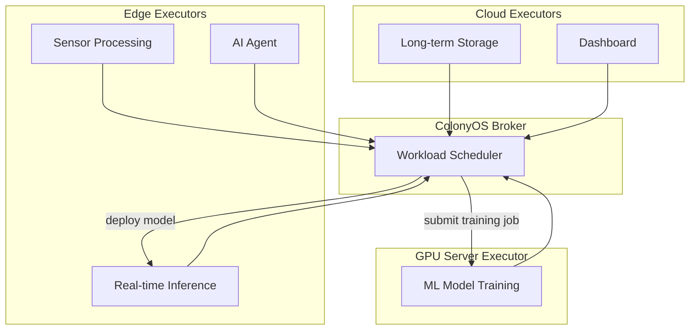
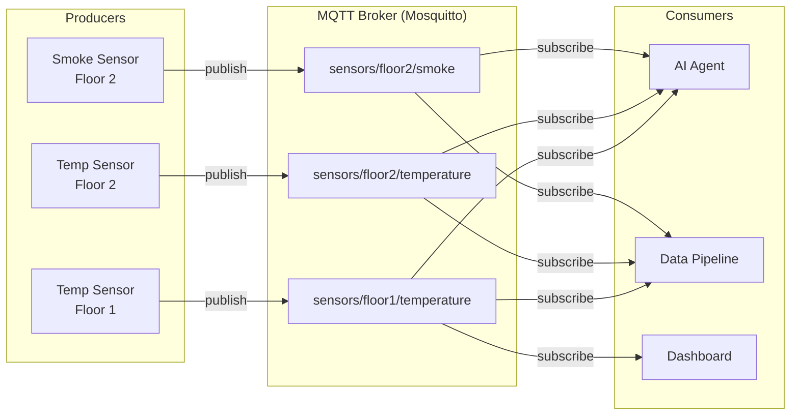
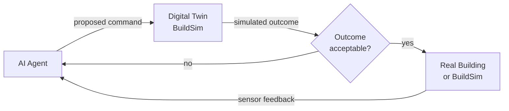

# Lecture 1: Edge Intelligence & CPS Architecture

## Learning Objectives

After this lecture, students will be able to:
- Explain the edge-cloud continuum and where intelligence should be placed
- Compare communication patterns for CPS (pub/sub, request/response, event-driven)
- Design a service-oriented architecture for a building control system
- Justify architectural decisions based on latency, bandwidth, and reliability constraints

---

## Topics

### 1. Cyber-Physical Systems Fundamentals (20 min)

#### The Sensing-Computing-Actuating Loop

A cyber-physical system (CPS) is defined by the tight, continuous coupling between computation and physical processes. Unlike a traditional software system, where the physical world is an afterthought (a user who types slowly), in a CPS the physical world is the primary concern. The computation exists *to control the physical process*, and the physical process evolves *faster than a human can respond*.

The core loop is: **sense → compute → act**. Sensors measure physical quantities (temperature, pressure, position, light). Computation processes these measurements, reasons about the current state, and decides on a response. Actuators execute the response, changing the physical state. The changed physical state produces new sensor readings, and the loop repeats. In a building, this loop might run every 5 seconds for routine climate control, or every 100 milliseconds for a fire suppression system.

> **Key term — CPS:** Cyber-Physical System. A system in which computation and physical processes are tightly coupled, with embedded computers monitoring and controlling physical processes that feed back into computation.

What makes CPS engineering hard is that the physical world imposes real-time constraints, has physical limits (a fan cannot spin faster than its motor allows), is subject to noise and faults (sensors fail, network packets are dropped), and has safety consequences (a wrong command can start a fire or lock occupants in). These constraints drive every architectural decision.

#### Building Control as a CPS

In BuildSim, the physical layer includes: rooms at different temperatures, doors with states (open/locked/unlocked), HVAC units that heat and cool air, ventilation fans that move air between zones, smoke sensors with particle concentration readings, CO2 sensors tracking occupancy, and the people moving through the building. The cyber layer includes: sensor processes reading from the BuildSim API, a data pipeline storing and processing readings, an AI agent reasoning about the building state, and an actuator process sending commands back to BuildSim.

The physical and cyber layers are connected through the BuildSim API — a REST/WebSocket interface that abstracts the simulation. In a real building, this interface would be a field bus (BACnet, KNX, Modbus) connecting physical devices. The architecture is identical; only the bottom layer changes.

---

### 2. Edge-Cloud Continuum (30 min)

#### Why Edge Computing Matters for CPS

The conventional model of cloud computing — send all data to a data centre, process it there, send responses back — fails for many CPS use cases. The reasons are fundamental, not incidental:

**Latency.** A fire suppression system must detect fire and activate sprinklers in under one second. A round-trip to a cloud data centre takes 50–200 ms under ideal conditions, and much more under load or network congestion. Worse, if the internet connection drops during a fire, the system must still work. Safety-critical decisions cannot depend on a network connection outside the building.

**Bandwidth.** A building with 500 sensors each generating a reading every 5 seconds produces 100 readings/second. If each reading is a 200-byte JSON object, that is 20 KB/s — trivial. But if each sensor is a camera generating 1080p video at 30 fps, that is 500 MB/s per camera — impossible to stream to the cloud continuously. Edge processing compresses, filters, and aggregates data before it ever leaves the building.

**Privacy.** Video feeds and occupancy patterns are sensitive personal data. Many jurisdictions restrict cross-border data transfer under regulations like [GDPR](https://gdpr-info.eu/). Processing data on-premises eliminates the risk of sensitive data leaving the building.

**Reliability.** Cloud services go down. Internet connections go down. A building that cannot control its HVAC because AWS is having an outage is an embarrassing failure. Edge systems keep running when connectivity is lost.

> **Key term — Edge computing:** Processing data close to where it is generated — on the device itself or on local hardware — rather than sending it to a remote data centre. Reduces latency, bandwidth consumption, and dependency on connectivity.

#### The Compute Hierarchy

The edge-cloud continuum has several layers, each with different properties:

| Layer | Location | Latency | Compute | Examples |
|-------|----------|---------|---------|---------|
| **Device** | On the sensor/actuator | <1 ms | Very low | Arduino, Raspberry Pi, ESP32 |
| **Edge** | Local gateway, server room | 1–10 ms | Medium | NUC, industrial PC, Jetson |
| **Fog** | Building/campus level | 10–50 ms | High | Rack server, mini data centre |
| **Cloud** | Regional data centre | 50–200 ms | Unlimited | AWS, Azure, GCP |

For building control, the typical distribution is:
- **Device level:** sensor firmware, simple threshold alarms
- **Edge level:** data collection, real-time ML inference, agent decision-making
- **Cloud level:** model training, long-term analytics, fleet management, dashboards

**Hybrid edge-cloud** is the dominant real-world pattern: run inference at the edge, train models in the cloud. The edge model is updated periodically from the cloud with a freshly trained version. This combines the latency benefits of edge with the computational power of cloud for training. [TensorFlow Lite](https://www.tensorflow.org/lite) and [ONNX Runtime](https://onnxruntime.ai/) are the standard tools for deploying ML models at the edge.

#### Compute Continuum Orchestration

The edge-cloud continuum creates a practical problem: how do you manage workloads that span multiple platforms? A sensor process runs on a Raspberry Pi, a data pipeline on an edge server, ML training on a GPU cluster, and a dashboard in the cloud. Each has different capabilities, different APIs, and different failure modes.

**Compute continuum orchestrators** solve this by providing a single abstraction layer across all platforms. Instead of deploying to specific machines, you submit a workload description (what to run, what resources it needs) and the orchestrator places it on the best available platform.

[**ColonyOS**](https://github.com/colonyos/colonies) is an open-source meta-orchestrator designed for this purpose. It creates a "colony" — a unified orchestration layer across heterogeneous infrastructure (edge devices, local servers, cloud VMs, HPC clusters). Key concepts:

- **Executors** register capabilities (GPU, edge, IoT) with the colony
- **Function specifications** describe what to compute, not where
- **The broker** matches workloads to executors based on requirements
- **Zero-trust security** — executors can run on untrusted infrastructure

For building control, this enables architectures like:
- Sensor data preprocessing runs on edge executors (low latency)
- ML model training is submitted as a job that runs on the GPU server
- The trained model is automatically deployed back to edge executors
- If the GPU server is busy, training jobs queue or overflow to cloud

This approach is more sophisticated than running everything on one laptop with Docker Compose — it prepares the architecture for real deployment across distributed infrastructure.

#### When Edge Is Essential vs. When Cloud Is Fine

Edge is essential when:
- Response time < 1 second (fire suppression, emergency unlock)
- System must work without internet (safety-critical functions)
- Continuous data volume is too large to stream (video, high-frequency sensors)
- Data is too sensitive to leave the premises

Cloud is fine when:
- Latency > 5 seconds is acceptable (dashboard updates, reports)
- Compute requirements are too large for local hardware (training a large model)
- Data needs to be aggregated across many buildings (fleet benchmarking)
- Disaster recovery and backup storage

A common mistake is to over-edge: running everything on a single Raspberry Pi because "it's the edge," then discovering the Pi cannot run an LLM fast enough. The edge layer in a real building is a rack server or a small cluster of industrial computers — it has significant compute. For this course, your laptop is the edge.

---

### 3. Communication Patterns for CPS (30 min)

Choosing the right communication pattern is one of the most consequential architectural decisions. It affects latency, scalability, coupling between components, and how the system behaves under failure.

#### Request/Response (REST / HTTP)

In request/response, a client sends a request and blocks waiting for a response. This is the simplest pattern and the default for most web APIs, including the BuildSim API.

**When to use:** Control commands (set actuator state), one-time queries (get current sensor reading), configuration (register a new sensor). Any interaction where the caller needs to know the result before proceeding.

**When to avoid:** High-frequency data streams (polling at 1 Hz is inefficient), fan-out (one event needs to reach 20 subscribers), or when the caller does not need to wait for a response.

**REST specifics:** REST (Representational State Transfer) uses HTTP verbs (GET, POST, PUT, DELETE) to express intent. Resources are identified by URLs. Responses use standard HTTP status codes (200 OK, 400 Bad Request, 404 Not Found, 500 Internal Server Error). The [BuildSim API](https://github.com/eislab-cps/buildsim) is a REST API — you use `GET /sensors` to list sensors and `POST /actuators/{id}` to command an actuator.

A good REST API tutorial: [RESTful API Design Best Practices](https://stackoverflow.blog/2020/03/02/best-practices-for-rest-api-design/) (Stack Overflow Blog).

#### Publish/Subscribe (MQTT / Kafka)

In pub/sub, **publishers** emit messages to **topics** without knowing who receives them. **Subscribers** declare interest in topics and receive all matching messages. A **broker** routes messages between publishers and subscribers.

This decouples producers from consumers entirely. A sensor process publishes to `sensors/floor2/temperature` without knowing whether one, ten, or zero consumers are listening. An AI agent subscribes to `sensors/+/smoke` (MQTT wildcard) and receives all smoke readings from all floors — without the sensor processes knowing the agent exists.

**MQTT** ([mqtt.org](https://mqtt.org/)) is the standard protocol for IoT sensor data. It is lightweight (2-byte header), supports QoS levels (at-most-once, at-least-once, exactly-once), and handles intermittent connectivity gracefully with retained messages and persistent sessions. [Mosquitto](https://mosquitto.org/) is the standard open-source broker. The [HiveMQ MQTT essentials series](https://www.hivemq.com/mqtt-essentials/) is an excellent free resource.

**Kafka** ([kafka.apache.org](https://kafka.apache.org/)) is a distributed log designed for high-throughput, durable event streaming. Unlike MQTT, Kafka stores messages durably — subscribers can replay historical events. This is valuable for building a data lake (see Lecture 3). Kafka is overkill for a single building but the right choice for a fleet of buildings.

**When to use pub/sub:** Sensor data distribution (one sensor, many consumers), system events (door opened, fire alarm triggered), loose coupling between independently developed components.

#### Event-Driven Architecture

Event-driven architecture (EDA) is a broader pattern where system components communicate exclusively through events — immutable records of something that happened. An event is not a command ("turn on the fan") but a fact ("the temperature exceeded 28°C at 14:32:05"). Components react to events independently and asynchronously.

The key benefit of EDA is **temporal decoupling**: a component that reacts to an event does not need to be running when the event is produced. This makes systems resilient to partial failures. It also enables **event sourcing**: store every event in an append-only log, and you can reconstruct the entire state of the system at any point in time — invaluable for debugging ("why did the agent turn on the sprinklers?").

In building control, EDA is the natural pattern for safety systems: "fire alarm triggered" is an event that independently causes "sprinklers activated", "doors unlocked", "HVAC shutdown", and "alert sent to fire department" — four reactions to one event, each handled by a different component.

A good introduction: [Martin Fowler on Event-Driven Architecture](https://martinfowler.com/articles/201701-event-driven.html).

#### WebSocket

WebSocket provides a persistent, full-duplex TCP connection between a client and server. Unlike HTTP, where the client must initiate every exchange, WebSocket allows the server to push data to the client at any time. This is essential for real-time sensor streaming.

The BuildSim API uses WebSocket to stream live sensor readings to subscribed clients. Your sensor process connects to the WebSocket endpoint and receives a continuous stream of readings without polling. This is dramatically more efficient than polling a REST endpoint at 10 Hz.

**When to use:** Real-time push from server to client (sensor streaming, live dashboards), bidirectional real-time communication, connection that must stay open for extended periods.

**When to avoid:** Occasional queries where a connection setup cost is acceptable, stateless interactions, when HTTP/2 server-sent events would suffice.

#### Pattern Comparison

| Pattern | Coupling | Latency | Scalability | Durability | Use in building control |
|---------|----------|---------|-------------|-----------|------------------------|
| REST | Tight | Low | Medium | No | Control commands, API queries |
| MQTT pub/sub | Loose | Low | High | Optional | Sensor data distribution |
| Kafka | Loose | Medium | Very high | Yes | Multi-building event log |
| WebSocket | Medium | Very low | Medium | No | Real-time sensor streams |
| gRPC | Tight | Very low | High | No | High-performance internal services |

---

### 4. Service-Oriented Architecture (20 min)

#### Microservices vs. Monolith

A monolithic architecture puts all functionality in a single deployable unit. A microservices architecture decomposes functionality into small, independently deployable services that communicate over a network.

For CPS and building control, the microservices pattern fits well because:
- Different components have different scaling requirements (the data pipeline needs more storage than the AI agent needs compute)
- Different components have different update frequencies (the sensor process is stable; the agent logic evolves rapidly)
- Different components may be written by different teams or use different languages
- Failure isolation: a bug in the dashboard does not take down the safety agent

The cost of microservices is operational complexity: you need to orchestrate multiple containers, manage service discovery, handle network failures between services, and maintain more deployment configuration. For a course project, this complexity is a feature — it teaches you real-world CPS architecture.

> **Key term — Microservice:** A small, independently deployable service that does one thing well, communicates with other services over a network, and can be scaled, updated, and failed independently.

#### Containerisation with Docker

Docker packages a service and all its dependencies (libraries, runtime, configuration) into a container image that runs identically on any machine. This solves the "works on my laptop" problem and is the standard deployment mechanism for microservices.

Key concepts:
- **Dockerfile:** a recipe for building a container image — base OS, installed packages, application code, startup command
- **Container:** a running instance of an image — isolated filesystem, network, and process space
- **Docker Compose:** a tool for defining and running multi-container applications — your `docker-compose.yml` is the executable version of your container diagram

The [official Docker getting-started tutorial](https://docs.docker.com/get-started/) is the best introduction. The [Docker Compose documentation](https://docs.docker.com/compose/) covers multi-container setups.

#### Eclipse Arrowhead Framework

[Eclipse Arrowhead](https://www.arrowhead.eu/) is a service-oriented framework specifically designed for industrial IoT and CPS. It treats every sensor, actuator, and service as a registered, discoverable, and authorised service. The core system services are:

- **Service Registry:** all services register themselves; consumers look up producers by service type
- **Authorisation System:** enforces which services can talk to which
- **Orchestration System:** routes requests from consumers to appropriate providers

Arrowhead is used in Swedish industrial automation (it originated from Swedish research) and is relevant to this course as a reference architecture for how production CPS systems organise service communication. For the lab, you do not need to implement Arrowhead — but understanding its concepts informs your own service design.

The [Arrowhead Framework documentation](https://github.com/eclipse-arrowhead/core-java-spring) is the primary reference.

#### Each Sensor/Actuator as a Service

In a service-oriented building control architecture, every sensor and actuator is a service: it has a well-defined interface, it is independently deployable, and it can be discovered and used by other services without direct coupling.

Practical example: instead of one monolithic process that reads all sensors and commands all actuators, you have:
- `smoke-sensor-service` — reads smoke sensors, publishes to `sensors/smoke`
- `temperature-sensor-service` — reads temperature sensors, publishes to `sensors/temperature`
- `hvac-actuator-service` — subscribes to control commands on `actuators/hvac`, sends REST commands to BuildSim
- `door-actuator-service` — subscribes to `actuators/doors`, sends door commands to BuildSim

Each service can be restarted independently, scaled if needed, and replaced with a different implementation. The AI agent does not care whether the smoke sensor is a real device or a BuildSim simulator — it just reads from `sensors/smoke`.

---

### 5. Architecture Patterns for Building Control (20 min)

#### Event-Driven Pub/Sub Architecture

The most common pattern for building control: sensors publish readings to a message broker, consumers (AI agents, databases, dashboards) subscribe to topics of interest. This is the building block of most modern IoT architectures.

**Advantages:** loose coupling, simple to extend (add a new consumer without changing producers), natural fit for the one-to-many relationship between sensors and consumers.

**When it fits:** sensor data collection, event distribution, real-time alerting.

#### Lambda Architecture

The Lambda architecture separates data processing into two paths:

- **Speed layer (hot path):** processes events in real time, produces low-latency approximate results (current temperature, active alerts)
- **Batch layer (cold path):** processes historical data in bulk, produces accurate long-term results (weekly energy report, model training data)
- **Serving layer:** merges results from both paths for queries

For building control, the speed layer handles real-time ML inference and safety responses; the batch layer trains models, generates reports, and populates the feature store for the next training run.

The Lambda architecture has been [critiqued](https://www.oreilly.com/radar/questioning-the-lambda-architecture/) for duplicating logic across two code paths. The **Kappa architecture** (Nathan Marz) simplifies it by using a single stream processing layer for both real-time and historical processing — replay historical data through the same stream processor. [Apache Flink](https://flink.apache.org/) supports both patterns.

#### Multi-Agent Architecture

Multiple specialised agents, each responsible for a single objective, coordinating through a shared state or message passing. Example decomposition:

- **Safety Agent:** monitors smoke and fire sensors, responds to emergencies with highest priority
- **Energy Agent:** optimises HVAC schedules to minimise energy consumption
- **Comfort Agent:** maintains temperature and CO2 within occupant preference ranges
- **Coordination Layer:** resolves conflicts (Safety Agent always wins; Energy Agent and Comfort Agent negotiate)

Each agent is a separate process, independently updatable. Conflict resolution requires explicit priority rules or a supervisor agent. See Lecture 4 for a detailed treatment of multi-agent coordination.

#### Digital Twin Feedback Loop

A digital twin is a real-time simulation of the physical system that runs in parallel with the real system. Before the AI agent sends a command to a real actuator, it sends the command to the digital twin and observes the simulated outcome. If the outcome is undesirable, it tries a different command.

BuildSim is itself a digital twin of a building — it simulates the physical dynamics of room temperature, airflow, and occupancy. Your AI agent can use BuildSim as an oracle: "if I turn on HVAC zone 3, what will the temperature be in 10 minutes?" The [Building Controls Virtual Test Bed (BCVTB)](https://simulationresearch.lbl.gov/bcvtb) and [EnergyPlus](https://energyplus.net/) are examples of higher-fidelity building simulation tools used in research.

#### Choosing a Pattern

No single pattern fits all use cases. Use these questions to guide your choice:

1. **What is the latency requirement for the critical path?** < 100 ms → keep it local, use direct calls. < 1 s → edge processing, pub/sub. > 1 s → cloud is fine.
2. **How many consumers need the same data?** One → request/response. Many → pub/sub.
3. **Must the system work without connectivity?** Yes → all critical logic at the edge, local storage, offline-first design.
4. **How complex is the reasoning?** Simple threshold → rule engine. Contextual trade-offs → LLM agent.
5. **How many distinct objectives need to be balanced?** One → single agent. Multiple → multi-agent with coordination.

---

## Lab Connection

- Run the BuildSim server locally, explore the REST API with `curl` or a REST client like [Insomnia](https://insomnia.rest/)
- Subscribe to the BuildSim WebSocket and observe the real-time sensor stream
- Decide on your communication patterns for the architecture document: will you use pub/sub (MQTT), direct WebSocket, or REST polling for sensor ingestion?
- Select your architecture pattern (event-driven, multi-agent, digital twin loop, or hybrid) and justify the choice in your architecture document

---

## Recommended Reading

- Shi, W. et al. "Edge Computing: Vision and Challenges" (IEEE IoT Journal, 2016) — [doi.org/10.1109/JIOT.2016.2579198](https://doi.org/10.1109/JIOT.2016.2579198) — the foundational paper on edge computing
- Dastjerdi, A.V. & Buyya, R. "Fog Computing: Helping the Internet of Things Realize Its Potential" (IEEE Computer, 2016) — [doi.org/10.1109/MC.2016.301](https://doi.org/10.1109/MC.2016.301)
- Eclipse Arrowhead Framework — [arrowhead.eu](https://www.arrowhead.eu/) and [GitHub](https://github.com/eclipse-arrowhead/core-java-spring)
- HiveMQ MQTT Essentials (12-part series, free) — [hivemq.com/mqtt-essentials](https://www.hivemq.com/mqtt-essentials/) — read parts 1–6
- Fowler, M. "Patterns of Enterprise Application Architecture" — [martinfowler.com/eaaCatalog](https://martinfowler.com/eaaCatalog/) — free online reference for architectural patterns
- Fowler, M. "Microservices" article — [martinfowler.com/articles/microservices.html](https://martinfowler.com/articles/microservices.html) — the canonical introduction
- Richardson, C. "Microservices Patterns" — [microservices.io](https://microservices.io/) — free pattern catalog; especially relevant: service registry, API gateway, event-driven patterns
- Docker getting-started tutorial — [docs.docker.com/get-started](https://docs.docker.com/get-started/)
