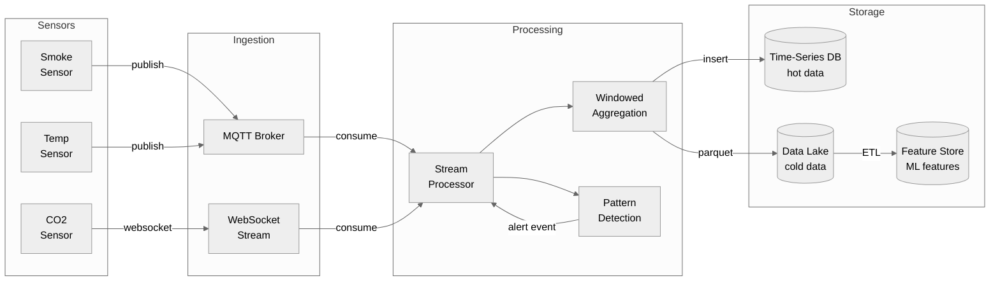
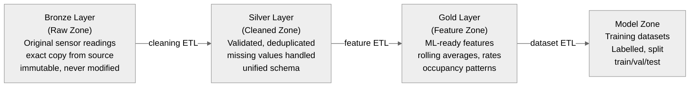

# Data Engineering for CPS

## The Data Problem in CPS

### Why Data Engineering Is a First-Class Concern

Building control systems generate data continuously and at scale. A modest commercial building with 100 sensor points, each sampled every 5 seconds, produces 1,728,000 readings per day. Add video, audio, and higher-frequency sensors, and the total reaches hundreds of millions of records. The volume is not the hard part; the hard part is that the data is **heterogeneous**, **time-ordered**, **noisy**, and **latency-sensitive**.

The fundamental tension in CPS data engineering is between three competing goals. Real-time decisions need data with sub-second latency, making batch processing before acting impractical. ML model training needs months of clean, labelled, feature-engineered data, making raw real-time data unsuitable. Long-term analytics need years of queryable history, making aggressive downsampling or deletion harmful.

These three goals require different storage systems, different processing patterns, and different data representations. A well-designed data architecture serves all three without compromise.

The classical framework for characterising data challenges, **volume, velocity, variety**, all apply to CPS. Volume encompasses millions of readings per day and years of history. Velocity covers real-time decisions and sub-second latency requirements for safety. Variety spans floats (temperature), booleans (door state), strings (event type), images, and time series.

> **Key term — Data pipeline:** A sequence of processing steps that moves data from its source (sensors) to its destination (storage, ML model, dashboard), transforming it at each step.

## Sensor Data Pipelines

### Ingestion Patterns

Data ingestion is the first step: getting data from sensor processes into a durable store. Three patterns are common.

**Direct REST POST** — the sensor process calls a REST API to store each reading immediately. Simple to implement and effective at low volume. At scale, 100 sensors at 10 Hz produces 1,000 REST calls per second, which overwhelms most databases.

**Message queue as buffer** — the sensor process publishes to an MQTT broker or Kafka topic. A separate consumer process reads from the queue and writes to storage. The queue acts as a buffer: if the database is slow or temporarily unavailable, readings accumulate in the queue and are processed later. This decouples ingestion rate from storage write rate. For the lab, MQTT combined with a consumer process writing to TimescaleDB or DuckDB is the recommended pattern.

**Batch file upload** — the sensor process accumulates readings in memory and periodically (every minute, every hour) writes a Parquet file to object storage (MinIO, S3). A batch processor reads these files. High throughput and low overhead, but latency of minutes makes this unsuitable for real-time decisions while remaining excellent for the historical data needed for ML training.

### Stream Processing

Stream processing means operating on data as it arrives, without accumulating it first. The key abstraction is the **stream**: an unbounded, time-ordered sequence of events. Stream processors apply operations to streams and produce new streams or side effects (database writes, alerts).

**Windowed aggregation** is the most common stream operation for sensor data. Instead of acting on each individual reading, statistics are computed over a sliding time window: a 5-minute average temperature smooths out sensor noise, a 1-minute maximum smoke level detects peaks rather than averages, and a 30-second standard deviation detects anomalies as unusual variance suggests a fault.

A window can be **tumbling** (non-overlapping, fixed size: 0–5 min, 5–10 min), **sliding** (overlapping, fixed size: updated every second with the last 5 minutes of data), or **session** (dynamic, ending when there is a gap in events).

**Complex event processing (CEP)** detects patterns across multiple events over time. A fire detection pattern might be expressed as: smoke level above 0.7 for 10 consecutive readings, combined with temperature rising at more than 2°C per minute, combined with a door opening in the zone recently. CEP systems can express these temporal patterns declaratively. [Apache Flink](https://flink.apache.org/) has a CEP library; for smaller scale, a stateful Python process with a sliding window buffer is sufficient.



Useful tools include [Apache Flink](https://flink.apache.org/) (distributed stream processing engine, production-grade but heavy for a lab), [Kafka Streams](https://kafka.apache.org/documentation/streams/) (stream processing library built on Kafka), [Redis Streams](https://redis.io/docs/data-types/streams/) (lightweight, in-memory stream storage with consumer groups, excellent for the lab), and plain Python with asyncio, where a simple asyncio consumer reading from MQTT and writing to DuckDB is entirely sufficient for the lab.

### Batch Processing

Batch processing operates on large volumes of stored data at once: daily training data preparation, weekly energy reports, monthly anomaly analysis. Batch jobs run on a schedule (nightly, weekly) or on demand.

For building control, the critical batch job is **training data preparation**: extracting 90 days of sensor readings from the data lake, computing features (rolling averages, occupancy patterns, time-of-day encodings), and producing a clean CSV or Parquet file for ML training. This job may take minutes to hours, which is acceptable because real-time processing is not required.

[DuckDB](https://duckdb.org/) is an in-process SQL engine that can query Parquet files directly without a server. It is the recommended tool for batch processing in this course: fast, zero-configuration, and SQL-interfaced. [pandas](https://pandas.pydata.org/) is a Python DataFrame library useful for prototyping ETL logic. [Apache Spark](https://spark.apache.org/) is a distributed batch processing engine, appropriate for multi-building analytics at industrial scale.

## Data Lake Architecture

### The Data Lake Philosophy

A **data lake** is a storage system that holds raw data in its native format until it is needed. The philosophy is: store first, structure later. Rather than deciding upfront what questions will be asked of the data (as a data warehouse requires), everything is stored and the schema is defined at query time. This is especially valuable in CPS, where data science questions evolve over time; it may not be known in week one that 5-minute variance of CO2 readings will be needed as an occupancy feature.

The three core principles of a data lake are: storing raw data (never transforming or discarding the original sensor readings, always keeping the immutable raw record), transforming on read (applying transformations such as cleaning and feature engineering at query time rather than write time, allowing transformation changes without data loss), and schema on read (defining the schema when querying rather than writing, accommodating evolving schemas without migration).

> **Key term — Data lake:** A storage repository that holds a large amount of raw data in its native format (files on object storage) until it is needed for analysis. Data is stored cheaply, queried flexibly, and never discarded.

### Medallion Architecture

The **medallion architecture** (popularised by [Databricks](https://www.databricks.com/glossary/medallion-architecture)) organises a data lake into layers:



The **Bronze (raw)** layer holds an exact copy of source data, timestamped on arrival and never modified. If a bug is discovered in a downstream pipeline, reprocessing from bronze is always possible. The **Silver (cleaned)** layer contains validated data (out-of-range values flagged), deduplicated data (retransmissions removed), a unified schema (all sensors using the same field names and types), and handled missing values (forward-fill or flagged as null). The **Gold (features)** layer contains business-ready features for ML: rolling statistics, derived signals, time encodings, and cross-sensor relationships. The **Model zone** holds ready-to-train datasets with labels and train/validation/test splits.

### Storage Formats

**CSV** is human-readable and universally supported but slow for large data. It is appropriate for small exports and manual inspection, not for production pipelines.

**[Parquet](https://parquet.apache.org/)** is the standard format for data lakes. Columnar storage means that reading only the `temperature` column requires reading only that column's data. Parquet is compressed (typically 4–10x smaller than CSV), fast for analytical queries, and supports schema enforcement. All data lake storage should use Parquet.

**JSON Lines (JSONL)** stores one JSON object per line. Flexible schema, human-readable, and easy to append. Appropriate for event logs and audit trails where schema evolution is expected.

**[Apache ORC](https://orc.apache.org/)** is similar to Parquet and used in Hadoop ecosystems. Parquet is preferred unless working in a Hive/Spark environment that prefers ORC.

### Self-Hosted Data Lake with MinIO and DuckDB

A self-hosted data lake using [MinIO](https://min.io/) (S3-compatible object storage) and [DuckDB](https://duckdb.org/) (in-process SQL) is entirely sufficient for the lab and runs in Docker:

```yaml
# docker-compose.yml fragment
minio:
  image: minio/minio
  command: server /data --console-address ":9001"
  environment:
    MINIO_ROOT_USER: minioadmin
    MINIO_ROOT_PASSWORD: minioadmin
  volumes:
    - minio-data:/data
  ports:
    - "9000:9000"   # S3 API
    - "9001:9001"   # Web console
```

Sensor processes write Parquet files to MinIO. DuckDB queries them directly with SQL:

```sql
-- Query all smoke readings from the last 7 days
SELECT sensor_id, AVG(value) as avg_smoke, MAX(value) as peak_smoke
FROM read_parquet('s3://building-data/bronze/smoke/date=*/readings.parquet')
WHERE timestamp > NOW() - INTERVAL '7 days'
GROUP BY sensor_id
ORDER BY peak_smoke DESC;
```

DuckDB can read from S3/MinIO directly with the [httpfs extension](https://duckdb.org/docs/extensions/httpfs.html). No ETL server, no cluster, no managed service is needed. This is the recommended data lake setup for this course.

## Time-Series Storage

### Why Time-Series Databases?

Generic relational databases (PostgreSQL, MySQL) are designed for a workload dominated by lookups by primary key, joins between tables, and transactional updates. Sensor data has a completely different access pattern: **append-heavy** (100% of writes are new data, never updates to existing rows), **time-range queries** (all temperature readings between 14:00 and 15:00), and **downsampling** (hourly averages from 5-second data over a year).

Time-series databases are optimised for this access pattern. On the write path, data is stored in time-ordered chunks and new data appends to the latest chunk, producing much higher write throughput than a generic database. On the query path, time-range predicates prune entire chunks outside the range, making queries like "last 24 hours" extremely fast. Retention policies automatically delete data older than a retention window or downsample it (replacing 5-second data older than 30 days with 1-minute averages), managing storage automatically.

> **Key term — Time-series database (TSDB):** A database optimised for storing and querying time-stamped data. Provides fast range queries, automatic downsampling, and efficient compression for the append-heavy patterns of sensor data.

### Time-Series Database Options

**[InfluxDB](https://www.influxdata.com/)** is a purpose-built time-series database using its own data model (measurements, tags, fields) and query languages (InfluxQL, Flux). Version 3 uses Apache Arrow and SQL. Excellent tooling includes the [Telegraf](https://www.influxdata.com/time-series-platform/telegraf/) agent for automatic sensor ingestion and built-in [Grafana](https://grafana.com/) integration. The [InfluxDB getting-started guide](https://docs.influxdata.com/influxdb/v2/get-started/) is the best starting point.

**[TimescaleDB](https://www.timescale.com/)** is a PostgreSQL extension that adds time-series capabilities. Data lives in regular PostgreSQL tables, accessed with standard SQL, standard PostgreSQL tools, and every PostgreSQL driver. Hypertables automatically partition data by time. Continuous aggregates materialise time-windowed aggregations automatically. This is the most pragmatic choice for this course: standard SQL, easy to use with any Python database driver, and runs in Docker.

```sql
-- TimescaleDB: create a hypertable for sensor readings
CREATE TABLE readings (
    time        TIMESTAMPTZ NOT NULL,
    sensor_id   TEXT NOT NULL,
    value       DOUBLE PRECISION NOT NULL,
    unit        TEXT
);
SELECT create_hypertable('readings', 'time');

-- Insert a reading
INSERT INTO readings (time, sensor_id, value, unit)
VALUES (NOW(), 'smoke-A2306', 0.82, 'normalised');

-- Query: 5-minute averages over the last 24 hours
SELECT time_bucket('5 minutes', time) AS bucket,
       sensor_id,
       AVG(value) as avg_value,
       MAX(value) as max_value
FROM readings
WHERE sensor_id = 'smoke-A2306'
  AND time > NOW() - INTERVAL '24 hours'
GROUP BY bucket, sensor_id
ORDER BY bucket;
```

**[ClickHouse](https://clickhouse.com/)** is a column-oriented analytical database, extremely fast for read-heavy analytical queries with good write throughput. Used in production at Cloudflare, Uber, and many others. Appropriate for complex analytics at scale. [ClickHouse documentation](https://clickhouse.com/docs/en/intro).

**DuckDB on Parquet** requires no server, runs in-process, provides full SQL, and reads Parquet files directly. For the lab, this is the simplest option for the historical analytics path rather than real-time ingestion. [DuckDB documentation](https://duckdb.org/docs/).

The recommended setup for the lab is TimescaleDB for the hot (real-time) path combined with DuckDB/MinIO for the cold (historical) path. Both run in Docker and both use SQL.

## ETL and Feature Engineering

### ETL: Extract, Transform, Load

**Extract** means reading data from one or more sources: the time-series database (for recent data), the data lake (for historical data), or external sources (weather API for outdoor temperature, calendar API for occupancy schedules).

**Transform** is where the analytical value is created. Raw sensor readings (a float every 5 seconds) are not useful ML features, as they are too noisy, too high-dimensional, and lack context. Feature engineering turns raw readings into informative signals:

| Raw data | Derived feature | Why it helps |
|----------|----------------|-------------|
| Temperature readings | 5-min rolling average | Removes noise, reveals trends |
| Temperature readings | Rate of change (°C/min) | Detects rapid heating (fire signature) |
| Smoke readings | Count of readings > 0.5 in last 5 min | More robust than instantaneous reading |
| CO2 readings | Daily cycle similarity score | Detects occupancy anomalies |
| Door open events | Inter-event time | Detects unusual access patterns |
| HVAC state + temperature | Temperature residual (actual vs. expected) | Detects HVAC failure |

**Temporal features** encode time-of-day and day-of-week patterns. Occupancy is highly predictable (offices fill at 08:00, empty at 18:00 on weekdays), and an ML model that knows the time of day can predict occupancy without any occupancy sensor. Sine/cosine encoding of cyclical time features is preferable to raw hour/minute values, allowing a model to learn that 23:59 and 00:01 are adjacent.

```python
import numpy as np

def add_time_features(df):
    """Add cyclical time encodings to a DataFrame with a 'timestamp' column."""
    t = df['timestamp']
    df['hour_sin'] = np.sin(2 * np.pi * t.dt.hour / 24)
    df['hour_cos'] = np.cos(2 * np.pi * t.dt.hour / 24)
    df['dow_sin']  = np.sin(2 * np.pi * t.dt.dayofweek / 7)
    df['dow_cos']  = np.cos(2 * np.pi * t.dt.dayofweek / 7)
    return df
```

**Cross-sensor features** capture relationships between sensors: temperature difference between adjacent rooms (detects a door left open or HVAC imbalance), CO2 level combined with ventilation state (occupancy estimation without an occupancy sensor), and smoke level combined with temperature gradient (distinguishing cooking from fire).

**Load** writes the computed features to a feature store (a database or Parquet file ready for ML training) or directly into the ML training pipeline.

### ETL Tools

**[dbt (data build tool)](https://www.getdbt.com/)** transforms data inside a database using SQL. Transformations are defined as SQL queries; dbt runs them in the correct order, tests the outputs, and generates documentation. [dbt Core](https://github.com/dbt-labs/dbt-core) is open source and free. The [dbt fundamentals course](https://courses.getdbt.com/courses/fundamentals) is free and takes about 4 hours.

**pandas** is a Python DataFrame library, flexible and interactive, good for prototyping but not ideal for production (single-threaded, in-memory). It is appropriate for initial exploration and prototyping; production pipelines benefit from being rewritten in SQL (dbt/DuckDB) for reproducibility.

**[Apache Airflow](https://airflow.apache.org/)** is a workflow orchestration platform. ETL pipelines are defined as directed acyclic graphs (DAGs) of tasks that are scheduled, monitored, retried on failure, and alerting on errors. The [Airflow quick-start tutorial](https://airflow.apache.org/docs/apache-airflow/stable/tutorial/index.html) is the entry point. For the lab, a simple Python script scheduled with cron is sufficient; Airflow is the production-grade equivalent.

## Data Quality and Observability

### The Data Quality Problem

Data quality is the silent killer of ML systems. A model trained on bad data will produce bad predictions, and the failures are often subtle: the model performs well on the training data (which is also bad) but fails in production. In CPS, bad data is not just an ML problem but a safety problem: a stuck sensor that always reads 0.0 smoke will prevent a fire detection system from responding.

**Missing data** — a sensor goes offline due to network failure, power outage, or sensor failure. The pipeline receives no reading for that sensor for some period. Handling options include forward-fill (using the last known value, reasonable for slowly-changing quantities like temperature but dangerous for fast-changing ones like door state), linear interpolation (estimating the value based on readings before and after the gap, reasonable for smooth signals), marking as missing (inserting a null value or a special "no data" marker for the ML model to handle), or alerting on absence (if a safety sensor has not reported for over 30 seconds, triggering an alert).

**Duplicate data** — at-least-once delivery in MQTT means a reading may be delivered twice. Idempotent inserts (insert only if not already present) or deduplication in the stream processor prevent double-counting.

**Stale data** — the sensor responds but its value is stuck (a frozen sensor reads the same value indefinitely). Detection: if the standard deviation of readings over a 5-minute window is zero, the sensor may be stuck. Monitoring: tracking the last-updated timestamp for each sensor and alerting if it has not changed for N seconds.

**Clock drift** — the clock on the sensor device is not synchronised with the server clock. Timestamps from different devices can be minutes off. NTP on all devices is essential, and storing both the device timestamp and the server-receipt timestamp is recommended.

**Schema evolution** — adding a new sensor type with additional fields means the existing pipeline does not know how to handle those fields. Schema-on-read (data lake) handles this gracefully; schema-on-write (relational database) requires a migration.

### Monitoring the Pipeline

A data pipeline that silently fails is worse than one that fails loudly. Effective instrumentation includes **data freshness metrics** (tracking the age of the most recent reading for each sensor and alerting if any sensor's freshness exceeds its expected interval by more than three times), **value range checks** (alerting if a value is outside its physical range, since a temperature below -50°C or above 100°C is impossible in a building), **volume checks** (alerting if the number of readings per minute drops below a threshold, indicating sensors are offline), and **error rate metrics** (tracking how many readings are rejected by validation; a spike suggests a schema change or sensor fault).

[Grafana](https://grafana.com/) with [Prometheus](https://prometheus.io/) is the standard monitoring stack for containerised systems. Both are free and open source and have official Docker images.

## Recommended Reading

- Kleppmann, M. "Designing Data-Intensive Applications" (O'Reilly) — Ch. 3 (Storage and Retrieval), Ch. 11 (Stream Processing) — the best technical book on data systems; Ch. 3 and 11 are directly relevant
- TimescaleDB tutorial — [docs.timescale.com/getting-started](https://docs.timescale.com/getting-started/latest/) — practical intro with building/IoT examples
- DuckDB documentation — [duckdb.org/docs](https://duckdb.org/docs/) — especially the [Parquet](https://duckdb.org/docs/data/parquet/overview) and [httpfs](https://duckdb.org/docs/extensions/httpfs.html) sections
- Apache Parquet format specification — [parquet.apache.org](https://parquet.apache.org/) — understand why columnar storage matters
- Databricks "What is a Data Lakehouse?" — [databricks.com/glossary/data-lakehouse](https://www.databricks.com/glossary/data-lakehouse) — explains the medallion architecture
- dbt fundamentals course (free, 4 hours) — [courses.getdbt.com/courses/fundamentals](https://courses.getdbt.com/courses/fundamentals)
- "The Practical Test Pyramid" (Martin Fowler) — [martinfowler.com/articles/practical-test-pyramid.html](https://martinfowler.com/articles/practical-test-pyramid.html) — also applies to data pipeline testing
- MinIO quickstart — [min.io/docs/minio/container/index.html](https://min.io/docs/minio/container/index.html) — run S3-compatible object storage in Docker
- Flink CEP documentation — [nightlies.apache.org/flink/flink-docs-stable/docs/libs/cep/](https://nightlies.apache.org/flink/flink-docs-stable/docs/libs/cep/) — complex event processing patterns
