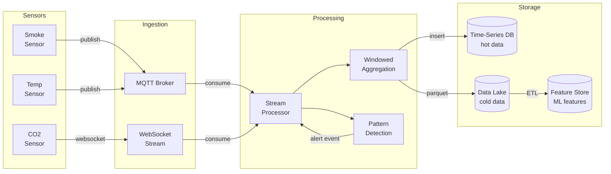
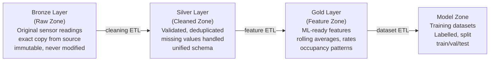

# Lecture 3: Data Engineering for CPS

## Learning Objectives

After this lecture, students will be able to:
- Design a data pipeline from sensors to analytics
- Choose appropriate storage strategies for different data types and query patterns
- Build ETL pipelines that transform raw sensor data into ML-ready features
- Query time-series sensor data using SQL

---

## Topics

### 1. The Data Problem in CPS (15 min)

#### Why Data Engineering Is a First-Class Concern

Building control systems generate data continuously and at scale. A modest commercial building with 100 sensor points, each sampled every 5 seconds, produces 1,728,000 readings per day. Add video, audio, and higher-frequency sensors, and you are in the hundreds of millions of records. But the volume is not the hard part — the hard part is that the data is **heterogeneous**, **time-ordered**, **noisy**, and **latency-sensitive**.

The fundamental tension in CPS data engineering is between three competing goals:
- **Real-time decisions** need data with sub-second latency — you cannot afford to batch and process before acting
- **ML model training** needs months of clean, labelled, feature-engineered data — you cannot use raw real-time data directly
- **Long-term analytics** need years of queryable history — you cannot delete or downsample too aggressively

These three goals require different storage systems, different processing patterns, and different data representations. A well-designed data architecture serves all three without compromise.

The classical framework for characterising data challenges — **volume, velocity, variety** — all apply to CPS:
- **Volume:** millions of readings per day; years of history
- **Velocity:** real-time decisions; sub-second latency requirements for safety
- **Variety:** floats (temperature), booleans (door state), strings (event type), images, time series

> **Key term — Data pipeline:** A sequence of processing steps that moves data from its source (sensors) to its destination (storage, ML model, dashboard), transforming it at each step.

---

### 2. Sensor Data Pipelines (30 min)

#### Ingestion Patterns

Data ingestion is the first step: getting data from sensor processes into a durable store. Three patterns are common:

**Direct REST POST** — the sensor process calls a REST API to store each reading immediately. Simple to implement, works well at low volume. Fails at scale: 100 sensors × 10 Hz = 1,000 REST calls/second, which overwhelms most databases.

**Message queue as buffer** — the sensor process publishes to an MQTT broker or Kafka topic. A separate consumer process reads from the queue and writes to storage. The queue acts as a buffer: if the database is slow or temporarily unavailable, readings accumulate in the queue and are processed later. This decouples ingestion rate from storage write rate. For the lab, MQTT + a consumer process writing to TimescaleDB or DuckDB is the recommended pattern.

**Batch file upload** — the sensor process accumulates readings in memory and periodically (every minute, every hour) writes a Parquet file to object storage (MinIO, S3). A batch processor reads these files. High throughput, low overhead, but latency of minutes — not suitable for real-time decisions, but excellent for the historical data needed for ML training.

#### Stream Processing

Stream processing means operating on data as it arrives, without accumulating it first. The key abstraction is the **stream**: an unbounded, time-ordered sequence of events. Stream processors apply operations to streams and produce new streams or side effects (database writes, alerts).

**Windowed aggregation** is the most common stream operation for sensor data. Instead of acting on each individual reading, you compute statistics over a sliding time window:
- 5-minute average temperature (smooth out sensor noise)
- 1-minute maximum smoke level (detect peaks, not just averages)
- 30-second standard deviation (detect anomalies — unusual variance suggests a fault)

A window can be **tumbling** (non-overlapping, fixed size: 0–5 min, 5–10 min, ...), **sliding** (overlapping, fixed size: updated every second with the last 5 minutes of data), or **session** (dynamic, ends when there is a gap in events).

**Complex event processing (CEP)** detects patterns across multiple events over time. For fire detection: "(smoke level > 0.7 for 10 consecutive readings) AND (temperature rising at > 2°C/min) AND (door in zone opened recently)". CEP systems can express these temporal patterns declaratively. [Apache Flink](https://flink.apache.org/) has a CEP library; for smaller scale, a stateful Python process with a sliding window buffer is sufficient.



**Useful tools:**
- [Apache Flink](https://flink.apache.org/) — distributed stream processing engine; production-grade but heavy for a lab
- [Kafka Streams](https://kafka.apache.org/documentation/streams/) — stream processing library built on Kafka
- [Redis Streams](https://redis.io/docs/data-types/streams/) — lightweight, in-memory stream storage with consumer groups; excellent for the lab
- Plain Python with asyncio — for the lab, a simple asyncio consumer reading from MQTT and writing to DuckDB is entirely sufficient

#### Batch Processing

Batch processing operates on large volumes of stored data at once: daily training data preparation, weekly energy reports, monthly anomaly analysis. Batch jobs run on a schedule (nightly, weekly) or on demand.

For building control, the critical batch job is **training data preparation**: extract 90 days of sensor readings from the data lake, compute features (rolling averages, occupancy patterns, time-of-day encodings), and produce a clean CSV or Parquet file for ML training. This job may take minutes to hours, which is fine because it does not need to be real-time.

Tools:
- [DuckDB](https://duckdb.org/) — in-process SQL engine that can query Parquet files directly without a server. The recommended tool for batch processing in this course: fast, zero-configuration, SQL interface.
- [pandas](https://pandas.pydata.org/) — Python DataFrame library; good for prototyping ETL logic
- [Apache Spark](https://spark.apache.org/) — distributed batch processing; overkill for a single building but the industry standard for multi-building analytics

---

### 3. Data Lake Architecture (30 min)

#### The Data Lake Philosophy

A **data lake** is a storage system that holds raw data in its native format until it is needed. The philosophy is: **store first, structure later**. Rather than deciding upfront what questions you will ask of the data (as a data warehouse requires), you store everything and define the schema when you query it. This is especially valuable in CPS, where the data science questions evolve over time: you may not know in week 1 that you will need 5-minute variance of CO2 readings as an occupancy feature.

The three core principles of a data lake are:
1. **Store raw data** — never transform or discard the original sensor readings; always keep the immutable raw record
2. **Transform on read** — apply transformations (cleaning, feature engineering) at query time, not at write time; this allows you to change the transformation without losing data
3. **Schema on read** — the schema (column names, types) is defined when querying, not when writing; this accommodates evolving schemas without migration

> **Key term — Data lake:** A storage repository that holds a large amount of raw data in its native format (files on object storage) until it is needed for analysis. Data is stored cheaply, queried flexibly, and never discarded.

#### Medallion Architecture

The **medallion architecture** (popularised by [Databricks](https://www.databricks.com/glossary/medallion-architecture)) organises a data lake into layers:



- **Bronze (raw):** exact copy of source data, timestamped on arrival. Never modified. If you discover a bug in a downstream pipeline, you can always reprocess from bronze.
- **Silver (cleaned):** validated (out-of-range values flagged), deduplicated (remove retransmissions), unified schema (all sensors use the same field names and types), missing values handled (forward-fill or flagged as null).
- **Gold (features):** business-ready features for ML — rolling statistics, derived signals, time encodings, cross-sensor relationships.
- **Model zone:** ready-to-train datasets with labels, train/validation/test splits.

#### Storage Formats

**CSV** — human-readable, universally supported, slow for large data. Use for small exports and manual inspection, not for production pipelines.

**[Parquet](https://parquet.apache.org/)** — the standard format for data lakes. Columnar storage: if you only need the `temperature` column, the file system reads only that column's data. Compressed (typically 4–10x smaller than CSV). Fast for analytical queries. Supports schema enforcement. Use Parquet for all data lake storage.

**JSON Lines (JSONL)** — one JSON object per line. Flexible schema, human-readable, easy to append. Use for event logs and audit trails where schema evolution is expected.

**[Apache ORC](https://orc.apache.org/)** — similar to Parquet, used in Hadoop ecosystems. Choose Parquet unless you are in a Hive/Spark environment that prefers ORC.

#### Self-Hosted Data Lake with MinIO and DuckDB

For the lab, you do not need a cloud data warehouse. A self-hosted data lake using [MinIO](https://min.io/) (S3-compatible object storage) and [DuckDB](https://duckdb.org/) (in-process SQL) is entirely sufficient and runs in Docker:

```yaml
# docker-compose.yml fragment
minio:
  image: minio/minio
  command: server /data --console-address ":9001"
  environment:
    MINIO_ROOT_USER: minioadmin
    MINIO_ROOT_PASSWORD: minioadmin
  volumes:
    - minio-data:/data
  ports:
    - "9000:9000"   # S3 API
    - "9001:9001"   # Web console
```

Sensor processes write Parquet files to MinIO. DuckDB queries them directly with SQL:

```sql
-- Query all smoke readings from the last 7 days
SELECT sensor_id, AVG(value) as avg_smoke, MAX(value) as peak_smoke
FROM read_parquet('s3://building-data/bronze/smoke/date=*/readings.parquet')
WHERE timestamp > NOW() - INTERVAL '7 days'
GROUP BY sensor_id
ORDER BY peak_smoke DESC;
```

DuckDB can read from S3/MinIO directly with the [httpfs extension](https://duckdb.org/docs/extensions/httpfs.html). No ETL server, no cluster, no managed service needed. This is the recommended data lake setup for this course.

---

### 4. Time-Series Storage (20 min)

#### Why Time-Series Databases?

Generic relational databases (PostgreSQL, MySQL) are designed for a workload dominated by lookups by primary key, joins between tables, and transactional updates. Sensor data has a completely different access pattern: **append-heavy** (100% writes are new data, never updates to existing rows), **time-range queries** ("give me all temperature readings between 14:00 and 15:00"), and **downsampling** ("I have 5-second data for a year; give me hourly averages").

Time-series databases are optimised for this access pattern:
- **Write path:** data is stored in time-ordered chunks; new data appends to the latest chunk. Write throughput is much higher than a generic database.
- **Query path:** time-range predicates prune entire chunks that are outside the range. Queries like "last 24 hours" are extremely fast.
- **Retention policies:** automatically delete data older than a retention window, or downsample (replace 5-second data older than 30 days with 1-minute averages). This manages storage automatically.

> **Key term — Time-series database (TSDB):** A database optimised for storing and querying time-stamped data. Provides fast range queries, automatic downsampling, and efficient compression for the append-heavy patterns of sensor data.

#### Time-Series Database Options

**[InfluxDB](https://www.influxdata.com/)** — purpose-built time-series database. Uses its own data model (measurements, tags, fields) and query languages (InfluxQL, Flux). Version 3 uses Apache Arrow and SQL. Excellent tooling, [Telegraf](https://www.influxdata.com/time-series-platform/telegraf/) agent for automatic sensor ingestion, [Grafana](https://grafana.com/) integration built-in. The [InfluxDB getting-started guide](https://docs.influxdata.com/influxdb/v2/get-started/) is the best starting point.

**[TimescaleDB](https://www.timescale.com/)** — PostgreSQL extension that adds time-series capabilities. Your data is a regular PostgreSQL table — you use standard SQL, standard PostgreSQL tools, and every PostgreSQL driver. Hypertables automatically partition data by time. Continuous aggregates materialise time-windowed aggregations automatically. This is the most pragmatic choice for this course: standard SQL, easy to use with any Python database driver, runs in Docker.

```sql
-- TimescaleDB: create a hypertable for sensor readings
CREATE TABLE readings (
    time        TIMESTAMPTZ NOT NULL,
    sensor_id   TEXT NOT NULL,
    value       DOUBLE PRECISION NOT NULL,
    unit        TEXT
);
SELECT create_hypertable('readings', 'time');

-- Insert a reading
INSERT INTO readings (time, sensor_id, value, unit)
VALUES (NOW(), 'smoke-A2306', 0.82, 'normalised');

-- Query: 5-minute averages over the last 24 hours
SELECT time_bucket('5 minutes', time) AS bucket,
       sensor_id,
       AVG(value) as avg_value,
       MAX(value) as max_value
FROM readings
WHERE sensor_id = 'smoke-A2306'
  AND time > NOW() - INTERVAL '24 hours'
GROUP BY bucket, sensor_id
ORDER BY bucket;
```

**[ClickHouse](https://clickhouse.com/)** — column-oriented analytical database. Extremely fast for read-heavy analytical queries, good write throughput. Used in production at Cloudflare, Uber, and many others. Overkill for a single building but the right choice if you are doing complex analytics. [ClickHouse documentation](https://clickhouse.com/docs/en/intro).

**DuckDB on Parquet** — no server required, runs in-process, full SQL, reads Parquet files directly. For the lab, this is the simplest option for the historical analytics path (not real-time ingestion). [DuckDB documentation](https://duckdb.org/docs/).

**Recommendation for the lab:** TimescaleDB for the hot (real-time) path + DuckDB/MinIO for the cold (historical) path. Both run in Docker, both use SQL.

---

### 5. ETL and Feature Engineering (20 min)

#### ETL: Extract, Transform, Load

**Extract** means reading data from one or more sources: the time-series database (for recent data), the data lake (for historical data), or external sources (weather API for outdoor temperature, calendar API for occupancy schedules).

**Transform** is where the analytical value is created. Raw sensor readings (a float every 5 seconds) are not useful ML features — they are too noisy, too high-dimensional, and lack context. Feature engineering turns raw readings into informative signals:

| Raw data | Derived feature | Why it helps |
|----------|----------------|-------------|
| Temperature readings | 5-min rolling average | Removes noise, reveals trends |
| Temperature readings | Rate of change (°C/min) | Detects rapid heating (fire signature) |
| Smoke readings | Count of readings > 0.5 in last 5 min | More robust than instantaneous reading |
| CO2 readings | Daily cycle similarity score | Detects occupancy anomalies |
| Door open events | Inter-event time | Detects unusual access patterns |
| HVAC state + temperature | Temperature residual (actual vs. expected) | Detects HVAC failure |

**Temporal features** encode time-of-day and day-of-week patterns. Occupancy is highly predictable (offices fill at 08:00, empty at 18:00 on weekdays), and an ML model that knows the time of day can predict occupancy without any occupancy sensor. Use sine/cosine encoding of cyclical time features rather than raw hour/minute values — a model can learn that 23:59 and 00:01 are adjacent, but only if you encode time as a cycle.

```python
import numpy as np

def add_time_features(df):
    """Add cyclical time encodings to a DataFrame with a 'timestamp' column."""
    t = df['timestamp']
    df['hour_sin'] = np.sin(2 * np.pi * t.dt.hour / 24)
    df['hour_cos'] = np.cos(2 * np.pi * t.dt.hour / 24)
    df['dow_sin']  = np.sin(2 * np.pi * t.dt.dayofweek / 7)
    df['dow_cos']  = np.cos(2 * np.pi * t.dt.dayofweek / 7)
    return df
```

**Cross-sensor features** capture relationships between sensors:
- Temperature difference between adjacent rooms (detects door left open, HVAC imbalance)
- CO2 level × ventilation state (occupancy estimation despite lack of occupancy sensor)
- Smoke level × temperature gradient (distinguishes cooking from fire)

**Load** writes the computed features to a feature store (a database or Parquet file ready for ML training) or directly into the ML training pipeline.

#### ETL Tools

**[dbt (data build tool)](https://www.getdbt.com/)** — transforms data inside your database using SQL. You define transformations as SQL queries; dbt runs them in the correct order, tests the outputs, and generates documentation. The [dbt Core](https://github.com/dbt-labs/dbt-core) is open source and free. The [dbt fundamentals course](https://courses.getdbt.com/courses/fundamentals) is free and takes about 4 hours.

**pandas** — Python DataFrame library. Flexible, interactive, good for prototyping. Not ideal for production (single-threaded, in-memory). Use for initial exploration and prototyping; rewrite production pipelines in SQL (dbt/DuckDB) for reproducibility.

**[Apache Airflow](https://airflow.apache.org/)** — workflow orchestration platform. Define ETL pipelines as directed acyclic graphs (DAGs) of tasks. Schedule them, monitor them, retry on failure, alert on errors. The [Airflow quick-start tutorial](https://airflow.apache.org/docs/apache-airflow/stable/tutorial/index.html) is the entry point. For the lab, a simple Python script scheduled with cron is sufficient — Airflow is the production-grade equivalent.

---

### 6. Data Quality and Observability (15 min)

#### The Data Quality Problem

Data quality is the silent killer of ML systems. A model trained on bad data will produce bad predictions, and the failures are often subtle — the model performs well on the training data (which is also bad) but fails in production. In CPS, bad data is not just an ML problem; it is a safety problem: a stuck sensor that always reads 0.0 smoke will prevent a fire detection system from responding.

Common data quality issues in sensor pipelines:

**Missing data** — a sensor goes offline (network failure, power outage, sensor failure). Your pipeline receives no reading for that sensor for some period. How do you handle the gap? Options:
- **Forward-fill:** use the last known value (reasonable for slowly-changing quantities like temperature; dangerous for fast-changing ones like door state)
- **Linear interpolation:** estimate the value based on readings before and after the gap (reasonable for smooth signals)
- **Mark as missing:** insert a null value or a special "no data" marker; let the ML model handle it (requires a model that handles missing features)
- **Alert on absence:** if a safety sensor has not reported for > 30 seconds, trigger an alert

**Duplicate data** — at-least-once delivery in MQTT means a reading may be delivered twice. Idempotent inserts (insert only if not already present) or deduplication in the stream processor prevent double-counting.

**Stale data** — the sensor is responding but its value is stuck (a frozen sensor reads the same value indefinitely). Detection: if the standard deviation of readings over a 5-minute window is zero, the sensor may be stuck. Monitoring: track the last-updated timestamp for each sensor; alert if it has not changed for N seconds.

**Clock drift** — the clock on the sensor device is not synchronised with the server clock. Timestamps from different devices can be minutes off. Use NTP on all devices, and store both the device timestamp and the server-receipt timestamp.

**Schema evolution** — you add a new sensor type that has additional fields. The existing pipeline does not know how to handle the new fields. Solution: schema-on-read (data lake) handles this gracefully; schema-on-write (relational database) requires a migration.

#### Monitoring Your Pipeline

A data pipeline that silently fails is worse than one that fails loudly. Instrument your pipeline with:

- **Data freshness metrics:** for each sensor, track the age of the most recent reading. Alert if any sensor's freshness exceeds its expected interval by > 3×.
- **Value range checks:** alert if a value is outside its physical range (temperature < -50°C or > 100°C is impossible in a building).
- **Volume checks:** alert if the number of readings per minute drops below a threshold (indicates sensors are offline).
- **Error rate metrics:** track how many readings are rejected by validation; a spike suggests a schema change or sensor fault.

[Grafana](https://grafana.com/) with [Prometheus](https://prometheus.io/) is the standard monitoring stack for containerised systems. Both are free and open source and have official Docker images.

---

## Lab Connection

- Design the data architecture for your use case: which sensors produce which data, at what rate, in what format?
- Choose your storage strategy: TimescaleDB for real-time queries + DuckDB/Parquet for historical data is recommended
- Plan your ETL pipeline: what features will your ML model need, and how will you compute them from raw sensor readings?
- Document your data model (field names, types, units) in your architecture document
- Include a data flow diagram tracing a sensor reading from BuildSim through storage to an ML model decision

---

## Recommended Reading

- Kleppmann, M. "Designing Data-Intensive Applications" (O'Reilly) — Ch. 3 (Storage and Retrieval), Ch. 11 (Stream Processing) — the best technical book on data systems; Ch. 3 and 11 are directly relevant
- TimescaleDB tutorial — [docs.timescale.com/getting-started](https://docs.timescale.com/getting-started/latest/) — practical intro with building/IoT examples
- DuckDB documentation — [duckdb.org/docs](https://duckdb.org/docs/) — especially the [Parquet](https://duckdb.org/docs/data/parquet/overview) and [httpfs](https://duckdb.org/docs/extensions/httpfs.html) sections
- Apache Parquet format specification — [parquet.apache.org](https://parquet.apache.org/) — understand why columnar storage matters
- Databricks "What is a Data Lakehouse?" — [databricks.com/glossary/data-lakehouse](https://www.databricks.com/glossary/data-lakehouse) — explains the medallion architecture
- dbt fundamentals course (free, 4 hours) — [courses.getdbt.com/courses/fundamentals](https://courses.getdbt.com/courses/fundamentals)
- "The Practical Test Pyramid" (Martin Fowler) — [martinfowler.com/articles/practical-test-pyramid.html](https://martinfowler.com/articles/practical-test-pyramid.html) — also applies to data pipeline testing
- MinIO quickstart — [min.io/docs/minio/container/index.html](https://min.io/docs/minio/container/index.html) — run S3-compatible object storage in Docker
- Flink CEP documentation — [nightlies.apache.org/flink/flink-docs-stable/docs/libs/cep/](https://nightlies.apache.org/flink/flink-docs-stable/docs/libs/cep/) — complex event processing patterns
