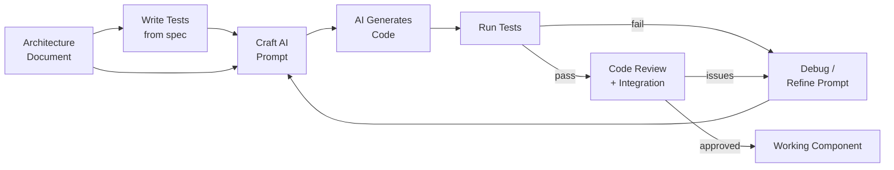

# Lecture 2: AI-Driven Development & Test-Driven Generation

## Learning Objectives

After this lecture, students will be able to:
- Use AI coding tools effectively to implement a system from a design specification
- Apply test-driven development with AI-generated code
- Write effective prompts that turn architecture documents into working code
- Evaluate, verify, and debug AI-generated code
- Use modern AI development tools (Claude Code, Cursor, Copilot, Aider)

---

## Topics

### 1. The Specification-First Workflow (20 min)

#### Why the Old Workflow Breaks Down with AI

The traditional software development workflow goes roughly: understand the problem → write code → write tests → discover the design was wrong → rewrite. Tests are treated as a verification afterthought, and the design often emerges from the code rather than driving it. This is painful enough for human developers, but it breaks down completely when AI is writing the code.

AI coding tools are extraordinarily good at generating code that *looks* correct. They produce clean, idiomatic, well-formatted code that passes a superficial review. The problem is that they generate code to satisfy the *prompt*, not the *problem*. If your prompt is vague ("write a sensor process"), the AI makes assumptions — often reasonable ones, sometimes disastrously wrong ones. When the code fails, you do not know whether the AI misunderstood the prompt, the prompt was ambiguous, or the design was wrong in the first place.

The solution is to flip the workflow: **write the specification first, then write the tests, then generate the code**. The specification is precise enough that the AI has no room for dangerous assumptions. The tests encode the expected behaviour so precisely that "correct" is a binary outcome. The AI becomes a contractor who must satisfy a clearly written contract, not an artist who interprets a vague brief.

#### Your Architecture Document IS the Prompt

The MBSE artifacts you produce in week 1 are not bureaucratic overhead — they are the inputs to your AI development process:

- **Requirements** → acceptance tests (each requirement becomes a test case)
- **Component diagram** → project structure (each container becomes a directory with a Dockerfile)
- **Sequence diagrams** → integration tests (the sequence diagram *is* the integration test scenario)
- **API contracts** → interface tests (the JSON schema is the assertion)
- **Data models** → unit tests (test that every field is present, typed, and in range)
- **State machines** → state transition tests (test every state and every transition)

This means a well-written architecture document dramatically reduces the effort of implementation. An AI that has your architecture document, sequence diagrams, and API contracts as context can generate a working skeleton in minutes. An AI working from a vague description will generate something that looks plausible but fails on the first real test.

> **Key principle:** The specification is more important than ever when working with AI. AI amplifies the quality of your specification — a good spec becomes excellent code; a bad spec becomes confidently wrong code.



---

### 2. Test-Driven Generation (30 min)

#### The Core Practice: Write Tests Before Code

Test-Driven Development (TDD) predates AI coding tools by two decades — [Kent Beck introduced it in 2003](https://www.amazon.com/Test-Driven-Development-Kent-Beck/dp/0321146530). Its core discipline is: write a failing test first, then write the minimum code to make it pass, then refactor. With AI-generated code, TDD becomes even more valuable: the tests are the specification that the AI must satisfy. You write the contract; the AI writes the implementation.

The workflow is:
1. Write a test that captures the required behaviour (it will fail — there is no code yet)
2. Give the test to the AI as context: "implement the code that makes this test pass"
3. AI generates the implementation
4. Run the tests — they should pass
5. If they do not, examine the failure and refine either the tests or the prompt
6. Add more tests for edge cases; repeat

This practice catches hallucinated APIs early (the test will fail with `AttributeError`), wrong logic early (the test will fail with assertion errors), and missing error handling (add a test for the error case).

#### Test Types for CPS

**Unit tests** test a single function or class in isolation. For building control:

```python
# Example: test that a smoke sensor reading is correctly classified
def test_smoke_alert_threshold():
    classifier = SmokeClassifier(threshold=0.7)
    assert classifier.classify(0.65) == SensorState.NOMINAL
    assert classifier.classify(0.75) == SensorState.ALERT
    assert classifier.classify(1.0) == SensorState.ALERT

def test_smoke_classifier_rejects_invalid_input():
    classifier = SmokeClassifier(threshold=0.7)
    with pytest.raises(ValueError):
        classifier.classify(-0.1)  # Smoke level cannot be negative
    with pytest.raises(ValueError):
        classifier.classify(1.5)   # Smoke level cannot exceed 1.0
```

**Integration tests** test that two or more components work together correctly. They require a running BuildSim instance (or a mock of it):

```python
# Example: test that sensor process stores readings in the database
def test_sensor_process_stores_readings(buildsim_mock, db_connection):
    sensor_process = SensorProcess(api_url="http://localhost:8080", db=db_connection)
    buildsim_mock.set_sensor("smoke-A2306", value=0.82)
    sensor_process.poll_once()
    readings = db_connection.query("SELECT * FROM readings WHERE sensor_id='smoke-A2306'")
    assert len(readings) == 1
    assert readings[0]["value"] == pytest.approx(0.82)
```

**Behavioural tests** test the end-to-end response to a scenario. These are the most valuable tests for CPS — they verify the entire system against a requirement:

```python
# Requirement R-FIRE-01: fire detected → sprinklers on within 30 seconds
def test_fire_detection_activates_sprinklers(building_system, buildsim_client):
    buildsim_client.set_sensor("smoke-A2306", value=0.85)
    buildsim_client.set_sensor("temperature-A2306", value=45.0)
    time.sleep(30)  # wait up to 30 seconds
    actuator_state = buildsim_client.get_actuator("sprinkler-A2306")
    assert actuator_state["state"] == "on"
```

**Property-based tests** verify invariants that must always hold:

```python
# Property: actuator state is always one of the valid states
@given(smoke_level=st.floats(0.0, 1.0), temperature=st.floats(10.0, 80.0))
def test_agent_always_produces_valid_actuator_command(smoke_level, temperature):
    agent = SafetyAgent()
    command = agent.decide({"smoke": smoke_level, "temperature": temperature})
    assert command.actuator_id in VALID_ACTUATOR_IDS
    assert command.state in ["on", "off", "auto"]
```

[Hypothesis](https://hypothesis.readthedocs.io/en/latest/) is the standard Python library for property-based testing.

#### Testing AI Agent Behaviour

Testing an LLM-based agent is harder than testing a deterministic function, because the LLM response varies between calls. Three strategies:

**Mock the LLM:** replace the LLM client with a mock that returns deterministic responses. Test that your agent correctly interprets the LLM output and takes the right action — without testing the LLM itself.

```python
def test_agent_activates_sprinklers_on_fire_decision(mock_llm):
    mock_llm.set_response('{"action": "activate_sprinkler", "zone": "A2306", "reason": "fire detected"}')
    agent = SafetyAgent(llm=mock_llm)
    agent.process_alert({"smoke": 0.85, "room": "A2306"})
    assert mock_llm.last_tool_call == ("activate_sprinkler", {"zone": "A2306"})
```

**Record and replay:** in a staging environment, run the real LLM and record all requests and responses. In CI, replay the recorded responses. This captures real LLM behaviour while making tests deterministic and fast.

**Scenario tests with evaluation:** define a set of scenarios (sensor states) and expected outputs (actuator commands or reasoning categories). Run the real LLM, and use a second LLM or a classifier to evaluate whether the response is acceptable. This is the approach used in [LLM evaluation frameworks](https://docs.confident-ai.com/).

---

### 3. AI Coding Tools (30 min)

#### CLI-Based Tools (terminal-native, work with any editor)

| Tool | Description | Link |
|------|-------------|------|
| **Claude Code** | Anthropic's CLI agent — reads your codebase, edits files, runs tests, uses tools | [claude.ai/code](https://claude.ai/code) |
| **Aider** | Terminal pair programmer — edits files in your repo, git integration, supports many models | [aider.chat](https://aider.chat/) |

**Claude Code** is particularly powerful for this course because it can read your entire architecture document, understand the context of your project, and make targeted edits across multiple files while running your tests to verify the result. It operates in a conversation that maintains context across a session, so you can say "now add error handling to the sensor process" and it knows what the sensor process is.

**Aider** integrates tightly with git, commits after each successful change, and supports a wide range of models (including local Ollama models). It is excellent for incremental changes to an existing codebase.

#### IDE-Integrated Tools

| Tool | Description | Link |
|------|-------------|------|
| **GitHub Copilot** | Inline code completion and chat in VS Code/JetBrains | [github.com/features/copilot](https://github.com/features/copilot) |
| **Cursor** | AI-first IDE with codebase-aware chat, edit, and generation; based on VS Code | [cursor.com](https://cursor.com/) |
| **Windsurf** | AI IDE with "Cascade" agent that can plan and execute multi-file changes | [windsurf.com](https://windsurf.com/) |

**Cursor** is the most popular AI IDE for professional software development in 2025. Its `@codebase` feature indexes your entire repository and lets you ask questions about the code ("how does the sensor process connect to the database?") and make changes with full codebase context. The [Cursor documentation](https://docs.cursor.com/) is the best starting point.

#### How to Use Them Effectively

**Start with context.** Before asking an AI to generate code, give it your architecture document, the relevant sequence diagrams, the API contract for the interface you are implementing, and any existing code it should follow the pattern of. An AI with good context produces dramatically better code than one working from a vague description.

**Be specific.** Compare:
- Vague: "write a sensor process"
- Specific: "implement a Python process that: (1) connects to the BuildSim WebSocket at `ws://localhost:8080/stream`, (2) receives sensor reading messages in the format `{sensor_id, value, timestamp}`, (3) validates that `value` is within the physical range for the sensor type, (4) inserts each valid reading into a TimescaleDB table `readings(sensor_id, value, timestamp)` using asyncpg, (5) reconnects automatically on disconnect with exponential backoff. Use the asyncio library. Here is the database schema: ..."

**Iterate.** AI rarely produces perfect code on the first attempt. Generate → review → run tests → identify gaps → refine the prompt. This cycle takes 3–5 iterations for a non-trivial component.

**Do not trust blindly.** AI-generated code must be read, understood, and tested. "The AI wrote it" is not a defence when it causes a system failure. You are responsible for every line of code in your repository.

**Use AI for boilerplate.** Dockerfiles, docker-compose configuration, `requirements.txt`, API client boilerplate, data model classes, logging setup, health check endpoints — these are exactly the kind of repetitive, structured code that AI generates reliably. Do not spend your time on boilerplate.

**Keep control of architecture.** You decide the structure. AI fills in the implementation. Never let the AI refactor your architecture — it does not have the context of why you made architectural decisions, and it will optimise for code cleanliness at the expense of your design intent.

---

### 4. Prompting for Code Generation (20 min)

#### Prompt Engineering for Developers

Prompt engineering for code generation is not about clever tricks — it is about being precise. The more precisely you specify what you want, the better the result. The [Prompt Engineering Guide](https://www.promptingguide.ai/) covers the principles in detail; here are the most relevant techniques for this course.

**Specification as prompt.** Copy the relevant section of your architecture document directly into the prompt. The architecture document was written to be precise — it works as a prompt. Example:

```
Here is the architecture for the sensor ingestion component from my design document:

[paste your sensor process architecture section]

Implement this component in Python. Use the asyncio library for concurrency.
Follow this data model: [paste your data model].
The BuildSim API is documented here: [paste API docs excerpt].
```

**Few-shot prompting.** Show one complete, working example and ask for a similar one. "Here is a working temperature sensor process [paste code]. Now implement an equivalent process for CO2 sensors. The CO2 sensor readings are in ppm (0–5000) and the alert threshold is 1000 ppm."

**Test-first prompting.** Give the AI your test file and ask it to write the implementation. "Here are the pytest tests for the smoke classifier [paste tests]. Write the `SmokeClassifier` class that makes all tests pass. Do not modify the tests."

**Constraint prompting.** Explicit constraints prevent common AI failure modes. Examples:
- "Do not use any external libraries beyond what is listed in requirements.txt"
- "All database queries must use parameterised statements — no string formatting"
- "All configuration values must come from environment variables, not hardcoded"
- "Every function must have a docstring and type annotations"

**Incremental generation.** For complex systems, generate one component at a time:
1. Generate the data models (no dependencies)
2. Generate the database client (depends on data models)
3. Generate the sensor process (depends on database client and BuildSim API client)
4. Generate the AI agent (depends on database client and tool definitions)
5. Generate the actuator process (depends on tool definitions)
6. Generate the docker-compose.yml (depends on all of the above)

**Review prompting.** After generating code, ask the AI to review it: "Review this code for: (1) security issues, (2) race conditions, (3) missing error handling, (4) places where configuration should be externalised, (5) places where logging would help debugging. Output a list of issues with suggested fixes."

#### What Makes a Good Prompt

A good code generation prompt contains:
- **What the component does** (one clear sentence)
- **Input and output** (types, formats, example values)
- **Dependencies** (which libraries, APIs, databases it interacts with)
- **Constraints** (what it must NOT do or use)
- **Context** (existing code it must integrate with)
- **Tests** (the tests it must pass)

---

### 5. Debugging and Verifying AI-Generated Code (15 min)

#### Common Failure Modes

AI-generated code fails in predictable ways. Knowing the patterns lets you catch issues faster:

**Hallucinated APIs.** The AI calls a function or method that does not exist, or uses a real function with the wrong signature. Always check: does this import exist? Does this method exist on this class? The fix is to run the code immediately — a hallucinated API fails on import or first call.

**Plausible but wrong logic.** The code *looks* correct and passes superficial review, but fails on edge cases. Example: a sensor averaging function that divides by zero when the list is empty, or a timestamp parser that fails on timestamps with microseconds. The fix is tests that cover edge cases — empty inputs, boundary values, malformed data.

**Missing error handling.** AI tends to write happy-path code. What happens when the database is unavailable? When the BuildSim WebSocket disconnects? When a sensor reading is missing a required field? The fix is explicit requirements: "add error handling for: database connection failure, WebSocket disconnect, malformed input. Log errors with context. Use exponential backoff for retries."

**Hardcoded values.** AI frequently hardcodes URLs, thresholds, and credentials that should be configuration. Search generated code for string literals and numbers. Move them to environment variables or a configuration file.

**Security issues.** SQL injection via string formatting, secrets stored in code, no input validation on incoming data. The fix is explicit constraints in the prompt and a security-focused review prompt after generation.

#### Verification Strategy

1. **Run the tests** (you wrote them before generating the code)
2. **Read the code** — you are responsible for every line; understand what it does
3. **Fault injection** — kill a process, send malformed data, simulate a network outage; observe how the system behaves
4. **Check against the specification** — does the code match the sequence diagrams? Does it handle every state in the state machine?
5. **Review prompt** — ask the AI to find its own bugs with a structured review prompt

#### The Human's Role in AI-Driven Development

AI handles: boilerplate, data model generation, API client generation, test fixture generation, Dockerfile generation, repetitive patterns.

You handle: architectural decisions, security review, integration testing, debugging subtle logic errors, deciding what the system should do, and taking responsibility for the result.

The division is roughly: AI writes the code; you specify, review, test, and own it.

---

### 6. Containerisation & CI with AI (15 min)

#### Letting AI Handle DevOps Boilerplate

Docker configuration, CI pipeline setup, and deployment configuration are exactly the kind of structured, repetitive work that AI generates reliably. A good prompt:

```
Generate a Dockerfile for this Python service:
- Base image: python:3.12-slim
- Install dependencies from requirements.txt
- Run as a non-root user
- Health check: HTTP GET /health every 30 seconds
- Graceful shutdown on SIGTERM
- Entry point: python -m sensor_process

Also generate a docker-compose.yml for these services:
[paste your container diagram description]
Include: restart policies, health check dependencies, a shared network, and environment variables from .env files.
```

AI-generated CI pipelines (GitHub Actions) are particularly useful for this course. A prompt like "generate a GitHub Actions workflow that: runs pytest on push, builds Docker images, and fails if any test fails" produces a working `.github/workflows/ci.yml` in seconds.

#### What You Must Decide

AI does not know your system's operational requirements. You must decide:
- Which containers are stateful (need persistent volumes) vs. stateless
- How containers communicate (shared network, which ports to expose)
- What the restart policy should be (always restart safety components; maybe not the dashboard)
- What secrets need to be injected (database passwords, API keys) and how
- Which services are dependencies of which (the AI agent should not start before the database is ready)

Document these decisions in your architecture document — the `docker-compose.yml` is the executable form of your container diagram, and they should be consistent.

---

## Lab Connection

- Choose your AI coding tool and familiarise yourself with it before implementation begins
- Write tests for your sensor process, data pipeline, and AI agent *before* generating any implementation code
- Use the specification-first workflow: architecture document → tests → AI generation → verification
- Document in your report: which components were AI-generated, which were hand-written, what issues you encountered, and how you resolved them
- Reflect on the AI-driven development experience in your evaluation: what worked, what failed, what you would do differently

---

## Recommended Reading

- "Prompt Engineering Guide" — [promptingguide.ai](https://www.promptingguide.ai/) — comprehensive, free, practical; read the "techniques" section
- Claude Code documentation — [docs.anthropic.com/en/docs/claude-code](https://docs.anthropic.com/en/docs/claude-code) — reference for the tool used in this course
- Aider usage guide — [aider.chat/docs/usage.html](https://aider.chat/docs/usage.html) — good alternative for terminal-native workflow
- Cursor documentation — [docs.cursor.com](https://docs.cursor.com/) — the most popular AI IDE; read the "context" section
- Beck, K. "Test-Driven Development: By Example" (Addison-Wesley) — the foundational TDD reference; the principles apply directly to AI-generated code
- "pytest documentation" — [docs.pytest.org](https://docs.pytest.org/) — the standard Python testing framework; know fixtures, parametrize, and conftest.py
- "Hypothesis: Property-Based Testing for Python" — [hypothesis.readthedocs.io](https://hypothesis.readthedocs.io/en/latest/) — invaluable for testing CPS invariants
- Fowler, M. "Mocks Aren't Stubs" — [martinfowler.com/articles/mocksArentStubs.html](https://martinfowler.com/articles/mocksArentStubs.html) — essential background for testing AI agents with mocks
- "How to Write Better Prompts for Code Generation" — [simonwillison.net](https://simonwillison.net/) — Simon Willison's blog covers practical AI development in depth
