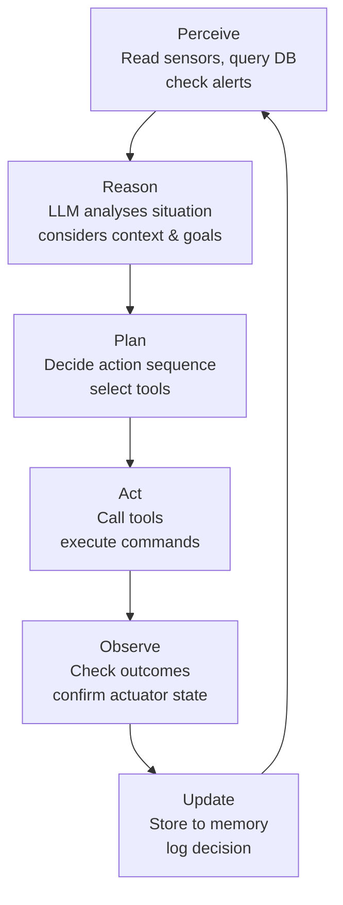
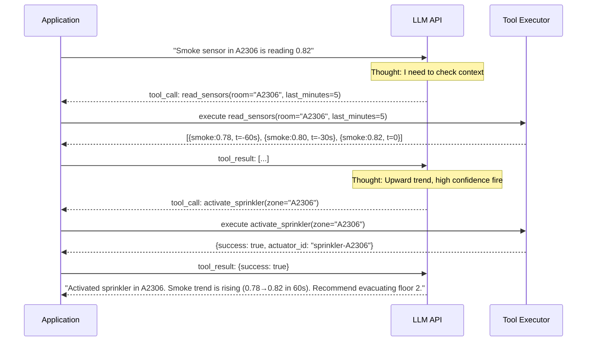
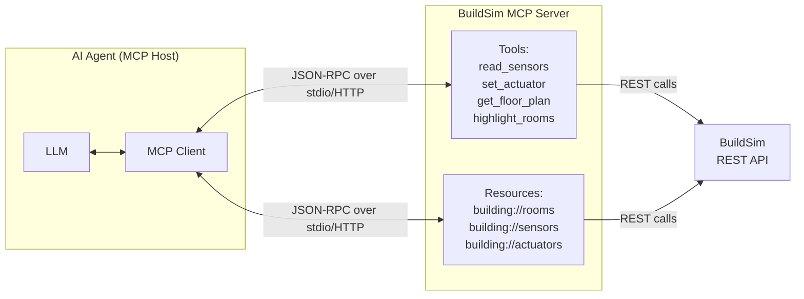
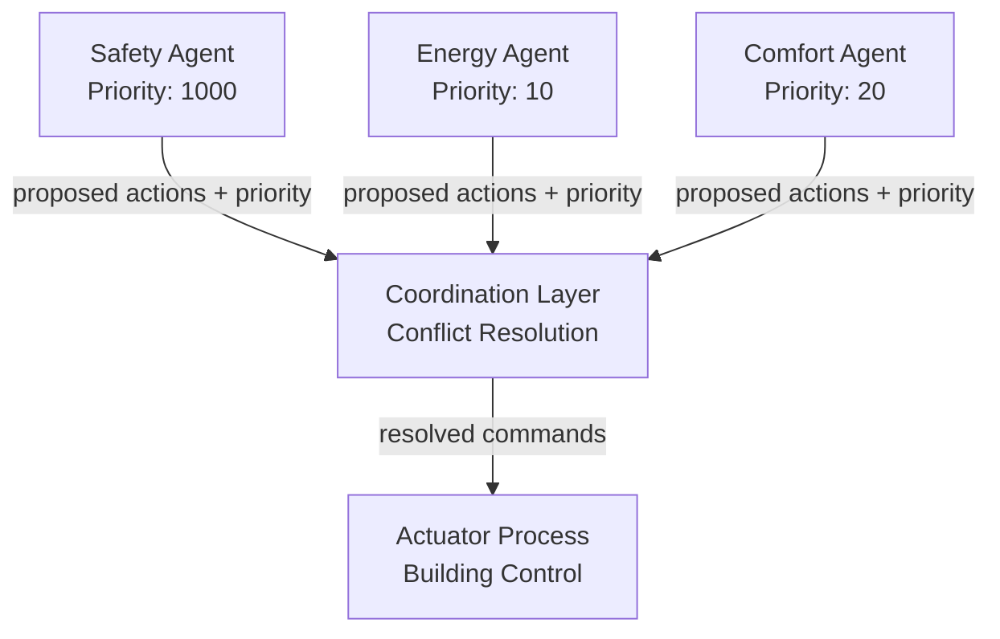

# Lecture 4: Agentic AI for Autonomous Systems

## Learning Objectives

After this lecture, students will be able to:
- Explain the difference between traditional automation, ML inference, and agentic AI
- Design an AI agent that perceives, reasons, and acts in a CPS environment
- Use tool-calling and MCP to connect LLMs to physical systems
- Design multi-agent systems with coordination protocols

---

## Topics

### 1. From Rules to Agents (20 min)

#### Three Generations of Automation

The history of building automation is a progression from rigid rule-following to flexible, context-aware reasoning. Understanding where each approach fits helps you design a system that uses each tool appropriately.

**Rule-based automation** is the oldest and simplest form: `if temperature > 25°C then turn on AC`. These systems are deterministic, predictable, and fast — a PLC can evaluate thousands of rules per millisecond. They are also brittle: the rules must anticipate every situation. A rule that says "turn on AC when temperature > 25°C" does not know that it is 03:00 and the building is empty, or that today is a holiday, or that there is a ventilation fault that will cause AC operation to worsen the problem. Real buildings have hundreds of interacting rules that are nearly impossible to maintain without introducing conflicts and edge cases.

**ML inference** replaces handcrafted rules with learned models. A classification model trained on thousands of building-day examples learns that "temperature rising at 3°C/hour + CO2 increasing + occupancy sensor active" predicts "cooling needed in 15 minutes." The model generalises beyond the cases the rule engineer anticipated. But ML inference is still a function: input features in → prediction out. It does not reason about context, cannot explain its decisions, and cannot handle situations outside its training distribution.

**Agentic AI** goes further: the agent *observes* the current situation, *reasons* about its context (what time is it, what happened recently, what are the competing priorities, what are the consequences of different actions), *plans* a sequence of actions, *executes* the plan by calling tools, *observes* the outcome, and *updates* its approach. An LLM-based agent can handle a situation it has never encountered before by reasoning from first principles. It can explain its decisions in natural language. It can ask for clarification when a situation is ambiguous.

> **Key term — Agent:** A system that perceives its environment, maintains a representation of state, selects actions to achieve goals, and executes those actions through tools. An AI agent uses an LLM as its reasoning engine.

The agent loop:



#### When to Use Each Approach

The choice between rules, ML, and agents should be driven by the latency and complexity requirements of each decision:

| Decision type | Latency | Example | Approach |
|---------------|---------|---------|---------|
| Safety-critical | < 100 ms | Fire suppression, emergency unlock | Rule-based or ML on edge |
| Real-time control | < 1 s | Temperature setpoint adjustment | Edge ML inference |
| Operational reasoning | 1–30 s | HVAC schedule optimisation | LLM agent |
| Strategic planning | Minutes | Energy cost optimisation | LLM agent + optimiser |
| Human-facing | Interactive | Explain why heating changed | LLM |

A well-designed building control system uses all three layers: hard-wired rules for the fastest safety functions, ML models for real-time inference, and LLM agents for higher-level reasoning and planning.

---

### 2. LLMs as Controllers (30 min)

#### Why LLMs for Building Control?

Large language models bring capabilities to building control that neither rules nor traditional ML can match:

**Contextual reasoning.** An LLM can reason about trade-offs that involve multiple objectives simultaneously: "energy cost is currently high due to peak pricing, but three occupants are reporting thermal discomfort via the app, and outdoor temperature is forecast to drop in 2 hours — the optimal action is to tolerate current discomfort for 45 minutes, then pre-heat aggressively when the price drops." No rule system and no ML classifier can express this kind of multi-dimensional situational reasoning.

**Natural language understanding.** Occupants and building managers communicate in natural language. An LLM agent can accept "it feels stuffy in the meeting room on floor 3" and translate it into the appropriate sensor query, diagnosis, and actuator command — without requiring the user to know which CO2 sensor ID to check.

**Explainability.** When the AI makes a decision, it can explain it: "I turned off HVAC zone 4 because the CO2 sensor in that zone has been stuck at 450 ppm for the last 30 minutes despite three occupants being present according to the booking system, which suggests a sensor fault rather than genuine air quality. I have created a maintenance ticket." Traditional ML models cannot produce this kind of structured, human-readable justification.

**Handling novel situations.** A fire alarm in a building that is also hosting a film shoot with artificial smoke effects. A sensor reading 0 because it has been painted over during renovation. A building manager who has manually overridden the HVAC and forgotten. LLMs can reason about these situations using common sense; rule systems and ML models fail.

#### Limitations and Mitigations

**Hallucination** — LLMs sometimes generate plausible but incorrect outputs. An LLM might suggest activating an actuator that does not exist, or claim a sensor is showing a value it is not. Mitigations: constrain the output to a JSON schema (structured output mode) so the agent can only produce valid actuator IDs; validate all tool call arguments before execution; never trust an LLM's claim about sensor values — always read from the ground truth (the database or the API).

**Latency** — a cloud LLM API call takes 500–3,000 ms. This is too slow for any decision on the critical control path. Mitigations: use LLMs only for deliberative reasoning (decisions that can tolerate seconds of latency); use ML models for real-time inference; cache common reasoning patterns; use smaller, faster local models for routine decisions.

**Cost** — calling a cloud LLM API for every sensor reading is economically unsustainable. A building with 100 sensors reading every 5 seconds would make 1.7 million LLM calls per day. Mitigations: only invoke the LLM when there is a novel situation or anomaly (not for routine operation); use the ML model as a filter that escalates to the LLM only when needed.

**Local models** — for latency and cost reasons, local models are attractive. [Ollama](https://ollama.com/) runs open-source LLMs (Llama 3, Gemma 3, Mistral, Qwen) locally with a simple API. The lab has a GPU server running Ollama. Local models are slower and less capable than the frontier cloud models, but entirely adequate for building control reasoning tasks. See [Ollama documentation](https://ollama.com/library) for available models.

**Structured output** — use JSON mode or schema-constrained generation to ensure the LLM always produces parseable, valid output. With OpenAI-compatible APIs (including Ollama), use `response_format={"type": "json_object"}` or a JSON schema in `response_format`. With Anthropic's API, use `tool_choice="required"` to force a tool call that defines the output schema.

---

### 3. Tool Use and Function Calling (30 min)

#### What Is Tool Calling?

An LLM, by itself, can only process text and produce text. It cannot read a sensor, write to a database, or command an actuator. **Tool calling** (also called function calling) extends the LLM with the ability to invoke external functions. The LLM decides *which* tool to call and with *what* arguments; the calling code actually executes the function and returns the result to the LLM.

The interaction pattern is:
1. The system defines a set of tools (functions) with names, descriptions, and parameter schemas
2. The user/system sends a message to the LLM along with the tool definitions
3. The LLM reasons about what to do and, if it needs to act, generates a **tool call** — a structured JSON specifying the function name and arguments
4. The calling code executes the function, gets the result
5. The result is returned to the LLM as a **tool result** message
6. The LLM reasons about the result and either calls another tool or produces a final response

This loop — Thought → Action → Observation → Thought — is the [ReAct pattern](https://arxiv.org/abs/2210.03629) (Yao et al., 2022), which is the foundation of most LLM agents.



#### Tool Design for Building Control

Good tool design for building control follows these principles:

**One tool per concern.** Do not create a single `control_building()` tool that does everything. Create `read_sensors()`, `set_actuator()`, `find_route()`, `highlight_rooms()`, `query_history()`, `create_alert()` — each with a clear, narrow purpose.

**Descriptive names and docstrings.** The LLM decides which tool to call based on the name and description. A tool named `get_data()` will be misused; a tool named `read_room_sensors(room_id, sensor_type, last_minutes)` will be used correctly.

**Validate inputs before execution.** Never trust the LLM's tool call arguments unconditionally. Validate that `room_id` exists, that `sensor_type` is a valid type, that numeric arguments are in valid ranges. Reject and return an error message if validation fails — the LLM will retry with corrected arguments.

**Return rich, informative results.** The LLM reasons about tool results. Instead of returning just `{"state": "on"}`, return `{"state": "on", "last_changed": "2025-03-15T14:32:05Z", "commanded_by": "safety_agent"}` — the LLM can use this context to produce better decisions.

Example tool definitions for building control (Python, using the OpenAI function calling schema):

```python
tools = [
    {
        "type": "function",
        "function": {
            "name": "read_sensors",
            "description": "Read current sensor values for a specific room. Returns temperature (°C), humidity (%), CO2 (ppm), smoke (0-1), and occupancy state.",
            "parameters": {
                "type": "object",
                "properties": {
                    "room_id": {
                        "type": "string",
                        "description": "Room identifier, e.g. 'A2306'"
                    },
                    "sensor_types": {
                        "type": "array",
                        "items": {"type": "string"},
                        "description": "List of sensor types to read. Options: temperature, humidity, co2, smoke, occupancy"
                    }
                },
                "required": ["room_id"]
            }
        }
    },
    {
        "type": "function",
        "function": {
            "name": "set_actuator",
            "description": "Set the state of a building actuator. Returns success/failure and the new state.",
            "parameters": {
                "type": "object",
                "properties": {
                    "actuator_id": {
                        "type": "string",
                        "description": "Actuator identifier, e.g. 'hvac-zone-3', 'sprinkler-A2306', 'door-floor2-north'"
                    },
                    "state": {
                        "type": "string",
                        "description": "New state. Valid values depend on actuator type: hvac accepts 'off'/'low'/'high'/'auto'; sprinklers accept 'on'/'off'; doors accept 'locked'/'unlocked'."
                    },
                    "reason": {
                        "type": "string",
                        "description": "Human-readable reason for this action. Will be logged in the audit trail."
                    }
                },
                "required": ["actuator_id", "state", "reason"]
            }
        }
    }
]
```

#### Model Context Protocol (MCP)

The [Model Context Protocol](https://modelcontextprotocol.io/) (MCP) is an open standard proposed by Anthropic in 2024 for connecting AI models to external data sources and tools. Rather than each application defining its own tool format and integration, MCP defines a standard protocol that any MCP-compatible model can use to discover and call tools from any MCP-compatible server.

The architecture has three components:
- **MCP Host:** the application that runs the LLM (Claude Code, your AI agent application)
- **MCP Client:** the protocol client inside the host that manages server connections
- **MCP Server:** a server that exposes tools, resources, and prompts via the MCP protocol

For building control, you would implement an **MCP server** that wraps the BuildSim REST API endpoints as MCP tools. Any MCP-compatible agent (Claude, GPT-4, local Ollama model) can then discover and use those tools automatically — without any custom integration code.



MCP uses JSON-RPC 2.0 over stdio or HTTP with Server-Sent Events for streaming. Implementing an MCP server for BuildSim means:
1. Define tool schemas for each BuildSim endpoint
2. Implement the tool handler functions (which call the BuildSim REST API)
3. Expose a `tools/list` endpoint that returns the tool definitions
4. Expose a `tools/call` endpoint that executes a tool call

The [MCP Python SDK](https://github.com/modelcontextprotocol/python-sdk) handles the protocol; you only need to write the tool implementations. See the [MCP specification](https://spec.modelcontextprotocol.io/) for the full protocol.

---

### 4. Agent Frameworks (20 min)

#### Choosing a Framework

Agent frameworks provide scaffolding for building LLM agents: tool execution loops, memory management, state machines, and multi-agent coordination. The right choice depends on the complexity of your use case.

**No framework** — for simple agents that call one or two tools in a fixed sequence, plain Python with direct LLM API calls is often clearest. A 50-line Python script that reads sensors, constructs a prompt, calls the LLM, parses the tool call, executes the tool, and loops is simpler to understand, test, and debug than the same logic expressed in a framework's DSL.

**[LangChain](https://python.langchain.com/)** — the most widely used LLM application framework. Provides chains (sequential tool calls), agents (LLM-driven tool selection), memory (conversation history), and a large ecosystem of integrations. Can be verbose and opinionated; best for applications that need many integrations quickly.

**[LangGraph](https://langchain-ai.github.io/langgraph/)** — a graph-based agent framework from the LangChain team. Agents are defined as nodes in a directed graph with cycles; the LLM decides which edge to follow at each step. Better than plain LangChain for complex workflows with branching and looping. The [LangGraph conceptual guide](https://langchain-ai.github.io/langgraph/concepts/) is the best starting point.

```python
# LangGraph example: a simple building control agent
from langgraph.graph import StateGraph, END
from langgraph.prebuilt import ToolNode

# Define the agent state
class AgentState(TypedDict):
    messages: list
    sensor_readings: dict
    pending_actions: list

# Build the graph
workflow = StateGraph(AgentState)
workflow.add_node("read_sensors", sensor_reading_node)
workflow.add_node("reason", llm_reasoning_node)
workflow.add_node("act", ToolNode(building_tools))

workflow.set_entry_point("read_sensors")
workflow.add_edge("read_sensors", "reason")
workflow.add_conditional_edges("reason", should_act, {"act": "act", "done": END})
workflow.add_edge("act", "reason")  # Loop back to reason after acting

agent = workflow.compile()
```

**[CrewAI](https://crewai.com/)** — a framework for role-based multi-agent systems. You define agents with roles, goals, and backstories; tasks with descriptions and expected outputs; and crews that assign tasks to agents. Agents can delegate to each other. Good for workflows that map naturally to human team structures. [CrewAI documentation](https://docs.crewai.com/).

**[AutoGen](https://microsoft.github.io/autogen/)** — Microsoft's conversational multi-agent framework. Agents exchange messages in a structured conversation; a coordinator directs the conversation. Good for tasks that benefit from multiple agents critiquing each other's outputs (code review, report writing). [AutoGen documentation](https://microsoft.github.io/autogen/).

**[Pydantic AI](https://ai.pydantic.dev/)** — a newer framework that integrates tightly with Pydantic for structured outputs and type safety. Good for agents that need reliable, typed tool call arguments and responses. Less feature-rich than LangGraph but simpler to use for straightforward agents.

#### The ReAct Pattern

ReAct (Reasoning + Acting) is the most important concept for implementing LLM agents. Introduced in the [ReAct paper](https://arxiv.org/abs/2210.03629) (Yao et al., ICLR 2023), the pattern interleaves language reasoning (thoughts) with actions:

```
Thought: The smoke sensor in A2306 reads 0.82, which is above the alert threshold of 0.7.
         I should check if there are corroborating signals before activating sprinklers.
Action: read_sensors(room="A2306", sensor_types=["temperature", "co2"])
Observation: temperature=38.5°C (normal is 21°C), co2=890 ppm (normal is 450 ppm)
Thought: Temperature is significantly elevated and CO2 is rising. Combined with smoke,
         this is consistent with a fire, not a false alarm. I should activate sprinklers
         and unlock evacuation doors.
Action: set_actuator(actuator_id="sprinkler-A2306", state="on", reason="fire detected: smoke=0.82, temp=38.5C")
Observation: {success: true, state: "on"}
Action: set_actuator(actuator_id="doors-floor2", state="unlocked", reason="fire evacuation")
Observation: {success: true, state: "unlocked"}
Thought: Sprinklers activated and evacuation doors unlocked. I should alert the building manager.
Action: create_alert(severity="critical", message="Fire detected in A2306. Sprinklers activated. Doors unlocked.")
```

The key insight is that the reasoning (Thought) is explicit and can be logged and audited. This is critical for safety-critical systems: you can see exactly why the agent made each decision.

---

### 5. Multi-Agent Coordination (20 min)

#### Why Multiple Agents?

A single all-knowing agent that controls every aspect of a building is fragile and hard to test. Multiple specialised agents, each focused on a single objective, offer:

**Separation of concerns.** A safety agent is responsible for fire/emergency response. An energy agent optimises consumption. A comfort agent maintains occupant preferences. Each agent has clear responsibilities and can be developed, tested, and updated independently.

**Parallel reasoning.** Multiple agents can reason simultaneously. The energy agent is continuously optimising the HVAC schedule while the comfort agent is processing an occupant feedback event — they do not block each other.

**Robustness.** If the comfort agent crashes, the safety agent continues to operate. Single-agent architectures have a single point of failure.

**Specialisation.** A small, fast model (local Llama 3.2 3B) may be sufficient for routine energy optimisation, while a larger model (Claude Sonnet, GPT-4o) is used only for complex safety decisions. Using different models for different agents optimises cost and latency.

#### Conflict Resolution

Multi-agent systems create the possibility of **conflict**: the energy agent wants to reduce HVAC power consumption, but the comfort agent wants to increase it to maintain temperature. What happens?

**Priority-based:** assign a fixed priority to each agent. Safety always overrides energy; comfort overrides energy. When two agents issue conflicting commands, the higher-priority agent wins. Simple, predictable, but inflexible.

**Auction-based:** agents bid for actuator control with a numeric priority score. The agent with the highest score wins. Scores can be dynamic: the safety agent bids 1000 when smoke is detected (always wins), 0 otherwise. This allows flexible priority based on context.

**Consensus:** agents negotiate a compromise. The energy agent proposes a temperature setpoint; the comfort agent counter-proposes; they converge on a mutually acceptable value. More complex but produces better outcomes when neither agent needs to win completely.

**Hierarchical (supervisor pattern):** a supervisor agent receives all proposed actions from subordinate agents, reasons about conflicts, and produces a final unified action set. The supervisor has the most context but is the bottleneck and single point of failure.



#### Communication Between Agents

**Shared state (blackboard pattern):** all agents read and write to a shared data store (the time-series database, a Redis instance, BuildSim API). Agents observe each other's actions through state changes. Simple but can lead to conflicts if agents are not aware of each other's intentions.

**Message passing:** agents communicate by sending structured messages to each other through a message queue (MQTT, Redis Streams). Explicit, auditable, and decoupled. Requires careful design of the message format and routing.

**Shared context in LLM:** for LLM-based agents, the entire conversation history (including other agents' decisions) can be included in each agent's context. This allows passive awareness without direct communication — each agent sees what others have decided. Expensive in token cost but produces well-informed decisions.

#### Avoiding Pathologies

Multi-agent systems can exhibit failure modes that do not exist in single-agent systems:

**Oscillation:** Agent A turns on HVAC, which raises temperature; Agent B turns it off to save energy; temperature drops; Agent A turns it on again. This loop repeats indefinitely. Prevention: add hysteresis (do not change state unless the trigger condition has been true for at least N seconds); use a shared decision log so each agent knows what the other recently decided.

**Deadlock:** Agent A waits for Agent B to release control of an actuator; Agent B waits for Agent A to release a different actuator. Neither can proceed. Prevention: avoid circular dependencies in actuator ownership; use timeout-based lock release.

**Thrashing:** multiple agents issuing conflicting commands in rapid succession, causing actuators to change state faster than the physical system can respond. Prevention: rate limiting on actuator commands; minimum time between state changes.

---

### 6. Safety and Trust in Agentic AI (10 min)

#### The Stakes Are Real

An AI agent controlling a physical building can cause harm: it can leave emergency doors locked during a fire, over-cool a server room, or cause energy spikes that trip a breaker. Safety in agentic AI is not an abstract concern — it is an engineering requirement.

**Guardrails** are constraints applied before an action is executed. Examples:
- "Never lock all exits simultaneously" — even if the LLM reasons that it should
- "Smoke suppression can only be deactivated by a human operator"  
- "Actuator commands above a certain rate are rejected and flagged for human review"
- "If any action would result in all HVAC units being off simultaneously in winter, require human confirmation"

Guardrails are implemented as validation code that runs *before* the tool executes the action. The LLM never sees the validation — it is transparent to the LLM but catches dangerous actions before they reach the actuator.

**Human-in-the-loop (HITL)** means requiring human approval for high-stakes decisions. The agent proposes an action and waits for a human to approve it before executing. This is appropriate for irreversible or high-consequence actions (activating fire suppression, unlocking emergency exits). HITL adds latency but is essential when the cost of a wrong decision is high.

**Audit trail** — every agent decision, tool call, and reasoning step must be logged immutably. When something goes wrong (and in a complex system, something will), you need to be able to reconstruct exactly what the agent decided and why. The ReAct pattern makes this natural — log every Thought, Action, and Observation.

**Graceful degradation** — what happens when the AI agent is unavailable? When the LLM API is unreachable? When the agent crashes? The system must fall back to a safe state without human intervention:
- All actuators remain in their current state (do not assume a default)
- Rule-based fallbacks handle the most critical safety functions
- Alerts notify operators that AI control is inactive
- The system can be manually operated via the BuildSim API directly

**Testing safety** — adversarial testing is essential: inject sensor faults, simulate network outages, send the agent into novel situations it has never seen. Does the agent behave safely when the smoke sensor reads 0 for 10 minutes? When two conflicting commands arrive simultaneously? When the LLM API returns an error? Write tests for these scenarios before deployment.

---

## Lab Connection

- Design your agent architecture: which agent patterns will you use (single agent, multi-agent, hybrid ML + LLM)?
- Define the tools your agent will use: map each BuildSim API endpoint to a tool with a name, description, and parameter schema
- Decide the real-time vs. deliberative split: which decisions use ML inference (< 100 ms), which use LLM reasoning (< 5 s)?
- Implement guardrails: at minimum, ensure the agent cannot issue commands that leave the building in an unsafe state
- Write scenario tests: define at least 3 test scenarios (fire detection, energy optimisation, sensor fault) and verify your agent behaves correctly

---

## Recommended Reading

- Yao, S. et al. "ReAct: Synergizing Reasoning and Acting in Language Models" (ICLR 2023) — [arxiv.org/abs/2210.03629](https://arxiv.org/abs/2210.03629) — the foundational paper for LLM agents; short and readable
- Model Context Protocol specification — [spec.modelcontextprotocol.io](https://spec.modelcontextprotocol.io/) — the full protocol reference; read the overview and tools sections
- MCP Python SDK — [github.com/modelcontextprotocol/python-sdk](https://github.com/modelcontextprotocol/python-sdk) — practical starting point for implementing an MCP server
- LangGraph documentation — [langchain-ai.github.io/langgraph](https://langchain-ai.github.io/langgraph/) — read the concepts and how-to guides; the tutorial builds a ReAct agent from scratch
- LangGraph tutorial: "Build a ReAct Agent" — [langchain-ai.github.io/langgraph/tutorials/introduction/](https://langchain-ai.github.io/langgraph/tutorials/introduction/) — 30-minute hands-on tutorial
- Park, J.S. et al. "Generative Agents: Interactive Simulacra of Human Behavior" (2023) — [arxiv.org/abs/2304.03442](https://arxiv.org/abs/2304.03442) — multi-agent simulation with LLMs; the ideas transfer directly to building control
- Wei, J. et al. "Chain-of-Thought Prompting Elicits Reasoning in Large Language Models" (NeurIPS 2022) — [arxiv.org/abs/2201.11903](https://arxiv.org/abs/2201.11903) — the foundation of reasoning-focused prompting
- Anthropic "Building Effective Agents" — [anthropic.com/research/building-effective-agents](https://www.anthropic.com/research/building-effective-agents) — practical guide from Anthropic on agent design patterns
- Ollama documentation — [ollama.com](https://ollama.com/) — run LLMs locally; the lab GPU server runs Ollama
- OpenAI function calling guide — [platform.openai.com/docs/guides/function-calling](https://platform.openai.com/docs/guides/function-calling) — the tool calling schema used by most frameworks (compatible with Ollama)
